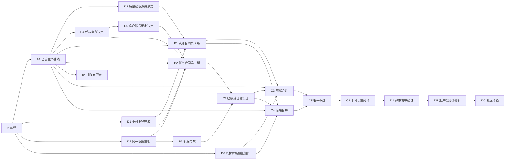

# 自媒体生产认证与任务闭环 SSOT

```yaml
ARTIFACT_CLASS: ssot-development
APPLICABILITY_DECISION: ssot
GOVERNANCE_REASON: "跨生产认证、任务执行器、数据库、飞书、网页发布和长期验收，且必须阻止低等级证据被误报为完成"
TARGET_EVIDENCE_LEVEL: physical-device/external-system
PLAN_VERSION: 5
DAG_VERSION: 5
INTERFACE_FREEZE_VERSION: 5
NODE_CONTRACT_VERSION: 4
SSOT_SCHEMA_VERSION: 1
SSOT_MACHINE_SOURCE: .ssot/manifest.json
```

## 业务结论与范围

本 SSOT 独占三个完成目标：第一，生产认证后的普通用户与管理员页面必须具有真实可用的交互、权限、错误和恢复状态；第二，从业务上下文发起任务后，必须由同一份端到端收据关联任务、执行者、产物、数据库、飞书和网页读回；第三，素材必须按冻结覆盖矩阵完成自动解析或人工补充复验，不能带着静默缺失字段入队。界面存在、入口打开、参数带入、接口返回成功或历史系统读回都不是完整闭环。

2026-08-14 的只读核对证明，当前生产已经切换到飞书扫码统一登录、账号密码登录并存、飞书账号关联和新租户角色会话的发布。旧认证合同和旧 B4 发布身份因此失效，不能直接用旧候选覆盖当前生产。第 23 波已经对当前本地唯一候选完成确定性复验：前端 200 项、后端 609 项，外部博主隔离、客户自有账号唯一关系和工作区运行归属门禁均通过。C5 继续保持已接受，C1 继续正式就绪；不能由此推导生产已经发布或验收。

## 用户、角色与受影响行为

- 普通用户：从自己的素材和业务上下文发起任务、查看状态和结果。
- 管理员：在明确的管理边界内查看、诊断和恢复，不共享普通用户证据。
- 任务执行者：在单一租约下执行能力，并留下可关联的执行尝试身份。
- 运行验收负责人：使用真实角色、发布和外部系统完成生产验收。
- 产品与安全负责人：分别批准代表能力集合和长期质量验收身份策略。

## 明确不做

- 不把历史截图、模拟数据、固定测试样例或源码存在升级为生产通过。
- 不保存密码、浏览器会话、令牌或私人业务正文到证据。
- 不在未获发布权限时修改活动发布、重启服务、运行迁移或清理远程脏工作树。
- 不建立新旧任务执行器双轨、兼容回退、双写或第二事实来源。
- 不把本轮两项代表能力的账号约束扩大为全部能力已经产品化。

## 人类决定状态

详见问题处理记录（`openproblem.md`）。当前没有待拍板事项：OP01 已确定长期质量验收身份策略；OP02 已确定用创作咨询验证只读链、用自媒体创作验证写入链；OP03 已确定两项代表能力必须在入队前以平台与客户自有账号完成精确唯一绑定；OP04 已确定 54 个素材与平台组合的解析、失败提示和人工补充边界。

## 实施路径摘要

1. A1 已固化当前生产前端、后端、发布身份和新的飞书认证边界。
2. B1 第 1 版认证合同已失效；B1 第 2 版合同、中文确认清单、绑定和保护测试已经锁定并接受，覆盖飞书扫码、账号密码登录、飞书账号关联、租户角色会话和未关联失败关闭。
3. C2 第 3 版任务闭环实现继续保持已接受；第 23 波又在当前 609 项后端候选上证明：外部博主不能授权运营账号，客户账号必须按租户、当前用户、平台、账号和有效正式关系唯一绑定，工作区、角色、维护者和活动成员校验先于幂等读回与入队。
4. D6 第 1 版冻结 9 个平台乘 6 种素材的 54 组合矩阵；只有自动完成（`completed_auto`）或人工补充复验完成（`completed_manual`）可以入队。
5. C3 前端保持已接受；C4 后端在第 23 波通过非数据库测试（109 项通过、16 项跳过、16 个子测试通过）、34 条正式迁移空库验证和 PostgreSQL 测试（35 项通过）。第 18 波和第 22 波 C5 证据继续保留为历史。
6. C5 当前唯一候选已接受，绑定前端 200 项和后端 609 项；C1 正式就绪，下一步执行本地认证闭环。真实质量验收身份和当次生产浏览器证据留在生产端到端验收（DB）。
7. 静态发布验证（DA）、生产端到端验收（DB）和独立终验（DC）严格串行；未获远程写入授权和有效质量验收身份前，不得部署或执行生产验收。

## 工程执行附录

## 输入一致性

| Promised behavior | Input location | Owning model/field | API or workflow entry | Permission/state authority | Conclusion | Action | Blocking decision node |
| --- | --- | --- | --- | --- | --- | --- | --- |
| 认证页面真实可用 | 用户请求第 1 条 | 会话、角色、账号关联和页面状态 | 生产 Media Web | 账户会话和角色策略 | 部分 | B1、C3、C4、C5、C1、DB | none |
| 上下文任务真实完成 | 用户请求第 2 条 | 任务、执行器、结果和读回收据 | 素材到任务入口 | 租户任务与执行租约 | 部分 | C2、C3、C4、C5、DB | none |
| 素材解析不静默缺字段 | 用户本轮明确指令 | 素材解析状态、必填输出、人工补充和失败详情 | 素材收集任务 | D6 第 1 版冻结矩阵 | 本地候选已接受 | D6、C3、C4、C5、DB | none |
| 当前生产候选可发布 | 运行态发布和源码清单 | 当前前端、后端与发布清单 | 发布门禁 | 发布责任人 | C5 第 23 波本地唯一候选已接受，但尚未执行 C1、DA、发布和生产验收 | C1、DA、DB、DC | none |

## 权威注册表

| Claim/domain | Declared authority path | Authority layer | Lookup method | Change required | Owning node | Validation |
| --- | --- | --- | --- | --- | --- | --- |
| 编排、决定和状态 | `.ssot/manifest.json` 与节点、依赖边分片 | decision/orchestration | 机器校验 | 是 | A | `check_ssot_program.py` |
| 认证网页验收语义 | `acceptance-fragments/MPE2E-AUTH-WEB/acceptance-contract.md` | domain-contract | 合同校验 | 第 2 版已接受 | B1 | 合同与保护测试 |
| 任务闭环验收语义 | `acceptance-fragments/MPE2E-TASK-RUN-V3/acceptance-contract.md` | domain-contract | 合同校验 | 已接受 | B2 | 合同与保护测试 |
| 两项代表能力账号决定 | `.ssot/nodes/D5.json` | decision/orchestration | 机器校验 | 已接受 | D5 | SSOT 机器校验 |
| 素材解析覆盖合同与 D6 决定 | `contracts/material-parsing-coverage-v1.json` 与 `.ssot/nodes/D6.json` | domain-contract | 54 组合和三份哈希校验 | 已接受，前后端本地候选已通过 | D6、C3、C4 | 矩阵完整性、后端 40 项、前端门禁和认证 HTTP 往返 |
| C2 实现输出 | `.codex-work/c2-main-takeover` 与清单 | domain-contract | 清单和测试 | 合并前保持字节身份 | C2 | 固定门禁和独立复核 |
| 当前生产状态 | A1 节点与本地只读源码快照 | runtime-evidence | 只读远程核对 | 后续只读刷新 | A1 | 清单校验 |
| 外部执行记录 | `execution-wave-*` 与 `worker-returns` | execution-record | 进程台账 | 否 | 各执行节点 | 进程与返回记录 |
| 开源借鉴 | `docs/open-source-frontend-visual-references.md` | research/hypothesis | 本地文档 | 否 | A | 不作为完成证据 |

## 不确定性路由

| Uncertainty | Class | Destination | Owner | Blocking scope | Resolution evidence |
| --- | --- | --- | --- | --- | --- |
| 长期质量验收身份策略 | human-decision | `openproblem.md` OP01 | 用户、安全负责人 | 决定已关闭；身份交付只阻塞 DB | D3 第 1 版决定 |
| 首发代表能力 | human-decision | `openproblem.md` OP02 | 用户、产品负责人 | 已关闭 | D4 第 2 版决定 |
| 代表能力账号绑定 | human-decision | `openproblem.md` OP03 | 用户、产品负责人 | 已关闭 | D5 第 1 版决定 |
| 素材解析覆盖边界 | human-decision | `openproblem.md` OP04 | 用户、产品负责人 | 已关闭；实现进入 C3、C4 | D6 第 1 版决定与合同哈希 |
| 认证第 1 版与现行生产不一致 | authority-conflict | B1 第 2 版合同 | 合同负责人 | 已解除；C3、C4 本地候选已接受 | 新合同、清单、绑定和保护测试 |
| 当次认证截图缺失 | evidence-gap | DB 证据台账 | 运行验收负责人 | 生产认证声明 | 当次桌面端和移动端运行 |
| 有效质量验收身份缺失 | execution-blocker | DB 状态台账 | 安全负责人 | 生产认证和生产端到端验收 | 脱敏身份能力确认 |
| 远程写入授权缺失 | execution-blocker | DA、DB 状态台账 | 发布负责人 | 部署、迁移、重启和生产写入 | 明确授权与发布窗口 |
| 飞书与数据库是否属于同次任务 | evidence-gap | DB 收据 | 运行验收负责人 | 任务闭环声明 | 同一任务编号和同一收据读回 |

## 全局适用性

| Concern | Decision | Owner | Required gate/evidence |
| --- | --- | --- | --- |
| security authentication secrets | required | 安全负责人 | 最小权限身份、凭据不入证据、跨租户拒绝 |
| privacy compliance retention | required | 产品与数据负责人 | 脱敏引用、测试数据保留和清理记录 |
| migration backup recovery | required | 后端负责人 | 单路径切换、迁移读回和恢复点 |
| reliability rollback disaster | required | 发布负责人 | 有界重试、发布回滚、未知结算不成功 |
| performance capacity | required | 后端负责人 | 队列等待、领取和完成延迟监控 |
| observability alerting | required | 运维负责人 | 任务编号串联日志、门禁和异常告警 |
| accessibility internationalization i18n | required | 前端负责人 | 桌面端与移动端可操作、状态文本和焦点检查 |
| cost external-service | required | 产品负责人 | 模型与飞书限流及成本观测 |
| deployment readback monitoring | required | 发布负责人 | 发布身份、活动链接、门禁和回滚读回 |
| operational handoff | required | 运行验收负责人 | 身份、事故和验收手册交接 |

## 修订记录

| Version | Date | Change | Authority |
| --- | --- | --- | --- |
| 1/1/1/1/1 | 2026-08-13 | 建立生产认证和任务闭环 SSOT | 用户与规划责任人 |
| 2/2/2/2/1 | 2026-08-13 | 修正首发代表能力并重锁第 2 版任务合同 | 用户与主编排责任人 |
| 3/3/3/3/1 | 2026-08-14 | 批准客户账号精确绑定并接受 C2 第 3 版实现输出 | 用户、合同负责人和主编排责任人 |
| 4/4/4/3/1 | 2026-08-14 | 现行生产飞书统一登录触发认证边界和依赖图重洗；旧 B4 失效，新增 C3、C4、C5，保留 C2 | 主编排责任人依据只读生产证据 |
| 5/5/5/4/1 | 2026-08-15 | 接受 54 组合素材解析覆盖矩阵，D6 直接约束 C3、C4，并启动前后端失败关闭开发 | 用户与主编排责任人 |

## 语义节点注册表

| Task ID | Semantic key | Work kind | Domain lane | Execution state | Decision state | Decision version | Readiness mode | Hard dependencies | Soft dependencies | Assumptions | Decision refs | Invalidation keys | Write authority | Acceptance authority |
| --- | --- | --- | --- | --- | --- | --- | --- | --- | --- | --- | --- | --- | --- | --- |
| A | media.e2e-charter | charter | governance | ACCEPTED | NOT_APPLICABLE | n/a | FORMAL | none | none | none | none | charter.media-production-e2e | authoritative-contract | user and planning authority |
| A1 | media.current-production-chain | fact-discovery | runtime-facts | ACCEPTED | NOT_APPLICABLE | n/a | FORMAL | A | none | none | none | runtime.media-chain, source.media-chain | evidence-only | main orchestrator |
| D1 | media.no-inference-completion-boundary | decision-acceptance | completion-semantics | ACCEPTED | ACCEPTED | 1 | FORMAL | A | none | none | none | decision.no-inference-completion | authoritative-contract | user |
| D2 | media.same-receipt-proof | decision-acceptance | completion-semantics | ACCEPTED | ACCEPTED | 1 | FORMAL | A | none | none | none | decision.same-receipt-proof | authoritative-contract | user and planning authority |
| D3 | media.qa-identity | decision-acceptance | auth | ACCEPTED | ACCEPTED | 1 | FORMAL | A1 | none | none | none | decision.qa-identity | isolated-record | user or named security owner |
| D4 | media.release-capability-samples | decision-acceptance | release-scope | ACCEPTED | ACCEPTED | 2 | FORMAL | A1 | none | none | none | decision.release-capability-samples | isolated-record | user or product owner |
| D5 | media.representative-account-binding-input | decision-acceptance | task-e2e | ACCEPTED | ACCEPTED | 1 | FORMAL | D4 | none | none | media.release-capability-samples@2 | decision.representative-account-binding-input | isolated-record | user or product owner |
| D6 | media.material-parsing-coverage | decision-acceptance | material-parsing | ACCEPTED | ACCEPTED | 1 | FORMAL | A | none | none | none | decision.material-parsing-coverage, contract.material-parsing-coverage-v1 | authoritative-contract | user and product owner |
| B1 | media.authenticated-web-completeness-contract | acceptance-design | auth-web | ACCEPTED | NOT_APPLICABLE | n/a | FORMAL | A1, D1, D3 | none | none | media.no-inference-completion-boundary@1, media.qa-identity@1 | contract.authenticated-web, decision.qa-identity | authoritative-contract | user or product owner |
| B2 | media.context-task-e2e-contract | acceptance-design | task-e2e | ACCEPTED | NOT_APPLICABLE | n/a | FORMAL | A1, D1, D2, D4, D5 | none | none | media.no-inference-completion-boundary@1, media.same-receipt-proof@1, media.release-capability-samples@2, media.representative-account-binding-input@1 | contract.context-task-e2e, decision.release-capability-samples, decision.representative-account-binding-input | authoritative-contract | user or product owner |
| B3 | media.e2e-receipt-guard | implementation | qa-harness | ACCEPTED | NOT_APPLICABLE | n/a | FORMAL | D2 | none | none | media.same-receipt-proof@1 | guard.e2e-receipt-v1 | implementation | main orchestrator |
| B4 | media.release-guard-repair | implementation | deployment | INVALIDATED | NOT_APPLICABLE | n/a | FORMAL | A1 | none | none | media.no-inference-completion-boundary@1 | deployment.media-release-guard | implementation | release owner |
| C1 | media.authenticated-web-implementation | convergence | auth-web | READY | NOT_APPLICABLE | n/a | FORMAL | C5 | none | none | media.no-inference-completion-boundary@1, media.qa-identity@1 | integration.authenticated-web | implementation | main orchestrator |
| C2 | media.task-runner-receipt-implementation | convergence | task-e2e | ACCEPTED | NOT_APPLICABLE | n/a | FORMAL | B2, B3 | none | none | media.no-inference-completion-boundary@1, media.same-receipt-proof@1, media.release-capability-samples@2, media.representative-account-binding-input@1 | integration.task-runner-receipt, decision.representative-account-binding-input, contract.context-task-e2e | implementation | main orchestrator |
| C3 | media.production-baseline-frontend-merge | implementation | frontend-merge | ACCEPTED | NOT_APPLICABLE | n/a | FORMAL | A1, B1, C2, D6 | none | none | media.no-inference-completion-boundary@1, media.qa-identity@1, media.release-capability-samples@2, media.representative-account-binding-input@1, media.material-parsing-coverage@1 | merge.frontend-current-production, contract.authenticated-web, integration.task-runner-receipt, contract.material-parsing-coverage-v1 | implementation | main orchestrator |
| C4 | media.production-baseline-backend-merge | implementation | backend-merge | ACCEPTED | NOT_APPLICABLE | n/a | FORMAL | A1, B1, C2, D6 | none | none | media.no-inference-completion-boundary@1, media.same-receipt-proof@1, media.qa-identity@1, media.release-capability-samples@2, media.representative-account-binding-input@1, media.material-parsing-coverage@1 | merge.backend-current-production, contract.authenticated-web, integration.task-runner-receipt, contract.material-parsing-coverage-v1 | implementation | main orchestrator |
| C5 | media.unique-release-candidate-convergence | convergence | candidate-convergence | ACCEPTED | NOT_APPLICABLE | n/a | FORMAL | C3, C4 | none | none | media.no-inference-completion-boundary@1, media.same-receipt-proof@1, media.qa-identity@1, media.release-capability-samples@2, media.representative-account-binding-input@1 | candidate.media-production-e2e-v4, merge.frontend-current-production, merge.backend-current-production | shared-generated | main orchestrator |
| DA | media.release-static-validation | validation | release | BLOCKED | NOT_APPLICABLE | n/a | FORMAL | C1 | none | none | none | validation.static-release | evidence-only | main orchestrator |
| DB | media.release-e2e-validation | validation | release | BLOCKED | NOT_APPLICABLE | n/a | FORMAL | DA | none | none | none | validation.production-e2e | evidence-only | runtime acceptance owner |
| DC | media.production-e2e-release-decision | release-decision | release | BLOCKED | NOT_APPLICABLE | n/a | FORMAL | DB | none | none | none | release.media-production-e2e | evidence-only | independent acceptance owner |

## ASCII 拓扑图

```text
A -> A1 -> D3 -> B1(v2) ----┬----> C3 前端合并 --\
|    |                       |        ^           +--> C5 --> C1 --> DA --> DB --> DC
|    +-> D4 -> D5 -> B2 -> C2 ----> C4 后端合并 --/
|                                     ^
+----> D6 素材解析矩阵 ---------------+----> C3/C4
+-> D1 -------------> B1/B2
+-> D2 -> B3 -------> C2

A1 同时向 C3、C4 提供当前生产基线；C2 同时向 C3、C4 提供已接受实现。
B4 仅保留失效历史，不再连接现行候选或验证路径。
```



## 依赖边表

| From | To | Dependency type | Dependency scope | Required upstream state | Assumption IDs | Invalidation keys | Transferred input | Gate/evidence |
| --- | --- | --- | --- | --- | --- | --- | --- | --- |
| A | A1 | hard | specific-output | ACCEPTED | none | runtime.media-chain | 完成边界 | A 已接受 |
| A | D1 | hard | specific-output | ACCEPTED | none | decision.no-inference-completion | 用户边界 | 用户请求 |
| A | D2 | hard | specific-output | ACCEPTED | none | decision.same-receipt-proof | 真实证明要求 | 用户请求 |
| A | D6 | hard | specific-output | ACCEPTED | none | decision.material-parsing-coverage | 素材任务闭环边界 | 用户本轮明确指令 |
| A1 | D3 | hard | specific-output | ACCEPTED | none | decision.qa-identity | 认证事实 | A1 台账 |
| A1 | D4 | hard | specific-output | ACCEPTED | none | decision.release-capability-samples | 能力事实 | A1 台账 |
| D4 | D5 | hard | specific-output | ACCEPTED | none | decision.representative-account-binding-input | 两项代表能力 | D4 第 2 版 |
| A1 | B1 | hard | specific-output | ACCEPTED | A-QA | contract.authenticated-web | 现行认证链路 | A1 第 4 版基线 |
| D1 | B1 | hard | specific-output | ACCEPTED | none | contract.authenticated-web | 不可推导决定 | D1 第 1 版 |
| D3 | B1 | hard | specific-output | ACCEPTED | A-QA | decision.qa-identity | 身份策略 | D3 第 1 版 |
| A1 | B2 | hard | specific-output | ACCEPTED | none | contract.context-task-e2e | 任务连接点 | A1 已接受 |
| D1 | B2 | hard | specific-output | ACCEPTED | none | contract.context-task-e2e | 入口边界 | D1 第 1 版 |
| D2 | B2 | hard | specific-output | ACCEPTED | none | contract.context-task-e2e | 同一收据语义 | D2 第 1 版 |
| D4 | B2 | hard | specific-output | ACCEPTED | none | decision.release-capability-samples | 代表能力 | D4 第 2 版 |
| D5 | B2 | hard | specific-output | ACCEPTED | none | decision.representative-account-binding-input, contract.context-task-e2e | 平台、账号和失败关闭边界 | D5 第 1 版 |
| D2 | B3 | hard | specific-output | ACCEPTED | none | guard.e2e-receipt-v1 | 收据语义 | D2 第 1 版 |
| A1 | B4 | hard | specific-output | ACCEPTED | none | deployment.media-release-guard | 旧门禁故障 | 仅历史证据 |
| B2 | C2 | hard | specific-output | ACCEPTED | none | integration.task-runner-receipt | 第 3 版合同 | B2 已接受 |
| B3 | C2 | hard | specific-output | ACCEPTED | none | guard.e2e-receipt-v1 | 收据门禁 | B3 已接受 |
| A1 | C3 | hard | specific-output | ACCEPTED | none | merge.frontend-current-production | 当前生产前端基线 | A1 第 4 版基线 |
| B1 | C3 | hard | specific-output | ACCEPTED | none | contract.authenticated-web, merge.frontend-current-production | 认证合同第 2 版 | B1 第 2 版接受 |
| C2 | C3 | hard | specific-output | ACCEPTED | none | integration.task-runner-receipt, merge.frontend-current-production | 已接受前端任务输出 | C2 清单 |
| D6 | C3 | hard | specific-output | ACCEPTED | none | contract.material-parsing-coverage-v1, merge.frontend-current-production | 54 组合矩阵、提示和人工补充规则 | D6 第 1 版与合同哈希 |
| A1 | C4 | hard | specific-output | ACCEPTED | none | merge.backend-current-production | 当前生产后端基线 | A1 第 4 版基线 |
| B1 | C4 | hard | specific-output | ACCEPTED | none | contract.authenticated-web, merge.backend-current-production | 认证合同第 2 版 | B1 第 2 版接受 |
| C2 | C4 | hard | specific-output | ACCEPTED | none | integration.task-runner-receipt, merge.backend-current-production | 已接受后端任务输出 | C2 清单 |
| D6 | C4 | hard | specific-output | ACCEPTED | none | contract.material-parsing-coverage-v1, merge.backend-current-production | 54 组合矩阵、解析状态和失败关闭规则 | D6 第 1 版与合同哈希 |
| C3 | C5 | hard | specific-output | ACCEPTED | none | candidate.media-production-e2e-v4, merge.frontend-current-production | 前端合并候选 | C3 接受 |
| C4 | C5 | hard | specific-output | ACCEPTED | none | candidate.media-production-e2e-v4, merge.backend-current-production | 后端合并候选 | C4 接受 |
| C5 | C1 | hard | specific-output | ACCEPTED | none | candidate.media-production-e2e-v4, integration.authenticated-web | 唯一候选 | C5 接受 |
| C1 | DA | hard | global-completeness | ACCEPTED | none | validation.static-release | 本地认证闭环候选 | C1 接受 |
| DA | DB | hard | global-completeness | ACCEPTED | none | validation.production-e2e | 可发布候选 | DA 接受 |
| DB | DC | hard | global-completeness | ACCEPTED | none | release.media-production-e2e | 生产收据 | DB 接受 |

## 当前就绪前沿

| Frontier | Task ID | Eligibility | Unsatisfied hard dependencies | Active assumptions | Resource decision |
| --- | --- | --- | --- | --- | --- |
| local-authenticated-browser | C1 | FORMAL | none | none | conflict-free |

当前只有 C1 处于 `READY` 状态。C5 第 23 波确定性复验已经把前端 200 项和后端 609 项绑定到当前唯一候选；C1 可以在该候选上执行本地认证桌面端与移动端浏览器闭环。

| Metric | Value | Basis |
| --- | --- | --- |
| ready-frontier-width | 1 | C1 的 C5 硬依赖已经接受 |
| formal-ready | 1 | C1 本地认证浏览器闭环正式就绪 |
| conditional-ready | 0 | 当前没有条件执行节点 |
| global-completeness-barriers | 3 | C1 到 DA、DA 到 DB、DB 到 DC |
| critical-path-length | 12 | 从章程经账号决定、任务合同、合并、候选和最终验收的最长边数 |

## 工作包清单与并行宽度

| Deliverable ID | Parallel batch | Deliverable | Authority write region | Dependencies | Isolation decision | Conflict class | Owning node | Grouping reason |
| --- | --- | --- | --- | --- | --- | --- | --- | --- |
| WP-A1 | facts-decisions | 当前生产链路证据 | A1 节点与本地只读快照 | A | independent | none | A1 | n/a |
| WP-D1 | facts-decisions | 不可推导完成决定 | `.ssot/nodes/D1.json` | A | independent | none | D1 | n/a |
| WP-D2 | facts-decisions | 同一收据决定 | `.ssot/nodes/D2.json` | A | independent | none | D2 | n/a |
| WP-D3 | facts-decisions | 质量验收身份决定 | `.ssot/nodes/D3.json` | A1 | independent | none | D3 | n/a |
| WP-D4 | facts-decisions | 代表能力决定 | `.ssot/nodes/D4.json` | A1 | independent | none | D4 | n/a |
| WP-D5 | facts-decisions | 客户账号绑定决定 | `.ssot/nodes/D5.json` | D4 | independent | none | D5 | n/a |
| WP-D6 | facts-decisions | 素材解析覆盖决定与冻结矩阵 | `.ssot/nodes/D6.json`、`contracts/material-parsing-coverage-v1.json` | A | independent | none | D6 | n/a |
| WP-B1 | contracts-delivery | 认证合同第 2 版 | `acceptance-fragments/MPE2E-AUTH-WEB` | A1,D1,D3 | independent | none | B1 | n/a |
| WP-B2 | contracts-delivery | 任务合同第 3 版 | `acceptance-fragments/MPE2E-TASK-RUN-V3` | A1,D1,D2,D4,D5 | independent | none | B2 | n/a |
| WP-B3 | contracts-delivery | 收据门禁 | 收据门禁脚本与测试 | D2 | independent | none | B3 | n/a |
| WP-B4 | contracts-delivery | 旧发布历史记录 | B4 节点历史证据 | A1 | independent | none | B4 | n/a |
| WP-C1 | convergence | 本地认证闭环 | 唯一候选的隔离浏览器证据 | C5 | independent | none | C1 | n/a |
| WP-C2 | convergence | 已接受任务实现 | `.codex-work/c2-main-takeover` | B2,B3 | independent | none | C2 | n/a |
| WP-C3 | convergence | 前端合并与素材解析交互 | `.codex-work/merge-candidate-v4/frontend` | A1,B1,C2,D6 | independent | none | C3 | n/a |
| WP-C4 | convergence | 后端合并与素材解析失败关闭 | `.codex-work/merge-candidate-v4/backend` | A1,B1,C2,D6 | independent | none | C4 | n/a |
| WP-C5 | convergence | 唯一候选清单 | 候选共享清单与汇合报告 | C3,C4 | conflict-group | single-generated-artifact | C5 | 唯一候选清单只能由一个汇合责任人写入 |

| Parallel batch | Leaf deliverables | Independent deliverables | Conflict-grouped deliverables | Logical lane target | Available worker slots | Wave count |
| --- | --- | --- | --- | --- | --- | --- |
| facts-decisions | 7 | 7 | 0 | 7 | 12 | 1 |
| contracts-delivery | 4 | 4 | 0 | 4 | 12 | 1 |
| convergence | 5 | 4 | 1 | 5 | 12 | 1 |

## 资源冲突与执行护栏

| Resource ID | Type | Canonical path/name | Version/snapshot | Node | Access R/W | Isolation key | Conflict decision | Integration owner |
| --- | --- | --- | --- | --- | --- | --- | --- | --- |
| R-SSOT | authority | `agents-results/2026-08-13/media-production-e2e-closure` | 第 5 版 | A | W | main-only | 单一写者 | 主编排责任人 |
| R-MATERIAL-CONTRACT | contract | `contracts/material-parsing-coverage-v1.json` | `24452e...f56` | D6,C3,C4 | R | material-parsing-v1 | 前后端只读共享，副本必须字节一致 | 主编排责任人 |
| R-FRONTEND | source | `.codex-work/production-baseline-20260814T084319Z/frontend` | `7e2752...f14` | A1,C3 | R then W | frontend-v4 | 冻结后独立写候选 | C3 负责人 |
| R-BACKEND | source | `.codex-work/production-baseline-20260814T084319Z/backend` | `bca0da...49b` | A1,C4 | R then W | backend-v4 | 冻结后独立写候选 | C4 负责人 |
| R-C2 | source | `.codex-work/c2-main-takeover` | `23d401...927` | C2,C3,C4 | R | c2-immutable | 只读共享 | 主编排责任人 |
| R-CANDIDATE | generated | `.codex-work/merge-candidate-v4/candidate-manifest.json` | 当前 `f1ac786573e76aa40a0d69a10aab6dba5bd6a345596242d93f37773b59f45bcb` | C5 | W | candidate-v4-r3 | 第 18 波和第 22 波证据保留为历史；第 23 波当前清单已接受 | C5 负责人 |
| R-RELEASE | runtime | `/var/www/openclaw/media` 与后端活动发布 | 当前飞书登录发布 | DA,DB | serial W | release-id | 未授权前禁止写入 | 发布负责人 |
| R-QA | identity | 脱敏质量验收身份 | 待交付 | DB | serial mutable | role+tenant | 不并发共享 | 安全负责人 |
| R-EXTERNAL | external | 飞书和生产数据库 | 当前 | DB | serial test writes | receipt-id | 每次收据隔离 | 运行验收负责人 |

| Guard ID | Authority basis | Allowed write roots | Forbidden paths | External targets | External side effects | Destructive actions | Secret handling | Baseline | Recovery | Postflight diff | Readback | Rollback condition |
| --- | --- | --- | --- | --- | --- | --- | --- | --- | --- | --- | --- | --- |
| EG-LOCAL | 用户授权本地 SSOT、候选与门禁 | 项目 SSOT、`.codex-work` 隔离候选、合同和测试 | 无关本地文件及全部远程写入 | 只读 SSH | none | none | 凭据不得进入参数、日志或证据 | 当前文件清单 | 由主编排责任人按精确文件恢复 | 精确写入范围核对 | 本地门禁 | 任一越界写入 |
| EG-REMOTE-READ | 用户授权远程只读核验 | 本地证据和只读快照 | 全部远程写入 | `106.52.146.37` 指定路径 | SSH reads only | none | 不读取认证环境文件、Cookie 或令牌 | 发布身份与清单 | n/a | 仅本地证据 | 指定源码与状态读回 | 任一写入尝试 |
| EG-REMOTE-WRITE | 未来明确发布授权 | 届时声明的精确发布路径 | 无关脏文件、凭据和其他发布 | 指定源码、服务和发布 | 明确迁移、测试或发布 | 无恢复点不得删除 | 凭据不得进入参数、日志或证据 | 哈希、脏文件和发布身份 | 版本化发布回滚 | 精确路径差异 | 服务、接口、数据库和飞书读回 | 门禁失败或收据不一致 |

## 状态台账

| Task ID | Stage | Versions | State | Attempt | Owner | Guard ID | Blocking reason | Evidence | Unlocks |
| --- | --- | --- | --- | --- | --- | --- | --- | --- | --- |
| A | A | 5/5/5/4/1 | ACCEPTED | 1 | 主编排责任人 | EG-LOCAL | none | 用户请求 | A1,D1,D2,D6 |
| A1 | A | 5/5/5/4/1 | ACCEPTED | 2 | 主编排责任人 | EG-REMOTE-READ | none | EV-A1-V4 | B1,B2,B4,C3,C4,D3,D4 |
| D1 | A | 5/5/5/4/1 | ACCEPTED | 1 | 用户 | EG-LOCAL | none | 用户决定 | B1,B2 |
| D2 | A | 5/5/5/4/1 | ACCEPTED | 1 | 用户、规划责任人 | EG-LOCAL | none | 收据决定 | B2,B3 |
| D3 | A | 5/5/5/4/1 | ACCEPTED | 1 | 安全负责人 | EG-LOCAL | none | OP01 | B1 |
| D4 | A | 5/5/5/4/1 | ACCEPTED | 2 | 产品负责人 | EG-LOCAL | none | OP02 | B2,D5 |
| D5 | A | 5/5/5/4/1 | ACCEPTED | 1 | 产品负责人 | EG-LOCAL | none | OP03 | B2 |
| D6 | A | 5/5/5/4/1 | ACCEPTED | 1 | 产品负责人 | EG-LOCAL | none | OP04、54 组合合同 | C3,C4 |
| B1 | B | 5/5/5/4/1 | ACCEPTED | 2 | 合同负责人 | EG-LOCAL | none | EV-B1-V2 | C3,C4 |
| B2 | B | 5/5/5/4/1 | ACCEPTED | 3 | 合同负责人 | EG-LOCAL | none | EV-B2 | C2 |
| B3 | B | 5/5/5/4/1 | ACCEPTED | 1 | 门禁负责人 | EG-LOCAL | none | EV-B3 | C2 |
| B4 | A | 5/5/5/4/1 | INVALIDATED | 1 | 发布负责人 | EG-REMOTE-READ | 当前活动发布已变化 | EV-B4-HISTORICAL | none |
| C1 | C | 5/5/5/4/1 | READY | 1 | 汇合负责人 | EG-LOCAL | none | EV-C5-R3；等待本地认证浏览器闭环 | DA |
| C2 | C | 5/5/5/4/1 | ACCEPTED | 3 | 主编排责任人 | EG-LOCAL | none | EV-C2-ACCOUNT-WORKSPACE-R3 | C3,C4 |
| C3 | C | 5/5/5/4/1 | ACCEPTED | 1 | 前端合并负责人 | EG-LOCAL | none | EV-C3-MATERIAL | C5 |
| C4 | C | 5/5/5/4/1 | ACCEPTED | 1 | 后端合并负责人 | EG-LOCAL | none | EV-C4-MATERIAL；EV-C4-ACCOUNT-WORKSPACE-R3 | C5 |
| C5 | C | 5/5/5/4/1 | ACCEPTED | 2 | 候选汇合负责人 | EG-LOCAL | none | EV-C5-R3；EV-C5-R2 和 EV-C5-HISTORICAL 仅保留历史 | C1 |
| DA | D | 5/5/5/4/1 | BLOCKED | 1 | 主编排责任人 | EG-LOCAL | C1 | none | DB |
| DB | D | 5/5/5/4/1 | BLOCKED | 1 | 运行验收负责人 | EG-REMOTE-WRITE | DA、远程写入授权和有效身份 | none | DC |
| DC | D | 5/5/5/4/1 | BLOCKED | 1 | 独立验收负责人 | EG-REMOTE-READ | DB | none | none |

## 外部工作进程注册

所有新执行节点使用 `external-codex-exec`。包装器末端必须为 `exec codex exec`；聊天内子代理（`spawn_agent`）禁止作为 SSOT 执行器、回退路径或完成证据。可写沙箱是进程能力，不扩大任务授权。

| Task ID | Transport | Wrapper | Project root | Literal codex exec contract | Sandbox authority | Dispatch state | Return path |
| --- | --- | --- | --- | --- | --- | --- | --- |
| A | historical-unregistered | n/a | n/a | no retroactive worker claim | n/a | historical | n/a |
| A1 | external-codex-exec | /Users/vsiyo/.codex/workers/run-lw-luna.sh | /Users/vsiyo/Desktop/创业项目/自媒体创作Agent | codex exec -C '/Users/vsiyo/Desktop/创业项目/自媒体创作Agent' --skip-git-repo-check --sandbox danger-full-access | writable sandbox | EXITED | agents-results/2026-08-13/media-production-e2e-closure/execution-wave-1/A1/returns/A1-luna.json |
| D1 | historical-unregistered | n/a | n/a | no retroactive worker claim | n/a | historical | n/a |
| D2 | historical-unregistered | n/a | n/a | no retroactive worker claim | n/a | historical | n/a |
| D3 | historical-unregistered | n/a | n/a | no retroactive worker claim | n/a | accepted-human-decision | n/a |
| D4 | historical-unregistered | n/a | n/a | no retroactive worker claim | n/a | accepted-human-decision | n/a |
| D5 | historical-unregistered | n/a | n/a | no retroactive worker claim | n/a | accepted-human-decision | n/a |
| D6 | historical-unregistered | n/a | n/a | no retroactive worker claim | n/a | accepted-human-decision | n/a |
| B1 | external-codex-exec | /Users/vsiyo/.codex/workers/run-lw-luna.sh | /Users/vsiyo/Desktop/创业项目/自媒体创作Agent | codex exec -C '/Users/vsiyo/Desktop/创业项目/自媒体创作Agent' --skip-git-repo-check --sandbox danger-full-access | writable sandbox | EXITED | agents-results/2026-08-13/media-production-e2e-closure/execution-wave-11/B1-V2-LOCK/returns/B1-V2-LOCK-luna.json |
| B2 | external-codex-exec | /Users/vsiyo/.codex/workers/run-lw-luna.sh | /Users/vsiyo/Desktop/创业项目/自媒体创作Agent | codex exec -C '/Users/vsiyo/Desktop/创业项目/自媒体创作Agent' --skip-git-repo-check --sandbox danger-full-access | writable sandbox | EXITED | agents-results/2026-08-13/media-production-e2e-closure/execution-wave-7/B2-V3-LOCK/returns/B2-V3-LOCK-luna.json |
| B3 | external-codex-exec | /Users/vsiyo/.codex/workers/run-lw-luna.sh | /Users/vsiyo/Desktop/创业项目/自媒体创作Agent | codex exec -C '/Users/vsiyo/Desktop/创业项目/自媒体创作Agent' --skip-git-repo-check --sandbox danger-full-access | writable sandbox | EXITED | agents-results/2026-08-13/media-production-e2e-closure/execution-wave-1/B3/returns/B3-luna.json |
| B4 | external-codex-exec | /Users/vsiyo/.codex/workers/run-lw-luna.sh | /Users/vsiyo/Desktop/创业项目/自媒体创作Agent | codex exec -C '/Users/vsiyo/Desktop/创业项目/自媒体创作Agent' --skip-git-repo-check --sandbox danger-full-access | writable sandbox | INVALIDATED | agents-results/2026-08-13/media-production-e2e-closure/execution-wave-3/B4-R2/returns/B4-R2-l3.json |
| C1 | external-codex-exec | /Users/vsiyo/.codex/workers/run-lw-luna.sh | /Users/vsiyo/Desktop/创业项目/自媒体创作Agent | codex exec -C '/Users/vsiyo/Desktop/创业项目/自媒体创作Agent' --skip-git-repo-check --sandbox danger-full-access | writable sandbox | NOT_STARTED | agents-results/2026-08-13/media-production-e2e-closure/worker-returns/C1.json |
| C2 | external-codex-exec | /Users/vsiyo/.codex/workers/run-lw-luna.sh | /Users/vsiyo/Desktop/创业项目/自媒体创作Agent | codex exec -C '/Users/vsiyo/Desktop/创业项目/自媒体创作Agent' --skip-git-repo-check --sandbox danger-full-access | writable sandbox | EXITED | agents-results/2026-08-13/media-production-e2e-closure/execution-wave-8/C2-V3-IMPLEMENT/returns/C2-V3-IMPLEMENT-luna.json |
| C3 | external-codex-exec | /Users/vsiyo/.codex/workers/run-lw-luna.sh | /Users/vsiyo/Desktop/创业项目/自媒体创作Agent | codex exec -C '/Users/vsiyo/Desktop/创业项目/自媒体创作Agent' --skip-git-repo-check --sandbox danger-full-access | writable sandbox | EXITED | agents-results/2026-08-13/media-production-e2e-closure/execution-wave-16/C3-MATERIAL-PARSING-FRONTEND/returns/C3-MATERIAL-PARSING-FRONTEND-luna.json |
| C4 | external-codex-exec | /Users/vsiyo/.codex/workers/run-lw-luna.sh | /Users/vsiyo/Desktop/创业项目/自媒体创作Agent | codex exec -C '/Users/vsiyo/Desktop/创业项目/自媒体创作Agent' --skip-git-repo-check --sandbox danger-full-access | writable sandbox | EXITED | agents-results/2026-08-13/media-production-e2e-closure/execution-wave-16/C4-MATERIAL-PARSING-BACKEND/returns/C4-MATERIAL-PARSING-BACKEND-luna.json |
| C5 | external-codex-exec | /Users/vsiyo/.codex/workers/run-lw-luna.sh | /Users/vsiyo/Desktop/创业项目/自媒体创作Agent | codex exec -C '/Users/vsiyo/Desktop/创业项目/自媒体创作Agent' --skip-git-repo-check --sandbox danger-full-access | writable sandbox | EXITED | agents-results/2026-08-13/media-production-e2e-closure/execution-wave-22/C5-UNIQUE-CANDIDATE-R2/returns/C5-UNIQUE-CANDIDATE-R2-luna.json |
| DA | external-codex-exec | /Users/vsiyo/.codex/workers/run-lw-luna.sh | /Users/vsiyo/Desktop/创业项目/自媒体创作Agent | codex exec -C '/Users/vsiyo/Desktop/创业项目/自媒体创作Agent' --skip-git-repo-check --sandbox danger-full-access | writable sandbox | BLOCKED | agents-results/2026-08-13/media-production-e2e-closure/worker-returns/DA.json |
| DB | external-codex-exec | /Users/vsiyo/.codex/workers/run-lw-luna.sh | /Users/vsiyo/Desktop/创业项目/自媒体创作Agent | codex exec -C '/Users/vsiyo/Desktop/创业项目/自媒体创作Agent' --skip-git-repo-check --sandbox danger-full-access | writable sandbox | BLOCKED | agents-results/2026-08-13/media-production-e2e-closure/worker-returns/DB.json |
| DC | external-codex-exec | /Users/vsiyo/.codex/workers/run-l3.sh | /Users/vsiyo/Desktop/创业项目/自媒体创作Agent | codex exec -C '/Users/vsiyo/Desktop/创业项目/自媒体创作Agent' --skip-git-repo-check --sandbox danger-full-access | writable sandbox | BLOCKED | agents-results/2026-08-13/media-production-e2e-closure/worker-returns/DC.json |

## 进程预算与清理

| Task ID | Worker processes | Retry limit | Stop condition | Cancellation owner | Idempotency key | PID/session | Log path | Exit code |
| --- | --- | --- | --- | --- | --- | --- | --- | --- |
| A | 0 | 0 | historical | main | historical | historical | historical | historical |
| A1 | 1 | 1 | evidence contract passes or blocker | main | mpe2e-a1-v1 | historical exited | /Users/vsiyo/Desktop/创业项目/自媒体创作Agent/agents-results/2026-08-13/media-production-e2e-closure/execution-wave-1/A1/logs/A1-luna.log | 0 |
| D1 | 0 | 0 | historical | user | historical | historical | historical | historical |
| D2 | 0 | 0 | historical | user | historical | historical | historical | historical |
| D3 | 0 | 0 | human decision recorded | main | human-decision | historical | historical | historical |
| D4 | 0 | 0 | human decision recorded | main | human-decision | historical | historical | historical |
| D5 | 0 | 0 | human decision recorded | main | human-decision | historical | historical | historical |
| D6 | 0 | 0 | human decision recorded | main | human-decision | historical | historical | historical |
| B1 | 1 | 1 | 第 2 版合同门禁通过或明确阻塞 | main | 4/B1/2 | exited PID 66296 | /Users/vsiyo/Desktop/创业项目/自媒体创作Agent/agents-results/2026-08-13/media-production-e2e-closure/execution-wave-11/B1-V2-LOCK/logs/B1-V2-LOCK-luna.log | 0 |
| B2 | 1 | 1 | 第 3 版合同门禁通过 | main | mpe2e-b2-v3 | historical exited | /Users/vsiyo/Desktop/创业项目/自媒体创作Agent/agents-results/2026-08-13/media-production-e2e-closure/execution-wave-7/B2-V3-LOCK/logs/B2-V3-LOCK-luna.log | 0 |
| B3 | 1 | 1 | 收据红绿门禁通过 | main | mpe2e-b3-v1 | historical exited | /Users/vsiyo/Desktop/创业项目/自媒体创作Agent/agents-results/2026-08-13/media-production-e2e-closure/execution-wave-1/B3/logs/B3-luna.log | 0 |
| B4 | 1 | 1 | historical | main | mpe2e-b4-r2 | historical invalidated | /Users/vsiyo/Desktop/创业项目/自媒体创作Agent/agents-results/2026-08-13/media-production-e2e-closure/execution-wave-3/B4-R2/logs/B4-R2-l3.log | 0 |
| C1 | 1 | 1 | 候选认证闭环通过或明确阻塞 | main | 5/C1/1 | pending | /Users/vsiyo/Desktop/创业项目/自媒体创作Agent/agents-results/2026-08-13/media-production-e2e-closure/worker-logs/C1.log | pending |
| C2 | 1 | 1 | 已接受实现门禁通过 | main | mpe2e-c2-v3 | historical exited | /Users/vsiyo/Desktop/创业项目/自媒体创作Agent/agents-results/2026-08-13/media-production-e2e-closure/execution-wave-8/C2-V3-IMPLEMENT/logs/C2-V3-IMPLEMENT-luna.log | 0 |
| C3 | 1 | 1 | 前端合并门禁通过或明确阻塞 | main | 5/C3/1 | exited PID 33735 | /Users/vsiyo/Desktop/创业项目/自媒体创作Agent/agents-results/2026-08-13/media-production-e2e-closure/execution-wave-16/C3-MATERIAL-PARSING-FRONTEND/logs/C3-MATERIAL-PARSING-FRONTEND-luna.log | 0 |
| C4 | 1 | 1 | 后端合并门禁通过或明确阻塞 | main | 5/C4/1 | exited PID 33734 | /Users/vsiyo/Desktop/创业项目/自媒体创作Agent/agents-results/2026-08-13/media-production-e2e-closure/execution-wave-16/C4-MATERIAL-PARSING-BACKEND/logs/C4-MATERIAL-PARSING-BACKEND-luna.log | 0 |
| C5 | 1 | 1 | 当前 200 项前端与 605 项后端唯一候选汇合门禁通过或明确阻塞 | main | 5/C5/2 | exited PID 58546 | /Users/vsiyo/Desktop/创业项目/自媒体创作Agent/agents-results/2026-08-13/media-production-e2e-closure/execution-wave-22/C5-UNIQUE-CANDIDATE-R2/logs/C5-UNIQUE-CANDIDATE-R2-luna.log | 0 |
| DA | 1 | 1 | 静态发布门禁通过 | main | 4/DA/1 | pending | /Users/vsiyo/Desktop/创业项目/自媒体创作Agent/agents-results/2026-08-13/media-production-e2e-closure/worker-logs/DA.log | pending |
| DB | 1 | 1 | 生产端到端验收通过 | main | 4/DB/1 | pending | /Users/vsiyo/Desktop/创业项目/自媒体创作Agent/agents-results/2026-08-13/media-production-e2e-closure/worker-logs/DB.log | pending |
| DC | 1 | 0 | 独立决定或提出阻断问题 | main | 4/DC/1 | pending | /Users/vsiyo/Desktop/创业项目/自媒体创作Agent/agents-results/2026-08-13/media-production-e2e-closure/worker-logs/DC.log | pending |

| Task ID | Prompt path | Prompt SHA-256 | Launch barrier | Prompt cleanup | Runtime handle cleanup | Codex transcript retention |
| --- | --- | --- | --- | --- | --- | --- |
| A | historical-unverified | historical-unverified | historical-unverified | historical-unverified | historical-unverified | historical-unverified; no retroactive worker claim |
| A1 | /Users/vsiyo/Desktop/创业项目/自媒体创作Agent/agents-results/2026-08-13/media-production-e2e-closure/execution-wave-1/A1/prompts/A1-luna.txt | f2aec459a855a4ce0d9f42ce9bbd2afd370f9ccd63224c6623431c6d69ff9f80 | all wave PIDs registered before first wait | delete after exit evidence registration | release after exit evidence registration | preserve ~/.codex/sessions and ~/.codex/archived_sessions |
| D1 | historical-unverified | historical-unverified | historical-unverified | historical-unverified | historical-unverified | historical-unverified; no retroactive worker claim |
| D2 | historical-unverified | historical-unverified | historical-unverified | historical-unverified | historical-unverified | historical-unverified; no retroactive worker claim |
| D3 | historical-unverified | historical-unverified | historical-unverified | historical-unverified | historical-unverified | historical-unverified; no retroactive worker claim |
| D4 | historical-unverified | historical-unverified | historical-unverified | historical-unverified | historical-unverified | historical-unverified; no retroactive worker claim |
| D5 | historical-unverified | historical-unverified | historical-unverified | historical-unverified | historical-unverified | historical-unverified; no retroactive worker claim |
| D6 | historical-unverified | historical-unverified | historical-unverified | historical-unverified | historical-unverified | historical-unverified; no retroactive worker claim |
| B1 | /Users/vsiyo/Desktop/创业项目/自媒体创作Agent/agents-results/2026-08-13/media-production-e2e-closure/execution-wave-11/B1-V2-LOCK/prompts/B1-V2-LOCK-luna.txt | 143fcdc97473af63592d67f0f2c4f77046c281018e9df83d61297d7c24f9f5c8 | all wave PIDs registered before first wait | delete after exit evidence registration | release after exit evidence registration | preserve ~/.codex/sessions and ~/.codex/archived_sessions |
| B2 | /Users/vsiyo/Desktop/创业项目/自媒体创作Agent/agents-results/2026-08-13/media-production-e2e-closure/execution-wave-7/B2-V3-LOCK/prompts/B2-V3-LOCK-luna.txt | 970fe3d5014c95721e5bf831e12f0948c981309c245b3f9f963d265791b42059 | all wave PIDs registered before first wait | delete after exit evidence registration | release after exit evidence registration | preserve ~/.codex/sessions and ~/.codex/archived_sessions |
| B3 | /Users/vsiyo/Desktop/创业项目/自媒体创作Agent/agents-results/2026-08-13/media-production-e2e-closure/execution-wave-1/B3/prompts/B3-luna.txt | 9ab3b0d658818624ab2dc0d6db9d0734c9dd84a811279d8a81164ac283a32c17 | all wave PIDs registered before first wait | delete after exit evidence registration | release after exit evidence registration | preserve ~/.codex/sessions and ~/.codex/archived_sessions |
| B4 | /Users/vsiyo/Desktop/创业项目/自媒体创作Agent/agents-results/2026-08-13/media-production-e2e-closure/execution-wave-3/B4-R2/prompts/B4-R2-l3.txt | 2aa3e9734a1a005ddd50962d51bf3b9bd1e4f226985d901b318eaeb530cbd353 | all wave PIDs registered before first wait | delete after exit evidence registration | release after exit evidence registration | preserve ~/.codex/sessions and ~/.codex/archived_sessions |
| C1 | /Users/vsiyo/Desktop/创业项目/自媒体创作Agent/agents-results/2026-08-13/media-production-e2e-closure/prompts/C1.txt | capture-before-launch | all wave PIDs registered before first wait | delete after exit evidence registration | release after exit evidence registration | preserve ~/.codex/sessions and ~/.codex/archived_sessions |
| C2 | /Users/vsiyo/Desktop/创业项目/自媒体创作Agent/agents-results/2026-08-13/media-production-e2e-closure/execution-wave-8/C2-V3-IMPLEMENT/prompts/C2-V3-IMPLEMENT-luna.txt | 86d2b71220dc923f79743f6bcc51c90e96247a986c920dd0013e442a57dff4d5 | all wave PIDs registered before first wait | delete after exit evidence registration | release after exit evidence registration | preserve ~/.codex/sessions and ~/.codex/archived_sessions |
| C3 | /Users/vsiyo/Desktop/创业项目/自媒体创作Agent/agents-results/2026-08-13/media-production-e2e-closure/execution-wave-16/C3-MATERIAL-PARSING-FRONTEND/prompts/C3-MATERIAL-PARSING-FRONTEND-luna.txt | 17ead93030e02f93508422260fb60e99af0bfd1f68c1840d3e9e398d323d3acc | all wave PIDs registered before first wait | delete after exit evidence registration | release after exit evidence registration | preserve ~/.codex/sessions and ~/.codex/archived_sessions |
| C4 | /Users/vsiyo/Desktop/创业项目/自媒体创作Agent/agents-results/2026-08-13/media-production-e2e-closure/execution-wave-16/C4-MATERIAL-PARSING-BACKEND/prompts/C4-MATERIAL-PARSING-BACKEND-luna.txt | 6902d71233d31d968857e95d8d244fa78ebb3ccdb69035e58558a92e7cd8a306 | all wave PIDs registered before first wait | delete after exit evidence registration | release after exit evidence registration | preserve ~/.codex/sessions and ~/.codex/archived_sessions |
| C5 | /Users/vsiyo/Desktop/创业项目/自媒体创作Agent/agents-results/2026-08-13/media-production-e2e-closure/execution-wave-22/C5-UNIQUE-CANDIDATE-R2/prompts/C5-UNIQUE-CANDIDATE-R2-luna.txt | 08cb54e1ec46535dfdb7670c25b60159fef51a70f58e3ac3b0916437e0974bbc | all wave PIDs registered before first wait | delete after exit evidence registration | release after exit evidence registration | preserve ~/.codex/sessions and ~/.codex/archived_sessions |
| DA | /Users/vsiyo/Desktop/创业项目/自媒体创作Agent/agents-results/2026-08-13/media-production-e2e-closure/prompts/DA.txt | capture-before-launch | all wave PIDs registered before first wait | delete after exit evidence registration | release after exit evidence registration | preserve ~/.codex/sessions and ~/.codex/archived_sessions |
| DB | /Users/vsiyo/Desktop/创业项目/自媒体创作Agent/agents-results/2026-08-13/media-production-e2e-closure/prompts/DB.txt | capture-before-launch | all wave PIDs registered before first wait | delete after exit evidence registration | release after exit evidence registration | preserve ~/.codex/sessions and ~/.codex/archived_sessions |
| DC | /Users/vsiyo/Desktop/创业项目/自媒体创作Agent/agents-results/2026-08-13/media-production-e2e-closure/prompts/DC.txt | capture-before-launch | all wave PIDs registered before first wait | delete after exit evidence registration | release after exit evidence registration | preserve ~/.codex/sessions and ~/.codex/archived_sessions |

## 证据身份

| Evidence ID | Task ID | Evidence level | Source revision | Artifact hashes | Environment | Runtime release | Actor role | Account/tenant | Device/browser | Mock/fixture | Observed at | Acceptance contract |
| --- | --- | --- | --- | --- | --- | --- | --- | --- | --- | --- | --- | --- |
| EV-A | A | source | user-request-2026-08-13 | n/a | current task | n/a | user | n/a | n/a | false | 2026-08-13T00:00:00Z | user request |
| EV-D1 | D1 | source | user-request-2026-08-13 | n/a | current task | n/a | user | n/a | n/a | false | 2026-08-13T00:00:00Z | charter v1 |
| EV-D2 | D2 | source | user-request-2026-08-13 | n/a | current task | n/a | user | n/a | n/a | false | 2026-08-13T00:00:00Z | receipt invariant v1 |
| EV-D3 | D3 | source | user-decision-op01 | n/a | current task | n/a | user | redacted policy | n/a | false | 2026-08-13T12:12:47Z | OP01 |
| EV-D4 | D4 | source | user-decision-op02-v2 | n/a | current task | n/a | user | n/a | n/a | false | 2026-08-13T21:03:00+08:00 | OP02 |
| EV-D5 | D5 | source | user-decision-op03-v1 | n/a | current task | n/a | user | n/a | n/a | false | 2026-08-14T05:00:48+08:00 | OP03 |
| EV-D6 | D6 | source | user-decision-material-parsing-v1 | 24452e8b621fa3a797b7efba6c03a48aad86f3436193fbef38794bcf4de54f56 | current task and local candidate source | n/a | user | n/a | n/a | false | 2026-08-15T17:50:38+08:00 | OP04 and material parsing coverage v1 |
| EV-A1-V4 | A1 | production | frontend 20260814T084319Z; backend 20260814T062408Z | 7e27523e6fbb3f5297a15917672ad03082e3c7b919cb99fccf9cba738bc80f14,bca0dac2e657d0d1fd939c87645ad278fb6e9a049ac18429c11e714b5684e49b | ubuntu@106.52.146.37 read-only | current Feishu login releases | unauthenticated-readonly | redacted | n/a | false | 2026-08-14T22:00:04+08:00 | A1 production-baseline refresh v4 |
| EV-B1-V1-HISTORICAL | B1 | static-test | MPE2E-AUTH-WEB-v1 | cbd1f717653724ca862639f85f98cb82d254383d8b1b9db59b6287cf1c2d7b54 | local workspace | n/a | external worker | n/a | n/a | false | 2026-08-13T12:32:12Z | invalidated by current auth boundary |
| EV-B1-V2 | B1 | static-test | MPE2E-AUTH-WEB-v2-approved-locked | a0feedc825fff609f3cd72cbe7a0705ee0f0276fa18209a7f6192d4393984fdc,36dae88f75fde2409be382addbf41046ac4dd3a7d7a7d825c1543a2fae59966a,8a704298fe840fb6421fe1e256dc0dd6918d803f02342c4d5d95cdc44cf55725,28dac368e7e780b35072d22a3261ce5e125b5cbb43e8b6912267ba23ff17fcda | local macOS contract workspace | n/a | external Luna worker and main orchestrator | none | n/a | false | 2026-08-14T14:55:10Z | approved, locked and independently revalidated; no browser or production claim |
| EV-B2 | B2 | static-test | MPE2E-TASK-RUN-v3 | protected contract hashes | local workspace | n/a | contract owner | n/a | n/a | false | 2026-08-14T05:45:19+08:00 | accepted and locked |
| EV-B3 | B3 | static-test | receipt-guard-v1 | bda44b31081d09b5b80002067fb2c6d017eeecca52fb38c21fed3f91f5459b91 | local workspace | n/a | external worker | n/a | node | true | 2026-08-13T10:00:37Z | receipt guard |
| EV-B4-HISTORICAL | B4 | production | old release identity | 3ce9bbbde5656ee720fc2bb7d93761a7277c474b3d3308fec59849c9bc7ada64 | ubuntu@106.52.146.37 | 20260813T184753CST-media-e2e-b4-label-guard-r2 | release owner | n/a | Nginx/backend | false | 2026-08-13T12:05:09Z | invalidated historical release evidence |
| EV-C2 | C2 | local-runtime | 23d4017ba54422ba30f1aceb88ff34b2d0a034470d1bb70b9015e95613abe927 | 36-file manifest and fixed validation evidence | local macOS with disposable PostgreSQL 16 | n/a | main orchestrator after independent review | local fixtures | Playwright Chromium 1228 | true | 2026-08-14T13:26:53Z | C2 implementation accepted; production receipt remains DB |
| EV-C2-ACCOUNT-WORKSPACE-R2-HISTORICAL | C2 | local-runtime | 80612a3bd5742de73eff2ee1e5fc6b1793ab3cfd071b58e3c3de229effdaa2e6 | bc5f878b45b1b7f08050715470b823f840732d33a63efd593c8a6ab1f79cdbb8,35143a0fb22218ebdcf969ee3a137431c37f21f90781db15572909e1dba0ca8b,c6bd807376561c25820938b1839f50b633a7e2f4911f3460fea9a6f5e1a0e12b,dee8b55304a60b4284462310f68f03099369af15071efc2fe5f39dcc8f67b73d | local macOS with disposable PostgreSQL 16 | n/a | main orchestrator final validation | local fixtures | n/a | true | 2026-08-15T21:56:59+08:00 | historical 605-file backend evidence; superseded by R3 current candidate identity |
| EV-C4-ACCOUNT-WORKSPACE-R2-HISTORICAL | C4 | local-runtime | 80612a3bd5742de73eff2ee1e5fc6b1793ab3cfd071b58e3c3de229effdaa2e6 | bc5f878b45b1b7f08050715470b823f840732d33a63efd593c8a6ab1f79cdbb8,35143a0fb22218ebdcf969ee3a137431c37f21f90781db15572909e1dba0ca8b,c6bd807376561c25820938b1839f50b633a7e2f4911f3460fea9a6f5e1a0e12b,dee8b55304a60b4284462310f68f03099369af15071efc2fe5f39dcc8f67b73d | local macOS with disposable PostgreSQL 16 | n/a | main orchestrator final validation | local fixtures | n/a | true | 2026-08-15T21:56:59+08:00 | historical 605-file backend evidence; superseded by R3 current candidate identity |
| EV-C2-ACCOUNT-WORKSPACE-R3 | C2 | local-runtime | a5e34064d554fe6a11b93f608b23202e737b40eac9dcedc4388c18dc952710be | 134106d20f47b98b9600777490f5d22d48d32c4f6421c23a8fc11aaf3726569e,3f6028f577dc6674eb2afa3e48238ad503b042bb60436b737778a31a95bcd241,35143a0fb22218ebdcf969ee3a137431c37f21f90781db15572909e1dba0ca8b,dee8b55304a60b4284462310f68f03099369af15071efc2fe5f39dcc8f67b73d | local macOS with disposable PostgreSQL 16 | n/a | main orchestrator deterministic revalidation | local fixtures | contract QA and HTTP fixtures | true | 2026-08-16T00:49:11+08:00 | 609-file backend; 109 passed, 16 skipped, 16 subtests; 34 migrations; 35 PostgreSQL tests; auth receipt exit 20 and task receipt exit 3 |
| EV-C4-ACCOUNT-WORKSPACE-R3 | C4 | local-runtime | a5e34064d554fe6a11b93f608b23202e737b40eac9dcedc4388c18dc952710be | 134106d20f47b98b9600777490f5d22d48d32c4f6421c23a8fc11aaf3726569e,3f6028f577dc6674eb2afa3e48238ad503b042bb60436b737778a31a95bcd241,8bf6f33d0917948821f7a6ffbbd3e5f505002fb19d77c4f1d24b9c3261e6ab2e,dee8b55304a60b4284462310f68f03099369af15071efc2fe5f39dcc8f67b73d | local macOS with disposable PostgreSQL 16 | n/a | main orchestrator deterministic revalidation | local fixtures | contract QA and HTTP fixtures | true | 2026-08-16T00:49:11+08:00 | account and workspace fail-closed gates passed locally; no production claim |
| EV-C3-MATERIAL | C3 | local-runtime | 57b0b13ef179977d3b70c95caea660b2af54aa2859ec0f575f8db8d644a71edd | 24452e8b621fa3a797b7efba6c03a48aad86f3436193fbef38794bcf4de54f56,0ac831258df303c9bfa5d9eacab87901ceceb4df38ab156c8f20c85d95ac15ff,eff50c55b160d67296d6156fedfe21ab02ad5c99ec331af496b612e3b494952a,27cfc24b13d7618127996a72f57c38608f4a0df2a32f213104823b6c97021dbf | local macOS isolated frontend candidate | n/a | main orchestrator after registered Luna implementation and Wave 17 review | local fixtures | local Chromium desktop and mobile viewports | true | 2026-08-15T10:50:29Z | material parsing coverage v1; local candidate accepted, no production claim |
| EV-C4-MATERIAL | C4 | local-runtime | b1bee01ea908f6296ecd7377ff15a5cbf42a166315135de0434a5674cecaf69a | 24452e8b621fa3a797b7efba6c03a48aad86f3436193fbef38794bcf4de54f56,d68bea4aed050c3e44f6b1536715487f1629a8248b58230bca058181eada46d2,c4cfa004fa9c4f610256fdb1e267f0319731b2742f492fa9dd149c7b5f9d1a07,27cfc24b13d7618127996a72f57c38608f4a0df2a32f213104823b6c97021dbf | local network-isolated Docker backend candidate | n/a | main orchestrator after registered Luna implementation and Wave 17 repair/review | local fixtures | HTTP fixture server | true | 2026-08-15T10:50:29Z | material parsing coverage v1; local candidate accepted, no production claim |
| EV-C5-HISTORICAL | C5 | local-runtime | 62f0fd2a23b614483482242ea6294e0bb3cf7edc0037a740a99f19690fecad4a | e4b35df091184f2d51be0c5ccb675223ddc7b6fb1df6ebf366956c1ac9619580,c67461000c4dd3cee5f5087d76880a402f2831c20ba365e6c4e719abf3a32b44,24452e8b621fa3a797b7efba6c03a48aad86f3436193fbef38794bcf4de54f56,fbe0cbb3b1486d9a6fb269eeae34101f3ce2bc36229e4c5cf3953818ea503068,8d17dd92f58d40dffe791a86d2765d000499c17cc745de210357ccd22115c742,f4cffc8249c9777914b6770c1b12a106827b4475289898e9a40826f230a8356c,05cd89b5859568be3f92eecc58a4f32609a163c8f7061ee4eceaaf151c463e70 | local macOS content-bound merge-candidate-v4 | n/a | main orchestrator after registered Luna convergence and frozen main-thread validation | local fixtures | local Chromium desktop/mobile and authenticated HTTP fixture | true | 2026-08-15T11:36:11Z | historical 200-front-end and 566-back-end candidate; invalidated for current source by EV-C2-ACCOUNT-WORKSPACE |
| EV-C5-R2 | C5 | local-runtime | ef8bfb2f251b99bc0b4c262e3e82ecd9a4a4ca0406408b94b5dedae6db7072bc | e4b35df091184f2d51be0c5ccb675223ddc7b6fb1df6ebf366956c1ac9619580,80612a3bd5742de73eff2ee1e5fc6b1793ab3cfd071b58e3c3de229effdaa2e6,b8b3272186a02fc906dddb35850fb847a2e09716720e84f8546950ac4aab3f59,f7e13e4e31cc9f4af497ebb8ec7d839abb0ce52bb73493dce9a57c178bfb9b67,fca3507493470f14170e39513282a9993d4189872c1a7f8acdc1da4a935f761c,ab901f272120d897a5b4b6a48c858733cba93d02be7e1ad509f7552c9b363dde,eecb735e11c8e038e5f170ac71f5fae5bebd4f732596779231d9430184be04b4 | local macOS content-bound merge-candidate-v4 | n/a | main orchestrator after registered Luna convergence and composite ledger/return validation | local fixtures only | n/a | true | 2026-08-15T14:35:13Z | historical 200-front-end and 605-back-end unique candidate; superseded by EV-C5-R3 |
| EV-C5-R3 | C5 | local-runtime | f1ac786573e76aa40a0d69a10aab6dba5bd6a345596242d93f37773b59f45bcb | 420b4ac3c9a064a21c2511d3b71750bedc3fed1b5a2f85ace236d5930cefccb0,a5e34064d554fe6a11b93f608b23202e737b40eac9dcedc4388c18dc952710be,24452e8b621fa3a797b7efba6c03a48aad86f3436193fbef38794bcf4de54f56,134106d20f47b98b9600777490f5d22d48d32c4f6421c23a8fc11aaf3726569e,3f6028f577dc6674eb2afa3e48238ad503b042bb60436b737778a31a95bcd241 | local macOS candidate with disposable PostgreSQL 16 | n/a | main orchestrator deterministic revalidation | local fixtures only | contract QA and HTTP fixtures | true | 2026-08-16T00:49:11+08:00 | current 200-front-end and 609-back-end unique candidate accepted locally; not deployed or production accepted |

## 汇合、偏差与最终顺序

- 本次变化在既有认证边界偏差上新增第 3 级素材解析范围扩展和第 2 级依赖图重洗；规划、依赖图和接口冻结提升到第 5 版，节点合同提升到第 4 版。
- D3、D4、D5、D6、B2、B3、C2、C3 和 C4 继续有效；B1 第 1 版合同与 B4 旧发布当前效力失效，B1 第 2 版已经接受。
- 第 23 波将当前后端绑定为 609 项清单 `a5e34064...10be`，完整确定性复验通过；该证据等级仅为本地运行。
- C5 第 18 波和第 22 波内容校验值只作为历史候选证据保留；第 23 波当前候选内容校验值为 `f1ac7865...45bcb`，绑定前端 200 项和后端 609 项，继续由主编排责任人接受。
- 下一步执行 C1 本地认证闭环，随后串行执行 DA、DB、DC。DB 才消费真实质量验收身份、真实发布和生产外部系统证据。

## 清除清单与完成定义

| Scope | Type | Old or temporary item | Action | May remain | Evidence |
| --- | --- | --- | --- | --- | --- |
| 认证合同 | contract | 第 1 版认证合同的当前效力 | 保留历史文件，禁止解锁现行节点 | 历史文件可以保留 | B1 第 2 版绑定、保护测试和失效记录 |
| 发布 | runtime | B4 旧活动发布身份 | 保留历史证据，禁止作为当前候选 | 历史发布可以保留 | A1 第 4 版当前发布读回 |
| 质量验收身份 | runtime | 失效或共享账号 | 替换、撤销旧会话并读回状态 | 否 | OP01 和 DB 认证读回 |
| 任务执行 | code/runtime | 无同一收据关联的结果声明 | 单路径补齐并删除替代判定 | 否 | 收据门禁和生产收据 |
| 代表能力输入 | contract/code | 两项代表能力允许省略平台或客户账号 | 第 3 版硬切换并同步消费者 | 否 | 输入合同、接口测试和生产收据 |
| 素材解析 | contract/code | 静默缺字段、上传即解析成功或前后端各自默认支持 | 按 D6 第 1 版单路径切换；未完成必须入队前失败关闭 | 否 | 54 组合、三份合同哈希、前后端门禁和生产收据 |
| 证据 | temporary | 截图和网络日志中的敏感内容 | 脱敏后保留，原始敏感副本按策略清理 | 否 | 证据清单 |

禁止路径检查：不得引入兼容分支、双写、旧执行器、第二事实来源或由发布门禁承担运行时回退。完整完成必须同时达到第 2 版认证合同、当前生产基线合并、唯一候选、本地认证闭环、静态发布验证、真实生产发布、真实认证角色浏览器、真实任务执行器、数据库读回、适用的飞书和外部附件读回、网页刷新读回、失败恢复与独立终验；所有生产环节由同一收据关联。
