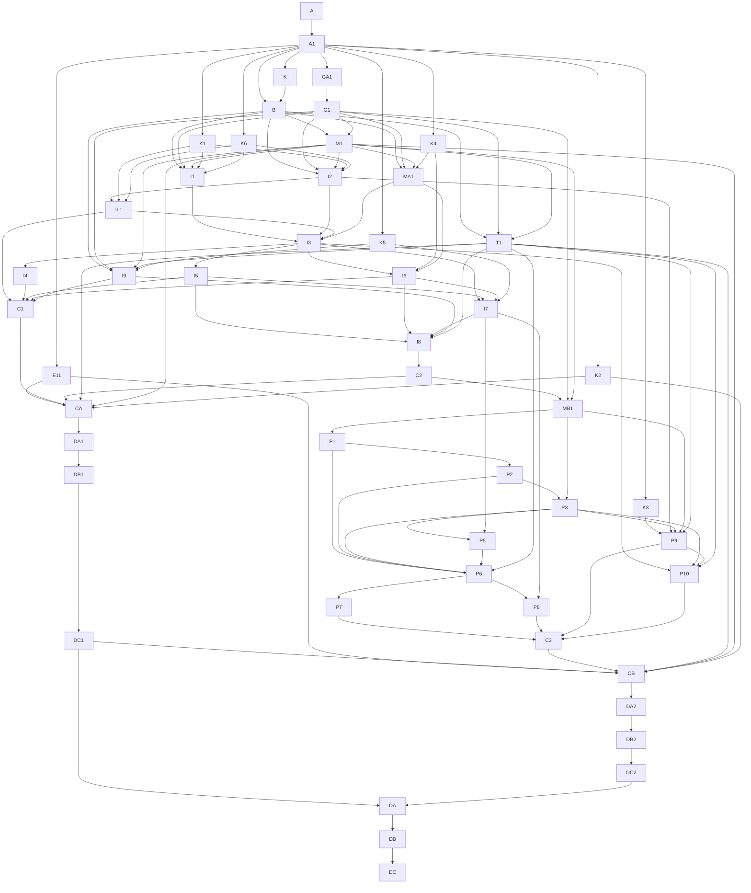

# 第一阶段权威与依赖拓扑

## 输入一致性

| Promised behavior | Input location | Owning model/field | API or workflow entry | Permission/state authority | Conclusion | Action | Blocking decision node |
| --- | --- | --- | --- | --- | --- | --- | --- |
| Revision 11 正式状态 | /Users/vsiyo/Library/Mobile Documents/iCloud~md~obsidian/Documents/日记/公共开发集/media/2026-08-07/media-visual-fix/agents-results/2026-08-07/media-cb-web-document-preview/ssot-development-paths.md | canonical D3A | E11 自动投影 | 原 SSOT | 当前未接受 | E11 绑定状态、候选和证据哈希，再硬阻塞 CA/CB | n/a |
| 统一登录选择个人或组织 | 当前用户决定与源码事实 | 工作区意图 | I1 与 I2 并行 | 服务端认证绑定 | 个人不用飞书且平台认证合同已接受 | 按 K6 实现双认证意图 | K1/K6 已接受 |
| 个人账号完整生命周期 | 当前用户决定与现有注册服务事实 | 待验证账号、邮箱验证、找回令牌和服务端会话 | I1/I2/T1 | K6 决定与服务端账号状态 | 当前注册成功直接签发会话，不符合目标 | 按 K6 改为先验证后登录，并补齐统一找回与全部会话撤销 | K6 已接受 |
| 一个用户多工作区 | /Users/vsiyo/Library/Mobile Documents/iCloud~md~obsidian/Documents/日记/公共开发集/public/2026-08-15/media-c-b-product-fact-audit/media-c-b-login-document-organization-audit.md | Membership、Binding 与 ExplicitIdentityLink | IL1/I3 | 服务端 Session | 当前会话字段和显式关联均不足 | 按 K6 显式绑定后生成 SessionPrincipal v2 | K/K6 已接受 |
| 按组织 Binding 读取资源 | /Users/vsiyo/Library/Mobile Documents/iCloud~md~obsidian/Documents/日记/公共开发集/public/2026-08-15/media-c-b-product-fact-audit/media-c-b-login-document-organization-audit.md | Binding 与资源 | I7 | 服务端解析器 | 当前路径依赖全局凭据 | 只保留发现、镜像、同步和打开，排除人工智能写入 | K5 已接受 |
| 组织自助接入 | /Users/vsiyo/Library/Mobile Documents/iCloud~md~obsidian/Documents/日记/公共开发集/public/2026-08-15/media-c-b-product-fact-audit/media-c-b-login-document-organization-audit.md | 组织接入状态与回执 | P1-P3/P5-P10 | 安装事件、管理员流程、成员首次授权和失效 | 只有试点脚本 | 试点后形成含即时接入与最小失效的发布增量 1B | K3 已接受 |
| 完整组织目录 | /Users/vsiyo/.codex/attachments/7ebe320f-6551-4294-8d1c-2b452a9b6b2b/pasted-text.txt | Stage 1C 交接 | 后续独立发布 | 不在本自动调度图 | 不是 1A/1B 必需 | 只保留交接；P9 即时建立，P10 提供最小失效 | K3 已接受 |

## 权威登记

| Claim/domain | Declared authority path | Authority layer | Lookup method | Change required | Owning node | Validation |
| --- | --- | --- | --- | --- | --- | --- |
| 第一阶段新增合同与编排 | .ssot/manifest.json 及其 nodes/edges | decision/orchestration | 机器校验 | 是 | B-CA-DC2 | check_ssot_program.py |
| Revision 11 D1-D3A 合同、调度、状态和证据 | /Users/vsiyo/Library/Mobile Documents/iCloud~md~obsidian/Documents/日记/公共开发集/media/2026-08-07/media-visual-fix/agents-results/2026-08-07/media-cb-web-document-preview/ssot-development-paths.md | domain-contract | E11 只读 D3A | 否；本包无执行节点 | E11 | canonical D3A 正式回执 |
| 当前产品和代码事实 | /Users/vsiyo/Library/Mobile Documents/iCloud~md~obsidian/Documents/日记/公共开发集/public/2026-08-15/media-c-b-product-fact-audit/media-c-b-login-document-organization-audit.md | runtime-evidence | 来源路径与审计证据定位 | 否 | A1 | 文件哈希和后续源码读回 |
| 稳定产品决定 | /Users/vsiyo/.codex/attachments/63a93708-8bfe-43ce-8dc7-cb079775f3b0/pasted-text.txt | domain-contract | 用户附件和事实审计 | 已汇编到 K | K | 决定记录第 2 版 |
| 局部产品决定 | .ssot/nodes/K1.json 至 .ssot/nodes/K6.json | decision/orchestration | 读取用户选择、日期、范围和存量处理 | K1-K6 全部已接受 | K1-K6 | 决定状态与批准记录核对 |
| 第 4 版结构修正 | /Users/vsiyo/.codex/attachments/7ebe320f-6551-4294-8d1c-2b452a9b6b2b/pasted-text.txt | research/hypothesis | 校验值与逐项合同映射 | 是 | A/E11/GA1/MA1/MB1/I9/P10 | 机器图与负例门禁 |
| 账号与工作区共享本地候选证据 | agents-results/2026-08-13/media-production-e2e-closure | runtime-evidence | 按候选、结果和验证日志校验值只读引用 | 否 | IL1/I3/C1 | 只复用已证明的唯一关系与工作区失败关闭；不提升节点状态 |
| 生成 Markdown | .ssot/view-sources/*.md -> renderer | execution-record | manifest 哈希绑定 | 自动生成 | A | render --check |

生成的主文档只是读取视图，不是第二套权威。第 11 次修订（Revision 11）在本机器依赖图（DAG）中没有执行节点；外部门（E11）是零写入自动投影，并通过真实硬边约束候选汇合节点（CA）与候选汇合节点（CB）。

## 不确定性路由

| Uncertainty | Class | Destination | Owner | Blocking scope | Resolution evidence |
| --- | --- | --- | --- | --- | --- |
| 真实外部与生产身份尚未登记 | execution-blocker | I8/DB1/DB2 节点身份台账 | runtime acceptance owner | 只阻塞外部测试与生产动作 | 真实账号、租户、批准窗口和同收据证据 |
| 真实飞书试点身份和验收账号 | execution-blocker | I8/DB1/DB2 身份台账 | runtime acceptance owner | 只阻塞外部与生产动作 | 同收据外部系统证据 |
| Revision 11 D3A 尚未接受 | evidence-gap | canonical D3A 证据目录 | canonical owner | 只阻塞 CA 与 CB 晋升 | canonical D3A ACCEPTED |

## 文本拓扑图（ASCII 拓扑图）

```text
A -> A1 -> K -> B
     |      \-> K1..K6 (accepted) -> I1/I2 -> IL1 -> I3
     |-> GA1 (manual, zero Codex) -> G1 (deterministic profile verification) -> M1/T1
     \-> E11 (automatic canonical D3A projection) --------------------+

B/G1/M1/K4 -> MA1 -> I3/I6 -> I4/I5/I7/I9 -> C1/I8 -> C2
E11 + C1 + C2 + T1 + M1 + K2 -> CA (deterministic rebuild) -> DA1 -> DB1 -> DC1
C2/G1/M1 -> MB1 -> P1 -> P2 -> P3 -> P5/P6 -> P7/P8
K3 + I2 + P3 + MB1 + T1 -> P9 -> P10 -> C3
E11 + DC1 + C3 + T1 + M1 + K2 -> CB (deterministic rebuild) -> DA2 -> DB2 -> DC2
DC1 + DC2 -> DA -> DB -> DC (automatic projections, zero Codex)
Stage 1C directory maturity: handoff only; outside this DAG
```

## 依赖图（Mermaid）



## 语义节点登记

| Task ID | Semantic key | Work kind | Domain lane | Execution state | Decision state | Decision version | Readiness mode | Hard dependencies | Soft dependencies | Assumptions | Decision refs | Invalidation keys | Write authority | Acceptance authority |
| --- | --- | --- | --- | --- | --- | --- | --- | --- | --- | --- | --- | --- | --- | --- |
| A | media.stage1.charter | charter | governance | ACCEPTED | NOT_APPLICABLE | n/a | FORMAL | n/a | n/a | n/a | n/a | media.stage1.charter.v5 | authoritative-contract | user and planning authority |
| A1 | media.stage1.source-baseline | fact-discovery | source-facts | ACCEPTED | NOT_APPLICABLE | n/a | FORMAL | A | n/a | n/a | n/a | media.stage1.source-baseline.v5 | evidence-only | main orchestrator |
| K | media.stage1.stable-decisions | decision-acceptance | product-contract | ACCEPTED | ACCEPTED | 2 | FORMAL | A1 | n/a | n/a | n/a | media.stage1.stable-decisions.v5 | authoritative-contract | user |
| K1 | media.stage1.decision.personal-auth | decision-acceptance | product-decision | ACCEPTED | ACCEPTED | 1 | FORMAL | A1 | n/a | n/a | n/a | media.stage1.decision.personal-auth.v5 | authoritative-contract | user |
| K2 | media.stage1.decision.release-controls | decision-acceptance | product-decision | ACCEPTED | ACCEPTED | 1 | FORMAL | A1 | n/a | n/a | n/a | media.stage1.decision.release-controls.v5 | authoritative-contract | user |
| K3 | media.stage1.decision.member-onboarding | decision-acceptance | product-decision | ACCEPTED | ACCEPTED | 1 | FORMAL | A1 | n/a | n/a | n/a | media.stage1.decision.member-onboarding.v5 | authoritative-contract | user |
| K4 | media.stage1.decision.recent-activity-ownership | decision-acceptance | product-decision | ACCEPTED | ACCEPTED | 2 | FORMAL | A1 | n/a | n/a | n/a | media.stage1.decision.recent-activity-ownership.v5 | authoritative-contract | user |
| K5 | media.stage1.decision.writer-boundary | decision-acceptance | product-decision | ACCEPTED | ACCEPTED | 2 | FORMAL | A1 | n/a | n/a | n/a | media.stage1.decision.writer-boundary.v5 | authoritative-contract | user |
| K6 | media.stage1.decision.personal-auth-contract | decision-acceptance | product-decision | ACCEPTED | ACCEPTED | 1 | FORMAL | A1 | n/a | n/a | media.stage1.decision.personal-auth@1 | media.stage1.decision.personal-auth-contract.v5 | authoritative-contract | user |
| B | media.stage1.contract-assembly | contract-assembly | new-candidates | ACCEPTED | NOT_APPLICABLE | n/a | FORMAL | A1, K | n/a | n/a | n/a | media.stage1.contract-assembly.v5 | authoritative-contract | main orchestrator |
| GA1 | media.stage1.runner-profile-bootstrap | foundation | execution-governance | ACCEPTED | NOT_APPLICABLE | n/a | FORMAL | A1 | n/a | n/a | n/a | media.stage1.runner-profile-bootstrap.v5 | authoritative-contract | execution environment owner |
| G1 | media.stage1.runner-capability-gate | foundation | execution-governance | ACCEPTED | NOT_APPLICABLE | n/a | FORMAL | GA1 | n/a | n/a | n/a | media.stage1.runner-capability-gate.v5 | authoritative-contract | execution environment owner |
| E11 | media.external.revision11-d3a | external-prerequisite | revision11 | BLOCKED | NOT_APPLICABLE | n/a | FORMAL | A1 | n/a | n/a | n/a | media.external.revision11-d3a.v5 | evidence-only | canonical acceptance owner |
| M1 | media.stage1.no-git-merge-protocol | implementation | candidate-build | ACCEPTED | NOT_APPLICABLE | n/a | FORMAL | B, G1 | n/a | n/a | media.stage1.stable-decisions@2 | media.stage1.no-git-merge-protocol.v5 | implementation | main orchestrator |
| MA1 | media.stage1.release1a-migration-owner | data-change | release-1a-data | VERIFIED | NOT_APPLICABLE | n/a | FORMAL | B, G1, K4, M1 | n/a | n/a | media.stage1.stable-decisions@2 | media.stage1.release1a-migration-owner.v5 | implementation | main orchestrator |
| T1 | media.stage1.acceptance-harness | acceptance-design | shared-contracts | VERIFIED | NOT_APPLICABLE | n/a | FORMAL | B, G1, M1 | n/a | n/a | media.stage1.stable-decisions@2, media.stage1.decision.personal-auth-contract@1 | media.stage1.acceptance-harness.v5 | implementation | main orchestrator |
| I1 | media.stage1.unified-login | implementation | identity | VERIFIED | NOT_APPLICABLE | n/a | FORMAL | B, G1, K1, K6, M1 | n/a | n/a | media.stage1.stable-decisions@2, media.stage1.decision.personal-auth@1, media.stage1.decision.personal-auth-contract@1 | media.stage1.unified-login.v5 | implementation | main orchestrator |
| I2 | media.stage1.auth-intent-binding | implementation | identity-security | VERIFIED | NOT_APPLICABLE | n/a | FORMAL | B, G1, K1, K6, M1 | n/a | n/a | media.stage1.stable-decisions@2, media.stage1.decision.personal-auth@1, media.stage1.decision.personal-auth-contract@1 | media.stage1.auth-intent-binding.v5 | implementation | main orchestrator |
| IL1 | media.stage1.explicit-identity-link | implementation | identity-security | BLOCKED | NOT_APPLICABLE | n/a | FORMAL | I2, K1, K6 | n/a | n/a | media.stage1.decision.personal-auth@1, media.stage1.decision.personal-auth-contract@1 | media.stage1.explicit-identity-link.v5 | implementation | main orchestrator |
| I3 | media.stage1.session-workspace-resolution | contract-compile | session | BLOCKED | NOT_APPLICABLE | n/a | FORMAL | I1, I2, IL1, MA1 | n/a | n/a | media.stage1.stable-decisions@2 | media.stage1.session-workspace-resolution.v5 | implementation | main orchestrator |
| I4 | media.stage1.personal-workspace-shell | implementation | frontend-personal | BLOCKED | NOT_APPLICABLE | n/a | FORMAL | I3 | n/a | n/a | media.stage1.stable-decisions@2 | media.stage1.personal-workspace-shell.v5 | implementation | main orchestrator |
| I5 | media.stage1.organization-workspace-shell | verification-remediation | frontend-organization | BLOCKED | NOT_APPLICABLE | n/a | FORMAL | I3 | n/a | n/a | media.stage1.stable-decisions@2 | media.stage1.organization-workspace-shell.v5 | implementation | main orchestrator |
| I6 | media.stage1.authorization-guards | implementation | authorization | BLOCKED | NOT_APPLICABLE | n/a | FORMAL | I3, K4, MA1 | n/a | n/a | media.stage1.stable-decisions@2, media.stage1.decision.recent-activity-ownership@2 | media.stage1.authorization-guards.v5 | implementation | main orchestrator |
| I7 | media.stage1.binding-resource-resolver | implementation | binding-runtime | BLOCKED | NOT_APPLICABLE | n/a | FORMAL | I3, I5, I6, K5 | n/a | n/a | media.stage1.stable-decisions@2, media.stage1.decision.writer-boundary@2 | media.stage1.binding-resource-resolver.v5 | implementation | main orchestrator |
| I9 | media.stage1.writer-fail-closed | implementation | writer-boundary | BLOCKED | NOT_APPLICABLE | n/a | FORMAL | B, G1, K5, M1, T1 | n/a | n/a | media.stage1.stable-decisions@2, media.stage1.decision.writer-boundary@2 | media.stage1.writer-fail-closed.v5 | implementation | main orchestrator |
| I8 | media.stage1.pilot-organization-e2e | frozen-acceptance | pilot | BLOCKED | NOT_APPLICABLE | n/a | FORMAL | I5, I6, I7, I9, T1 | n/a | n/a | n/a | media.stage1.pilot-organization-e2e.v5 | isolated-record | runtime acceptance owner |
| C1 | media.stage1.identity-convergence | convergence | identity | BLOCKED | NOT_APPLICABLE | n/a | FORMAL | I4, I5, I6, I9, IL1 | n/a | n/a | n/a | media.stage1.identity-convergence.v5 | shared-generated | main orchestrator |
| C2 | media.stage1.pilot-convergence | convergence | pilot | BLOCKED | NOT_APPLICABLE | n/a | FORMAL | I8 | n/a | n/a | n/a | media.stage1.pilot-convergence.v5 | evidence-only | independent acceptance owner |
| CA | media.stage1.release1a-candidate | convergence | release-1a | BLOCKED | NOT_APPLICABLE | n/a | FORMAL | C1, C2, E11, K2, M1, T1 | n/a | n/a | n/a | media.stage1.release1a-candidate.v5 | shared-generated | main orchestrator |
| DA1 | media.stage1.release1a-static | validation | release-1a | BLOCKED | NOT_APPLICABLE | n/a | FORMAL | CA | n/a | n/a | n/a | media.stage1.release1a-static.v5 | evidence-only | main orchestrator |
| DB1 | media.stage1.release1a-production | validation | release-1a | BLOCKED | NOT_APPLICABLE | n/a | FORMAL | DA1 | n/a | n/a | n/a | media.stage1.release1a-production.v5 | evidence-only | runtime acceptance owner |
| DC1 | media.stage1.release1a-final | release-decision | release-1a | BLOCKED | NOT_APPLICABLE | n/a | FORMAL | DB1 | n/a | n/a | n/a | media.stage1.release1a-final.v5 | evidence-only | independent acceptance owner |
| MB1 | media.stage1.release1b-migration-owner | data-change | release-1b-data | BLOCKED | NOT_APPLICABLE | n/a | FORMAL | C2, G1, M1 | n/a | n/a | media.stage1.stable-decisions@2 | media.stage1.release1b-migration-owner.v5 | implementation | main orchestrator |
| P1 | media.stage1.provision-model | data-change | provision-data | BLOCKED | NOT_APPLICABLE | n/a | FORMAL | MB1 | n/a | n/a | media.stage1.stable-decisions@2 | media.stage1.provision-model.v5 | implementation | main orchestrator |
| P2 | media.stage1.install-event-lifecycle | implementation | provision-events | BLOCKED | NOT_APPLICABLE | n/a | FORMAL | P1 | n/a | n/a | media.stage1.stable-decisions@2 | media.stage1.install-event-lifecycle.v5 | implementation | main orchestrator |
| P3 | media.stage1.admin-confirmation-owner | implementation | provision-admin | BLOCKED | NOT_APPLICABLE | n/a | FORMAL | MB1, P2 | n/a | n/a | media.stage1.stable-decisions@2 | media.stage1.admin-confirmation-owner.v5 | implementation | main orchestrator |
| P5 | media.stage1.resource-initialization | implementation | provision-resources | BLOCKED | NOT_APPLICABLE | n/a | FORMAL | I7, P3 | n/a | n/a | media.stage1.stable-decisions@2 | media.stage1.resource-initialization.v5 | implementation | main orchestrator |
| P6 | media.stage1.provision-orchestrator | implementation | provision-runtime | BLOCKED | NOT_APPLICABLE | n/a | FORMAL | P1, P2, P3, P5, T1 | n/a | n/a | media.stage1.stable-decisions@2 | media.stage1.provision-orchestrator.v5 | implementation | main orchestrator |
| P7 | media.stage1.provision-status-recovery | implementation | provision-ux | BLOCKED | NOT_APPLICABLE | n/a | FORMAL | P6 | n/a | n/a | media.stage1.stable-decisions@2 | media.stage1.provision-status-recovery.v5 | implementation | main orchestrator |
| P8 | media.stage1.deprovision-minimum | implementation | provision-reverse | BLOCKED | NOT_APPLICABLE | n/a | FORMAL | I7, P6 | n/a | n/a | media.stage1.stable-decisions@2 | media.stage1.deprovision-minimum.v5 | implementation | main orchestrator |
| P9 | media.stage1.just-in-time-member-onboarding | implementation | provision-member | BLOCKED | NOT_APPLICABLE | n/a | FORMAL | I2, K3, MB1, P3, T1 | n/a | n/a | media.stage1.stable-decisions@2, media.stage1.decision.member-onboarding@1 | media.stage1.just-in-time-member-onboarding.v5 | implementation | main orchestrator |
| P10 | media.stage1.member-invalidation | implementation | provision-member-security | BLOCKED | NOT_APPLICABLE | n/a | FORMAL | I3, P3, P9, T1 | n/a | n/a | media.stage1.stable-decisions@2 | media.stage1.member-invalidation.v5 | implementation | main orchestrator |
| C3 | media.stage1.provision-convergence | convergence | provision | BLOCKED | NOT_APPLICABLE | n/a | FORMAL | P10, P7, P8, P9 | n/a | n/a | n/a | media.stage1.provision-convergence.v5 | shared-generated | main orchestrator |
| CB | media.stage1.release1b-candidate | convergence | release-1b | BLOCKED | NOT_APPLICABLE | n/a | FORMAL | C3, DC1, E11, K2, M1, T1 | n/a | n/a | n/a | media.stage1.release1b-candidate.v5 | shared-generated | main orchestrator |
| DA2 | media.stage1.release1b-static | validation | release-1b | BLOCKED | NOT_APPLICABLE | n/a | FORMAL | CB | n/a | n/a | n/a | media.stage1.release1b-static.v5 | evidence-only | main orchestrator |
| DB2 | media.stage1.release1b-production | validation | release-1b | BLOCKED | NOT_APPLICABLE | n/a | FORMAL | DA2 | n/a | n/a | n/a | media.stage1.release1b-production.v5 | evidence-only | runtime acceptance owner |
| DC2 | media.stage1.release1b-final | release-decision | release-1b | BLOCKED | NOT_APPLICABLE | n/a | FORMAL | DB2 | n/a | n/a | n/a | media.stage1.release1b-final.v5 | evidence-only | independent acceptance owner |
| DA | media.stage1.macro-static-projection | validation | macro-projection | BLOCKED | NOT_APPLICABLE | n/a | FORMAL | DC1, DC2 | n/a | n/a | n/a | media.stage1.macro-static-projection.v5 | evidence-only | main orchestrator |
| DB | media.stage1.macro-regression-projection | validation | macro-projection | BLOCKED | NOT_APPLICABLE | n/a | FORMAL | DA | n/a | n/a | n/a | media.stage1.macro-regression-projection.v5 | evidence-only | main orchestrator |
| DC | media.stage1.macro-final-projection | release-decision | macro-projection | BLOCKED | NOT_APPLICABLE | n/a | FORMAL | DB | n/a | n/a | n/a | media.stage1.macro-final-projection.v5 | evidence-only | independent acceptance owner |

## 依赖边登记

| From | To | Dependency type | Dependency scope | Required upstream state | Assumption IDs | Invalidation keys | Transferred input | Gate/evidence |
| --- | --- | --- | --- | --- | --- | --- | --- | --- |
| A | A1 | hard | specific-output | ACCEPTED | n/a | edge.a.a1.v5 | 第一阶段第 4 版编排边界 | 第一阶段形成 1A 和 1B 两个独立候选 |
| A1 | K | hard | specific-output | ACCEPTED | n/a | edge.a1.k.v5 | 可复现的来源与能力基线 | Revision 11 仅由 canonical 管理；五类运行配置尚未被证明 |
| A1 | K1 | hard | specific-output | ACCEPTED | n/a | edge.a1.k1.v5 | 可复现的来源与能力基线 | Revision 11 仅由 canonical 管理；五类运行配置尚未被证明 |
| A1 | K2 | hard | specific-output | ACCEPTED | n/a | edge.a1.k2.v5 | 可复现的来源与能力基线 | Revision 11 仅由 canonical 管理；五类运行配置尚未被证明 |
| A1 | K3 | hard | specific-output | ACCEPTED | n/a | edge.a1.k3.v5 | 可复现的来源与能力基线 | Revision 11 仅由 canonical 管理；五类运行配置尚未被证明 |
| A1 | K4 | hard | specific-output | ACCEPTED | n/a | edge.a1.k4.v5 | 可复现的来源与能力基线 | Revision 11 仅由 canonical 管理；五类运行配置尚未被证明 |
| A1 | K5 | hard | specific-output | ACCEPTED | n/a | edge.a1.k5.v5 | 可复现的来源与能力基线 | Revision 11 仅由 canonical 管理；五类运行配置尚未被证明 |
| A1 | K6 | hard | specific-output | ACCEPTED | n/a | edge.a1.k6.v5 | 可复现的来源与能力基线 | Revision 11 仅由 canonical 管理；五类运行配置尚未被证明 |
| A1 | GA1 | hard | specific-output | ACCEPTED | n/a | edge.a1.ga1.v5 | 可复现的来源与能力基线 | Revision 11 仅由 canonical 管理；五类运行配置尚未被证明 |
| A1 | E11 | hard | specific-output | ACCEPTED | n/a | edge.a1.e11.v5 | 可复现的来源与能力基线 | Revision 11 仅由 canonical 管理；五类运行配置尚未被证明 |
| A1 | B | hard | specific-output | ACCEPTED | n/a | edge.a1.b.v5 | 可复现的来源与能力基线 | Revision 11 仅由 canonical 管理；五类运行配置尚未被证明 |
| K | B | hard | specific-output | ACCEPTED | n/a | edge.k.b.v5 | 稳定决定记录第 2 版 | 只冻结已有明确证据的决定 |
| GA1 | G1 | hard | specific-output | ACCEPTED | n/a | edge.ga1.g1.v5 | 五类配置定位与权限声明回执 | 每类配置都有可定位身份，且人工初始化本身不依赖任一配置 |
| B | M1 | hard | specific-output | ACCEPTED | n/a | edge.b.m1.v5 | 1A 与 1B 的共享合同身份 | 不消费 R11，也不把局部决定扩散成全局失效 |
| G1 | M1 | hard | specific-output | ACCEPTED | n/a | edge.g1.m1.v5 | 五类配置能力回执 | 五种配置均有真实启动命令、能力边界和失败关闭证据 |
| B | T1 | hard | specific-output | ACCEPTED | n/a | edge.b.t1.v5 | 1A 与 1B 的共享合同身份 | 不消费 R11，也不把局部决定扩散成全局失效 |
| G1 | T1 | hard | specific-output | ACCEPTED | n/a | edge.g1.t1.v5 | 五类配置能力回执 | 五种配置均有真实启动命令、能力边界和失败关闭证据 |
| M1 | T1 | hard | specific-output | ACCEPTED | n/a | edge.m1.t1.v5 | 可执行候选重建工具与清单 schema | CA 必须以 E11 候选为 promotion_base，CB 必须以 DC1 候选为 promotion_base；冲突、过期、遗漏或不安全输入均失败关闭 |
| B | MA1 | hard | specific-output | ACCEPTED | n/a | edge.b.ma1.v5 | 1A 与 1B 的共享合同身份 | 不消费 R11，也不把局部决定扩散成全局失效 |
| G1 | MA1 | hard | specific-output | ACCEPTED | n/a | edge.g1.ma1.v5 | 五类配置能力回执 | 五种配置均有真实启动命令、能力边界和失败关闭证据 |
| M1 | MA1 | hard | specific-output | ACCEPTED | n/a | edge.m1.ma1.v5 | 可执行候选重建工具与清单 schema | CA 必须以 E11 候选为 promotion_base，CB 必须以 DC1 候选为 promotion_base；冲突、过期、遗漏或不安全输入均失败关闭 |
| K4 | MA1 | hard | specific-output | ACCEPTED | n/a | edge.k4.ma1.v5 | 数据归属决定第 2 版 | 可证明归属则回填；冲突进入隔离待处置；完全无证据则对所有租户不可见 |
| B | I1 | hard | specific-output | ACCEPTED | n/a | edge.b.i1.v5 | 1A 与 1B 的共享合同身份 | 不消费 R11，也不把局部决定扩散成全局失效 |
| B | I2 | hard | specific-output | ACCEPTED | n/a | edge.b.i2.v5 | 1A 与 1B 的共享合同身份 | 不消费 R11，也不把局部决定扩散成全局失效 |
| G1 | I1 | hard | specific-output | ACCEPTED | n/a | edge.g1.i1.v5 | 五类配置能力回执 | 五种配置均有真实启动命令、能力边界和失败关闭证据 |
| G1 | I2 | hard | specific-output | ACCEPTED | n/a | edge.g1.i2.v5 | 五类配置能力回执 | 五种配置均有真实启动命令、能力边界和失败关闭证据 |
| M1 | I1 | hard | specific-output | ACCEPTED | n/a | edge.m1.i1.v5 | 可执行候选重建工具与清单 schema | CA 必须以 E11 候选为 promotion_base，CB 必须以 DC1 候选为 promotion_base；冲突、过期、遗漏或不安全输入均失败关闭 |
| M1 | I2 | hard | specific-output | ACCEPTED | n/a | edge.m1.i2.v5 | 可执行候选重建工具与清单 schema | CA 必须以 E11 候选为 promotion_base，CB 必须以 DC1 候选为 promotion_base；冲突、过期、遗漏或不安全输入均失败关闭 |
| K1 | I1 | hard | specific-output | ACCEPTED | n/a | edge.k1.i1.v5 | 个人认证决定第 1 版 | 个人路径不调用飞书且不自动按邮箱或姓名合并身份 |
| K1 | I2 | hard | specific-output | ACCEPTED | n/a | edge.k1.i2.v5 | 个人认证决定第 1 版 | 个人路径不调用飞书且不自动按邮箱或姓名合并身份 |
| K6 | I1 | hard | specific-output | ACCEPTED | n/a | edge.k6.i1.v5 | 个人认证具体决定第 1 版 | 注册和验证成功均不自动登录；重置密码后撤销全部旧会话和未使用找回令牌；新合同不恢复旧 Media 密码接口，不按邮箱或姓名自动合并身份 |
| K6 | I2 | hard | specific-output | ACCEPTED | n/a | edge.k6.i2.v5 | 个人认证具体决定第 1 版 | 注册和验证成功均不自动登录；重置密码后撤销全部旧会话和未使用找回令牌；新合同不恢复旧 Media 密码接口，不按邮箱或姓名自动合并身份 |
| I2 | IL1 | hard | specific-output | ACCEPTED | n/a | edge.i2.il1.v5 | 个人认证生命周期与可验证的组织意图收据 | 浏览器不能自行激活账号、选择租户或改变认证权威；找回请求不泄露账号是否存在，注册和验证不自动登录，密码重置后所有旧会话和未使用找回令牌失效 |
| K1 | IL1 | hard | specific-output | ACCEPTED | n/a | edge.k1.il1.v5 | 个人认证决定第 1 版 | 个人路径不调用飞书且不自动按邮箱或姓名合并身份 |
| K6 | IL1 | hard | specific-output | ACCEPTED | n/a | edge.k6.il1.v5 | 个人认证具体决定第 1 版 | 注册和验证成功均不自动登录；重置密码后撤销全部旧会话和未使用找回令牌；新合同不恢复旧 Media 密码接口，不按邮箱或姓名自动合并身份 |
| I1 | I3 | hard | specific-output | ACCEPTED | n/a | edge.i1.i3.v5 | 可访问且边界明确的统一认证界面 | 个人分支不调用飞书，组织分支不暴露平台注册或密码找回，所有返回地址必须是站内允许目标 |
| I2 | I3 | hard | specific-output | ACCEPTED | n/a | edge.i2.i3.v5 | 个人认证生命周期与可验证的组织意图收据 | 浏览器不能自行激活账号、选择租户或改变认证权威；找回请求不泄露账号是否存在，注册和验证不自动登录，密码重置后所有旧会话和未使用找回令牌失效 |
| IL1 | I3 | hard | specific-output | ACCEPTED | n/a | edge.il1.i3.v5 | ExplicitIdentityLink 与审计回执 | 只有当前已认证用户的显式操作可建立关联 |
| MA1 | I3 | hard | specific-output | ACCEPTED | n/a | edge.ma1.i3.v5 | Release 1A 前向迁移与回读合同 | 可证明归属则回填；冲突进入 quarantine/NEEDS_ATTENTION；完全无证据则对所有租户不可见 |
| I3 | I4 | hard | specific-output | ACCEPTED | n/a | edge.i3.i4.v5 | 可信会话和工作区候选集合 | 不持久化永久 user_type |
| I3 | I5 | hard | specific-output | ACCEPTED | n/a | edge.i3.i5.v5 | 可信会话和工作区候选集合 | 不持久化永久 user_type |
| I3 | I6 | hard | specific-output | ACCEPTED | n/a | edge.i3.i6.v5 | 可信会话和工作区候选集合 | 不持久化永久 user_type |
| K4 | I6 | hard | specific-output | ACCEPTED | n/a | edge.k4.i6.v5 | 数据归属决定第 2 版 | 可证明归属则回填；冲突进入隔离待处置；完全无证据则对所有租户不可见 |
| MA1 | I6 | hard | specific-output | ACCEPTED | n/a | edge.ma1.i6.v5 | Release 1A 前向迁移与回读合同 | 可证明归属则回填；冲突进入 quarantine/NEEDS_ATTENTION；完全无证据则对所有租户不可见 |
| I3 | I7 | hard | specific-output | ACCEPTED | n/a | edge.i3.i7.v5 | 可信会话和工作区候选集合 | 不持久化永久 user_type |
| I5 | I7 | hard | specific-output | ACCEPTED | n/a | edge.i5.i7.v5 | OrganizationWorkspaceShell | 页面不从前端 tenantId 或平台管理员推断权限 |
| I6 | I7 | hard | specific-output | ACCEPTED | n/a | edge.i6.i7.v5 | 服务端授权与审计日志 | 近期活动与其他私有资料使用同一租户边界 |
| K5 | I7 | hard | specific-output | ACCEPTED | n/a | edge.k5.i7.v5 | 阶段所有权决定第 2 版 | 第一阶段不得创建或更新人工智能文档，也不得保留可调用的全局凭据写入路径 |
| B | I9 | hard | specific-output | ACCEPTED | n/a | edge.b.i9.v5 | 1A 与 1B 的共享合同身份 | 不消费 R11，也不把局部决定扩散成全局失效 |
| G1 | I9 | hard | specific-output | ACCEPTED | n/a | edge.g1.i9.v5 | 五类配置能力回执 | 五种配置均有真实启动命令、能力边界和失败关闭证据 |
| M1 | I9 | hard | specific-output | ACCEPTED | n/a | edge.m1.i9.v5 | 可执行候选重建工具与清单 schema | CA 必须以 E11 候选为 promotion_base，CB 必须以 DC1 候选为 promotion_base；冲突、过期、遗漏或不安全输入均失败关闭 |
| T1 | I9 | hard | specific-output | ACCEPTED | n/a | edge.t1.i9.v5 | 保护测试与人工验收矩阵 | 每个稳定失败类有红绿门禁 |
| K5 | I9 | hard | specific-output | ACCEPTED | n/a | edge.k5.i9.v5 | 阶段所有权决定第 2 版 | 第一阶段不得创建或更新人工智能文档，也不得保留可调用的全局凭据写入路径 |
| IL1 | C1 | hard | specific-output | ACCEPTED | n/a | edge.il1.c1.v5 | ExplicitIdentityLink 与审计回执 | 只有当前已认证用户的显式操作可建立关联 |
| I4 | C1 | hard | specific-output | ACCEPTED | n/a | edge.i4.c1.v5 | PersonalWorkspaceShell | 个人路径不进入组织资源或飞书文档 |
| I5 | C1 | hard | specific-output | ACCEPTED | n/a | edge.i5.c1.v5 | OrganizationWorkspaceShell | 页面不从前端 tenantId 或平台管理员推断权限 |
| I6 | C1 | hard | specific-output | ACCEPTED | n/a | edge.i6.c1.v5 | 服务端授权与审计日志 | 近期活动与其他私有资料使用同一租户边界 |
| I9 | C1 | hard | specific-output | ACCEPTED | n/a | edge.i9.c1.v5 | 稳定关闭态与错误合同 | 统一返回 capability_unavailable_until_writer_migration，且外部写入调用数为零 |
| I5 | I8 | hard | specific-output | ACCEPTED | n/a | edge.i5.i8.v5 | OrganizationWorkspaceShell | 页面不从前端 tenantId 或平台管理员推断权限 |
| I6 | I8 | hard | specific-output | ACCEPTED | n/a | edge.i6.i8.v5 | 服务端授权与审计日志 | 近期活动与其他私有资料使用同一租户边界 |
| I7 | I8 | hard | specific-output | ACCEPTED | n/a | edge.i7.i8.v5 | BindingResourceResolver | 本节点不接入任何人工智能 Writer |
| I9 | I8 | hard | specific-output | ACCEPTED | n/a | edge.i9.i8.v5 | 稳定关闭态与错误合同 | 统一返回 capability_unavailable_until_writer_migration，且外部写入调用数为零 |
| T1 | I8 | hard | specific-output | ACCEPTED | n/a | edge.t1.i8.v5 | 保护测试与人工验收矩阵 | 每个稳定失败类有红绿门禁 |
| I8 | C2 | hard | specific-output | ACCEPTED | n/a | edge.i8.c2.v5 | 同收据 Pilot 外部证据 | 同一组织、Binding、资源和候选闭环 |
| E11 | CA | hard | specific-output | ACCEPTED | n/a | edge.e11.ca.v5 | E11 外部门回执 | 只有 canonical D3A ACCEPTED 才投影为 ACCEPTED |
| C1 | CA | hard | specific-output | ACCEPTED | n/a | edge.c1.ca.v5 | 身份工作区子候选 | 个人与组织可信分流及负例通过 |
| C2 | CA | hard | specific-output | ACCEPTED | n/a | edge.c2.ca.v5 | Pilot 子候选 | Pilot 正负例绑定同一候选 |
| T1 | CA | hard | specific-output | ACCEPTED | n/a | edge.t1.ca.v5 | 保护测试与人工验收矩阵 | 每个稳定失败类有红绿门禁 |
| M1 | CA | hard | specific-output | ACCEPTED | n/a | edge.m1.ca.v5 | 可执行候选重建工具与清单 schema | CA 必须以 E11 候选为 promotion_base，CB 必须以 DC1 候选为 promotion_base；冲突、过期、遗漏或不安全输入均失败关闭 |
| K2 | CA | hard | specific-output | ACCEPTED | n/a | edge.k2.ca.v5 | 发布控制决定第 1 版 | 不保留白名单、灰度、长期功能开关或双路径 |
| CA | DA1 | hard | global-completeness | ACCEPTED | n/a | edge.ca.da1.v5 | 哈希绑定的 Release 1A 候选 | R11 只在候选晋升时成为硬门；不得继续使用 development_base 直接晋升 |
| DA1 | DB1 | hard | global-completeness | ACCEPTED | n/a | edge.da1.db1.v5 | Release 1A 静态证据包 | 全部门禁对同一候选通过 |
| DB1 | DC1 | hard | global-completeness | ACCEPTED | n/a | edge.db1.dc1.v5 | Release 1A 生产同收据证据 | 不声称跨数据库与飞书原子回滚 |
| C2 | MB1 | hard | specific-output | ACCEPTED | n/a | edge.c2.mb1.v5 | Pilot 子候选 | Pilot 正负例绑定同一候选 |
| G1 | MB1 | hard | specific-output | ACCEPTED | n/a | edge.g1.mb1.v5 | 五类配置能力回执 | 五种配置均有真实启动命令、能力边界和失败关闭证据 |
| M1 | MB1 | hard | specific-output | ACCEPTED | n/a | edge.m1.mb1.v5 | 可执行候选重建工具与清单 schema | CA 必须以 E11 候选为 promotion_base，CB 必须以 DC1 候选为 promotion_base；冲突、过期、遗漏或不安全输入均失败关闭 |
| MB1 | P1 | hard | specific-output | ACCEPTED | n/a | edge.mb1.p1.v5 | Release 1B 前向迁移与回读合同 | 1B 迁移不占用或改写 MA1 的 1A 编号范围 |
| P1 | P2 | hard | specific-output | ACCEPTED | n/a | edge.p1.p2.v5 | Provision 模型 | 覆盖 ACTIVE、NEEDS_ATTENTION、DISABLED 和 REVOKED |
| P2 | P3 | hard | specific-output | ACCEPTED | n/a | edge.p2.p3.v5 | 事件服务与幂等回执 | 事件只影响匹配安装身份 |
| MB1 | P3 | hard | specific-output | ACCEPTED | n/a | edge.mb1.p3.v5 | Release 1B 前向迁移与回读合同 | 1B 迁移不占用或改写 MA1 的 1A 编号范围 |
| P3 | P5 | hard | specific-output | ACCEPTED | n/a | edge.p3.p5.v5 | 管理员授权、owner 与外部身份回执 | 只有匹配组织管理员可确认；唯一约束至少为 (binding_id, open_id) |
| I7 | P5 | hard | specific-output | ACCEPTED | n/a | edge.i7.p5.v5 | BindingResourceResolver | 本节点不接入任何人工智能 Writer |
| P1 | P6 | hard | specific-output | ACCEPTED | n/a | edge.p1.p6.v5 | Provision 模型 | 覆盖 ACTIVE、NEEDS_ATTENTION、DISABLED 和 REVOKED |
| P2 | P6 | hard | specific-output | ACCEPTED | n/a | edge.p2.p6.v5 | 事件服务与幂等回执 | 事件只影响匹配安装身份 |
| P3 | P6 | hard | specific-output | ACCEPTED | n/a | edge.p3.p6.v5 | 管理员授权、owner 与外部身份回执 | 只有匹配组织管理员可确认；唯一约束至少为 (binding_id, open_id) |
| P5 | P6 | hard | specific-output | ACCEPTED | n/a | edge.p5.p6.v5 | 资源步骤和 Binding 更新 | 每项资源都回读并绑定当前安装 |
| T1 | P6 | hard | specific-output | ACCEPTED | n/a | edge.t1.p6.v5 | 保护测试与人工验收矩阵 | 每个稳定失败类有红绿门禁 |
| P6 | P7 | hard | specific-output | ACCEPTED | n/a | edge.p6.p7.v5 | 持久化 Provision runner 与步骤回执 | 刷新或重启后从回读步骤续接 |
| P6 | P8 | hard | specific-output | ACCEPTED | n/a | edge.p6.p8.v5 | 持久化 Provision runner 与步骤回执 | 刷新或重启后从回读步骤续接 |
| I7 | P8 | hard | specific-output | ACCEPTED | n/a | edge.i7.p8.v5 | BindingResourceResolver | 本节点不接入任何人工智能 Writer |
| K3 | P9 | hard | specific-output | ACCEPTED | n/a | edge.k3.p9.v5 | 成员接入决定第 1 版 | 前端不得提交或覆盖 open_id，完整目录同步不进入 1B 完成门 |
| I2 | P9 | hard | specific-output | ACCEPTED | n/a | edge.i2.p9.v5 | 个人认证生命周期与可验证的组织意图收据 | 浏览器不能自行激活账号、选择租户或改变认证权威；找回请求不泄露账号是否存在，注册和验证不自动登录，密码重置后所有旧会话和未使用找回令牌失效 |
| P3 | P9 | hard | specific-output | ACCEPTED | n/a | edge.p3.p9.v5 | 管理员授权、owner 与外部身份回执 | 只有匹配组织管理员可确认；唯一约束至少为 (binding_id, open_id) |
| MB1 | P9 | hard | specific-output | ACCEPTED | n/a | edge.mb1.p9.v5 | Release 1B 前向迁移与回读合同 | 1B 迁移不占用或改写 MA1 的 1A 编号范围 |
| T1 | P9 | hard | specific-output | ACCEPTED | n/a | edge.t1.p9.v5 | 保护测试与人工验收矩阵 | 每个稳定失败类有红绿门禁 |
| I3 | P10 | hard | specific-output | ACCEPTED | n/a | edge.i3.p10.v5 | 可信会话和工作区候选集合 | 不持久化永久 user_type |
| P3 | P10 | hard | specific-output | ACCEPTED | n/a | edge.p3.p10.v5 | 管理员授权、owner 与外部身份回执 | 只有匹配组织管理员可确认；唯一约束至少为 (binding_id, open_id) |
| P9 | P10 | hard | specific-output | ACCEPTED | n/a | edge.p9.p10.v5 | 即时成员接入服务与回执 | 唯一外部成员字段是服务端 open_id，数据库唯一约束至少为 (binding_id, open_id) |
| T1 | P10 | hard | specific-output | ACCEPTED | n/a | edge.t1.p10.v5 | 保护测试与人工验收矩阵 | 每个稳定失败类有红绿门禁 |
| P7 | C3 | hard | specific-output | ACCEPTED | n/a | edge.p7.c3.v5 | 状态与恢复界面 | 部分成功不得显示为 ACTIVE |
| P8 | C3 | hard | specific-output | ACCEPTED | n/a | edge.p8.c3.v5 | DISABLED 或 REVOKED 回执 | 撤销后不能再访问或写入 |
| P9 | C3 | hard | specific-output | ACCEPTED | n/a | edge.p9.c3.v5 | 即时成员接入服务与回执 | 唯一外部成员字段是服务端 open_id，数据库唯一约束至少为 (binding_id, open_id) |
| P10 | C3 | hard | specific-output | ACCEPTED | n/a | edge.p10.c3.v5 | 成员停用服务与会话撤销回执 | disabled 成员的已有会话立即失效，且不能通过旧 token 刷新 |
| E11 | CB | hard | specific-output | ACCEPTED | n/a | edge.e11.cb.v5 | E11 外部门回执 | 只有 canonical D3A ACCEPTED 才投影为 ACCEPTED |
| DC1 | CB | hard | specific-output | ACCEPTED | n/a | edge.dc1.cb.v5 | Release 1A 独立结论 | 全部 1A 完成条件成立 |
| C3 | CB | hard | specific-output | ACCEPTED | n/a | edge.c3.cb.v5 | Provision 子候选 | 新组织 owner 可自助接入，普通成员可首次授权进入且可被安全停用 |
| T1 | CB | hard | specific-output | ACCEPTED | n/a | edge.t1.cb.v5 | 保护测试与人工验收矩阵 | 每个稳定失败类有红绿门禁 |
| M1 | CB | hard | specific-output | ACCEPTED | n/a | edge.m1.cb.v5 | 可执行候选重建工具与清单 schema | CA 必须以 E11 候选为 promotion_base，CB 必须以 DC1 候选为 promotion_base；冲突、过期、遗漏或不安全输入均失败关闭 |
| K2 | CB | hard | specific-output | ACCEPTED | n/a | edge.k2.cb.v5 | 发布控制决定第 1 版 | 不保留白名单、灰度、长期功能开关或双路径 |
| CB | DA2 | hard | global-completeness | ACCEPTED | n/a | edge.cb.da2.v5 | 哈希绑定的 Release 1B 候选 | 不得绕过 DC1、E11 或带入 Stage 1C 目录成熟化 |
| DA2 | DB2 | hard | global-completeness | ACCEPTED | n/a | edge.da2.db2.v5 | Release 1B 静态证据包 | 全部门禁对同一候选通过 |
| DB2 | DC2 | hard | global-completeness | ACCEPTED | n/a | edge.db2.dc2.v5 | Release 1B 生产同收据证据 | 不声称跨系统原子回滚 |
| DC1 | DA | hard | global-completeness | ACCEPTED | n/a | edge.dc1.da.v5 | Release 1A 独立结论 | 全部 1A 完成条件成立 |
| DC2 | DA | hard | global-completeness | ACCEPTED | n/a | edge.dc2.da.v5 | Release 1B 独立结论 | 1A 与 1B 必需完成条件全部成立 |
| DA | DB | hard | global-completeness | ACCEPTED | n/a | edge.da.db.v5 | 宏观阶段静态汇总记录 | 只汇总既有结论，不重跑或阻塞 1A、1B 发布 |
| DB | DC | hard | global-completeness | ACCEPTED | n/a | edge.db.dc.v5 | 宏观阶段回归汇总记录 | 不产生新的生产或外部系统动作 |
