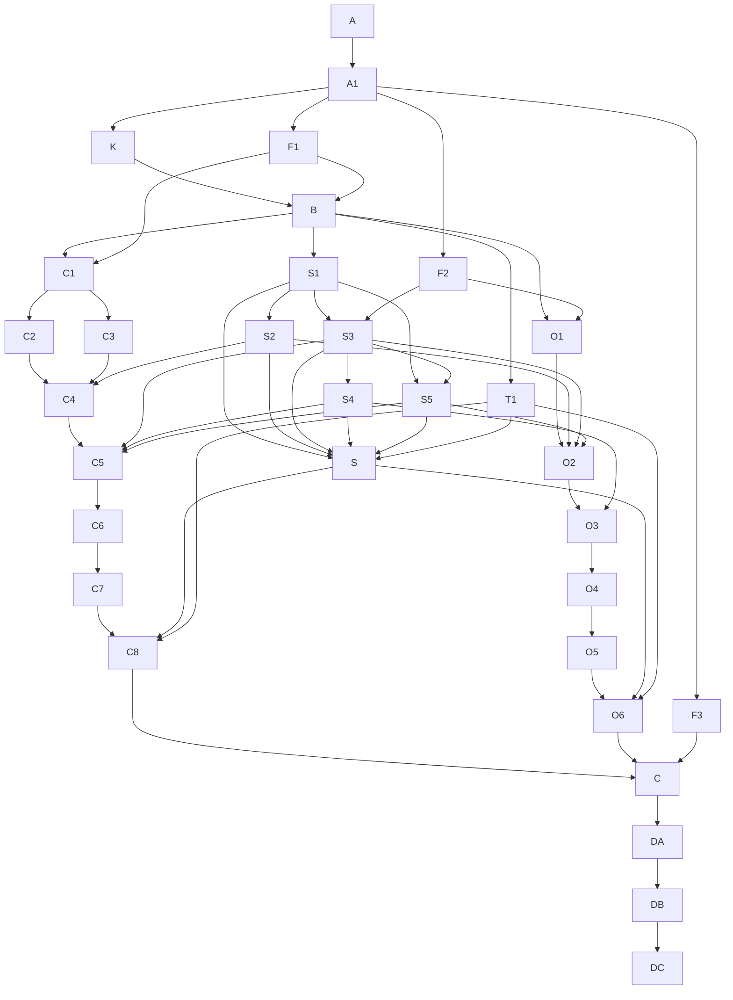

# 第二阶段权威与依赖拓扑

## 输入一致性

| Promised behavior | Input location | Owning model/field | API or workflow entry | Permission/state authority | Conclusion | Action | Blocking decision node |
| --- | --- | --- | --- | --- | --- | --- | --- |
| 个人可信会话、工作区与旧写入器关闭态 | /private/tmp/openclaw-media-live/agents-results/2026-08-15/media-c-b-stage-1-identity-and-organization-onboarding/ssot-development-paths.md | 第一阶段 C1 与 I9 | F1/B/C1 | 第一阶段机器节点 | 当前 BLOCKED | 只投影正式状态、候选身份和 I9 关闭回执 | F1 |
| 组织 Binding 与 Provision | /private/tmp/openclaw-media-live/agents-results/2026-08-15/media-c-b-stage-1-identity-and-organization-onboarding/ssot-development-paths.md | 第一阶段 C3 | F2/O1/S3 | 第一阶段机器节点 | 当前 BLOCKED | 只投影正式状态并约束第二阶段写入路由 | F2 |
| 第一阶段必需交付完成 | /private/tmp/openclaw-media-live/agents-results/2026-08-15/media-c-b-stage-1-identity-and-organization-onboarding/ssot-development-paths.md | 第一阶段 DC2 | F3/C | 第一阶段机器节点 | 当前 BLOCKED | 禁止提前组装候选 | F3 |
| 个人 Web 正文闭环 | /Users/vsiyo/.codex/attachments/63a93708-8bfe-43ce-8dc7-cb079775f3b0/pasted-text.txt | 个人成果与修订 | C1-C8 | 服务端会话和内部成果 | 范围已接受 | 第二阶段实现 | K 已接受 |
| 人工智能文档写入所有权 | /private/tmp/openclaw-media-live/agents-results/2026-08-15/media-c-b-stage-1-identity-and-organization-onboarding/.ssot/nodes/K5.json; /private/tmp/openclaw-media-live/agents-results/2026-08-15/media-c-b-stage-1-identity-and-organization-onboarding/.ssot/nodes/I9.json | 第一阶段 I7 排除写入且 I9 建立关闭态，第二阶段拥有唯一写入路由 | F1/F2/S3/C5/O2 | 两阶段机器节点与写入合同 | 第一阶段 K5 已接受，I9 仍阻塞 | F1 与 F2 接受后才允许 S3 正式执行 | 第一阶段 K5/I9 |
| 组织飞书正文闭环 | /Users/vsiyo/Library/Mobile Documents/iCloud~md~obsidian/Documents/日记/公共开发集/public/2026-08-15/media-c-b-product-fact-audit/media-c-b-login-document-organization-audit.md | Binding、飞书文档与镜像 | O1-O6 | 服务端 Binding | 主路径仍有全局凭据风险 | 按 Binding 切到唯一写入路由 | K 已接受 |
| 近期活动租户隔离 | /Users/vsiyo/Library/Mobile Documents/iCloud~md~obsidian/Documents/日记/公共开发集/public/2026-08-15/media-c-b-product-fact-audit/media-c-b-login-document-organization-audit.md | 资料所有者与租户范围 | S2/O1 | 服务端授权守卫 | 存在全表读取问题 | 上下文验收前关闭 | K 已接受 |
| 组织经营与商业化 | /Users/vsiyo/.codex/attachments/63a93708-8bfe-43ce-8dc7-cb079775f3b0/pasted-text.txt | 未来第三阶段 | 本阶段无入口 | 未来独立 SSOT | 明确排除 | 不生成节点 | n/a |

## 资料检索与档案类型定义

资料检索固定为四路：素材源（`02A_SourceAssets`）、素材拆解（`02B_MaterialDeconstructions`）、创作模式（`02C_CreativePatterns`）和商务机会（`05B_BusinessOpportunities`）；每一路都按当前租户、资料所有者和正典编号过滤。近期活动（`01_近期活动`）仅作为配置 URL 的全表读取例外，必须在上下文验收前关闭；创作者资料（`06_CreatorProfiles`）只提供账号上下文，不是正文资料路由。系统输出的真实档案只有三类：外部研究简报（`ExternalResearchBrief` / `external_research_brief`）、商务简报（`CommercialBrief` / `commercial_brief`）和创作决策简报（`DecisionBrief` / `creation_decision_brief`）。

## 权威登记

| Claim/domain | Declared authority path | Authority layer | Lookup method | Change required | Owning node | Validation |
| --- | --- | --- | --- | --- | --- | --- |
| 第二阶段决定与编排 | .ssot/manifest.json 及 nodes/edges | decision/orchestration | 机器校验 | 是 | A-DC | check_ssot_program.py |
| 第一阶段 C1/C3/DC2 正式状态 | /private/tmp/openclaw-media-live/agents-results/2026-08-15/media-c-b-stage-1-identity-and-organization-onboarding/.ssot/manifest.json | decision/orchestration | 按哈希读取上游节点 | 否；只同步投影 | F1-F3 | 上游 ACCEPTED 回执 |
| 当前产品和源码事实 | /Users/vsiyo/Library/Mobile Documents/iCloud~md~obsidian/Documents/日记/公共开发集/public/2026-08-15/media-c-b-product-fact-audit/media-c-b-login-document-organization-audit.md | runtime-evidence | 来源路径和事实审计 | 否 | A1/S2/O2 | 文件哈希与实现时源码读回 |
| 三阶段拆分与第二阶段边界 | /Users/vsiyo/.codex/attachments/63a93708-8bfe-43ce-8dc7-cb079775f3b0/pasted-text.txt | domain-contract | 用户附件和本次指令 | 已汇编到 K | K | 决定记录第 5 版 |
| 两个发布增量与写入所有权修正 | /Users/vsiyo/.codex/attachments/61fef357-7ee9-4a1a-a348-06db749a7466/pasted-text.txt | domain-contract | 用户提供的结构修正 | 已汇编到 K 与 F2/S3 | K/F2/S3 | 决定记录第 5 版与上游投影 |
| 第一阶段第 4 版结构复核 | /Users/vsiyo/.codex/attachments/7ebe320f-6551-4294-8d1c-2b452a9b6b2b/pasted-text.txt | research/hypothesis | 校验值与逐项合同映射 | 已同步上游哈希、I9 关闭态和五类运行配置 | A1/F1/S3/DA/DC | 机器源与跨阶段负例 |
| 第一阶段旧写入器关闭合同 | /private/tmp/openclaw-media-live/agents-results/2026-08-15/media-c-b-stage-1-identity-and-organization-onboarding/.ssot/nodes/I9.json | decision/orchestration | 按哈希读取上游节点 | 否；只通过 F1 投影消费 | F1/S3 | I9 与 C1 同候选 ACCEPTED 回执 |
| 人工智能上下文与写入合同 | 待 B/S1/S3 在真实源码仓冻结的唯一合同 | domain-contract | OpenAPI、类型和保护测试 | 是 | B/S1/S3/T1 | 合同生成与漂移门禁 |
| 会话路由清单与登录入口状态合同 | 会话 `media_web_business_pages_v3` 承载 routeGrants 漂移检测；登录前 `GET /openclaw/auth/entry-state?mode=` 只承载四态入口检查 | domain-contract | 会话/OpenAPI、服务端、客户端类型和真实会话矩阵；登录探针不得泄露授权事实 | 是 | B/S1/T1/C6 | 会话严格结构、路由清单漂移、登录探针脱敏与数据/动作越权负例 |
| 字体资源与弱网主路径 | index.media.html、src/media.verify.html、mediaDesignTokens.css、media.auth.css | domain-contract | 字体资源清单、构建产物和 Playwright 弱网证据 | 是 | C6/T1/DA | Google Fonts 拦截、字重和布局回归 |
| 生成 Markdown | .ssot/view-sources/*.md -> renderer | execution-record | manifest 哈希绑定 | 自动生成 | A | render --check |

生成的 Markdown 只是读取视图，不是第二套编排权威。第一阶段状态必须先在其机器节点中正式迁移，本文件的 F1-F3 才能同步；本包只读取第一阶段 K5 决定和 I9 关闭合同，不重复拥有或改写它们。

## 修订台账

| Revision | Deviation level | Reason | Changed versions | Affected nodes | Invalidated acceptance/evidence | Nodes to rerun | Approving authority | Timestamp |
| --- | --- | --- | --- | --- | --- | --- | --- | --- |
| 7 | L2 | 接受 studioOrdinaryRoutes + studioTrackRoutes 两组机器路由全量向个人人格开放，并冻结个人会话、租户、所有者作用域与组织能力隔离边界 | PLAN_VERSION 5; DAG_VERSION 5; INTERFACE_FREEZE_VERSION 5; NODE_CONTRACT_VERSION 5; PRODUCT_DECISION_VERSION 4 | A/A1/K/F1/F2/F3/B-S5/C1-C8/O1-O6/S/C/DA/DB/DC | 旧候选分支与测试数量引用；机器源进度视图漂移；会话授权与视觉资源边界待补充 | 重建全部机器分片、执行合同、规划编译记录和生成视图并复验；保留正式节点门禁和普通 IA 产品问题 | main orchestrator under user-requested cross-stage synchronization | 2026-08-30 |
| 8 | L2 | 依据已核验源码裁决 routeGrants 保留为会话内漂移检测，登录入口状态保持预登录探针，并登记历史执行、交互基线与人工验收工作区 | PRODUCT_DECISION_VERSION 5；PLAN/DAG/INTERFACE_FREEZE/NODE_CONTRACT 版本轴保持 5 | K/B/S1/T1/C6/O1/O5/DB/DA/DC | 第 4 版会话载体与入口授权表述失效；历史执行仅绑定既有源码提交，不能外推到当前 HEAD | 重建全部机器分片、执行合同、规划编译记录和生成视图；B 重签会话 v3，收敛路由清单生成源并补齐登录探针 OpenAPI/客户端类型 | user-approved K v5 adjudication | 2026-09-01T15:20:00+08:00 |

## 不确定性路由

| Uncertainty | Class | Destination | Owner | Blocking scope | Resolution evidence |
| --- | --- | --- | --- | --- | --- |
| 项目根目录没有 Git 元数据 | discoverable-fact | source-notes.md 非 Git 文件哈希基线 | main orchestrator | 只影响本地来源版本表达 | 十二项输入文件校验值 |
| 机器源 .ssot/implementation-progress.md 曾与已发布进度视图脱同步 | discoverable-fact | .ssot/view-sources/40-progress.md 与顶层 implementation-progress.md 同源重建 | orchestrator | 只影响生成视图一致性，不改变正式节点状态 | build_ssot.py 写入三份相同进度内容并由 render --check 校验 |
| 第一阶段 C1、C3、DC2 未接受 | execution-blocker | F1、F2、F3 跨阶段投影 | stage1 acceptance owners | 按三条投影局部阻塞 | 上游节点 ACCEPTED 及候选哈希 |
| 真实个人、飞书组织和验收账号 | execution-blocker | O5/DB 受控身份台账 | runtime acceptance owner | 只阻塞真实外部动作及下游 | 同收据外部系统证据 |
| 现有能力清单与生产源码位置 | discoverable-fact | B/S5 实现前有界查找 | contract owner | 不改变已接受产品决定 | 源码、OpenAPI 和注册表读回 |
| 第二阶段产品选择 | none | K 决定记录与第一阶段已接受决定；studioOrdinaryRoutes + studioTrackRoutes 两组机器路由全量向个人人格开放 | user | 不重复拥有第一阶段决定；路由动作仍需按个人会话、租户、所有者作用域实现 | K ACCEPTED / route allowlist ACCEPTED |

## ASCII 拓扑图

```text
A -> A1
A1 -> K
A1 -> F1
A1 -> F2
A1 -> F3
K -> B
F1 -> B
B -> S1
S1 -> S2
S1 -> S3
F2 -> S3
S1 -> S5
S3 -> S4
S3 -> S5
B -> T1
S1 -> S
S2 -> S
S3 -> S
S4 -> S
S5 -> S
T1 -> S
B -> C1
F1 -> C1
C1 -> C2
C1 -> C3
C2 -> C4
C3 -> C4
S2 -> C4
C4 -> C5
S3 -> C5
S4 -> C5
S5 -> C5
C5 -> C6
C6 -> C7
C7 -> C8
S -> C8
T1 -> C8
B -> O1
F2 -> O1
O1 -> O2
S2 -> O2
S3 -> O2
S5 -> O2
O2 -> O3
S4 -> O3
O3 -> O4
O4 -> O5
O5 -> O6
S -> O6
T1 -> O6
C8 -> C
O6 -> C
F3 -> C
C -> DA
DA -> DB
DB -> DC
```

## Mermaid 依赖图



## 语义节点登记

| Task ID | Semantic key | Work kind | Domain lane | Execution state | Decision state | Decision version | Readiness mode | Hard dependencies | Soft dependencies | Assumptions | Decision refs | Invalidation keys | Write authority | Acceptance authority |
| --- | --- | --- | --- | --- | --- | --- | --- | --- | --- | --- | --- | --- | --- | --- |
| A | media.stage2.charter | charter | governance | ACCEPTED | NOT_APPLICABLE | n/a | FORMAL | n/a | n/a | n/a | n/a | consumer.charter.phase-boundary, file-summary.charter.scope, consumer.a.surface.sha256-e7a5fbe90a0da6448a4ab0c82e221b30dc3f9030ad0b5665361372030ec37c97 | authoritative-contract | user and planning authority |
| A1 | media.stage2.source-baseline | fact-discovery | source-facts | ACCEPTED | NOT_APPLICABLE | n/a | FORMAL | A | n/a | n/a | n/a | consumer.source-baseline.upstream-state, file-summary.source-baseline.inputs, consumer.a1.surface.sha256-5623b60110971d15fc742c737ec4b9c63f73214d8bcaeee7e4c5d88a8286bb91 | evidence-only | main orchestrator |
| K | media.stage2.product-decisions | decision-acceptance | product-contract | ACCEPTED | ACCEPTED | 5 | FORMAL | A1 | n/a | n/a | n/a | consumer.product-decisions.session-envelope.route-grants, consumer.product-decisions.entry-state.contract, consumer.product-decisions.writer-authority, file-summary.product-decisions.accepted-shards, consumer.k.surface.sha256-c3813b27686b80a4955a7befce9e7bec713bcf099565694086cb1711c54adb6a | authoritative-contract | user |
| F1 | media.stage2.gate.stage1-identity | validation | cross-stage | BLOCKED | NOT_APPLICABLE | n/a | FORMAL | A1 | n/a | n/a | n/a | consumer.stage1-identity.projection, file-summary.stage1-c1-i9-receipt, consumer.f1.surface.sha256-824f45c0ee85cd89731705d9baa1835a2c309b84e80b3514e1777ab009d7a7a0 | evidence-only | cross-stage projection owner |
| F2 | media.stage2.gate.stage1-provision | validation | cross-stage | BLOCKED | NOT_APPLICABLE | n/a | FORMAL | A1 | n/a | n/a | n/a | consumer.stage1-provision.binding-projection, file-summary.stage1-c3-receipt, consumer.f2.surface.sha256-17e6980acb85fa779306a8a0a68981ca8d6ebb51de1cc8fae689fabd01947d52 | evidence-only | cross-stage projection owner |
| F3 | media.stage2.gate.stage1-final | validation | cross-stage | BLOCKED | NOT_APPLICABLE | n/a | FORMAL | A1 | n/a | n/a | n/a | consumer.stage1-final.candidate-identity, file-summary.stage1-dc2-receipt, consumer.f3.surface.sha256-75f4963659df6c614fa271b2226965390d360a79a72b4a1ea1fa689d34a8e212 | evidence-only | independent acceptance owner |
| B | media.stage2.contract-assembly | contract-assembly | shared-contracts | BLOCKED | NOT_APPLICABLE | n/a | FORMAL | F1, K | n/a | n/a | media.stage2.product-decisions@5 | consumer.shared-contracts.openapi-and-types, consumer.shared-contracts.error-state, file-summary.shared-contract-freeze, consumer.b.surface.sha256-dd7c53affba4b3255a3d964140c9ce64b8ed832dac0e345690ffe7c03a1c4a78 | authoritative-contract | main orchestrator |
| S1 | media.stage2.ai-execution-context | contract-compile | shared-ai | BLOCKED | NOT_APPLICABLE | n/a | FORMAL | B | n/a | n/a | media.stage2.product-decisions@5 | consumer.ai-context.server-fields, consumer.ai-context.membership-binding, file-summary.ai-execution-context, consumer.s1.surface.sha256-6530ee02678e354e0d06ac4458c03b4e3115896e03dd91cdfadce7ac7634c02d | implementation | main orchestrator |
| S2 | media.stage2.context-routing | implementation | shared-ai | BLOCKED | NOT_APPLICABLE | n/a | FORMAL | S1 | n/a | n/a | media.stage2.product-decisions@5 | consumer.context-routing.tenant-scope, consumer.context-routing.source-owner, file-summary.context-routing, consumer.s2.surface.sha256-feae255c0d42313fda5926d578a07ff7c96f5281333ffaa0e4160995b38206cc | implementation | main orchestrator |
| S3 | media.stage2.writer-routing | contract-compile | shared-writer | BLOCKED | NOT_APPLICABLE | n/a | FORMAL | F2, S1 | n/a | n/a | media.stage2.product-decisions@5 | consumer.writer-routing.authority, consumer.writer-routing.fail-closed-cutover, file-summary.writer-router, consumer.s3.surface.sha256-5ac682b13888640edfd57702318c000fea718568f530b7aab0676dfe8f0d1ce1 | implementation | main orchestrator |
| S4 | media.stage2.artifact-record-readback | implementation | shared-artifact | BLOCKED | NOT_APPLICABLE | n/a | FORMAL | S3 | n/a | n/a | media.stage2.product-decisions@5 | consumer.artifact-record.readback-state, consumer.artifact-record.idempotency, file-summary.artifact-recorder, consumer.s4.surface.sha256-d6d5cae4c212ba463bc27c16437f9bbb12dea6a0eb9b7aa1dd573b1e6af2e78b | implementation | main orchestrator |
| S5 | media.stage2.capability-side-effects | implementation | shared-capability | BLOCKED | NOT_APPLICABLE | n/a | FORMAL | S1, S3 | n/a | n/a | media.stage2.product-decisions@5 | consumer.capability-side-effects.registry, consumer.capability-side-effects.read-write, file-summary.capability-registry, consumer.s5.surface.sha256-30d96cd1d8807754f91acd9a01f5fe52eb6e9ffbdec256c8d03cf8f7d82fa4ca | implementation | main orchestrator |
| T1 | media.stage2.shared-acceptance-harness | acceptance-design | shared-contracts | BLOCKED | NOT_APPLICABLE | n/a | FORMAL | B | n/a | n/a | media.stage2.product-decisions@5 | consumer.acceptance-harness.protected-contracts, consumer.acceptance-harness.negative-cases, file-summary.acceptance-matrix, consumer.t1.surface.sha256-24f9765c16802e570fc36a2a7ed2c3a60170bf03fc5687c975c7769a9d5c572f | implementation | main orchestrator |
| C1 | media.stage2.personal-source-scope | implementation | personal-content | BLOCKED | NOT_APPLICABLE | n/a | FORMAL | B, F1 | n/a | n/a | media.stage2.product-decisions@5 | consumer.personal-scope.tenant-owner, consumer.personal-scope.source-receipts, file-summary.personal-source-scope, consumer.c1.surface.sha256-538930350b606e04f8786f008442ccc2c50e8f95decd7b047b0f23d210a6366c | implementation | main orchestrator |
| C2 | media.stage2.personal-research-brief | implementation | personal-content | BLOCKED | NOT_APPLICABLE | n/a | FORMAL | C1 | n/a | n/a | media.stage2.product-decisions@5 | consumer.personal-research.source-citations, consumer.personal-research.tenant-scope, file-summary.personal-research-brief, consumer.c2.surface.sha256-806d549c60949e24068bb9ed2fe7c9b0b9104ffd2bcb38530e09c96f11bdf5a9 | implementation | main orchestrator |
| C3 | media.stage2.personal-decision-brief | implementation | personal-content | BLOCKED | NOT_APPLICABLE | n/a | FORMAL | C1 | n/a | n/a | media.stage2.product-decisions@5 | consumer.personal-decision.manual-confirmation, consumer.personal-decision.platform-constraints, file-summary.personal-decision-brief, consumer.c3.surface.sha256-d4508e457d978adf0a627d782346cd3edf5c8ee53344cc2ba0242eaab571b194 | implementation | main orchestrator |
| C4 | media.stage2.personal-context-builder | implementation | personal-ai | BLOCKED | NOT_APPLICABLE | n/a | FORMAL | C2, C3, S2 | n/a | n/a | media.stage2.product-decisions@5 | consumer.personal-context.body-authority, consumer.personal-context.source-set, file-summary.personal-context-builder, consumer.c4.surface.sha256-d1e0eb105ba201c28f980328f0371988adf84706a37a134fb8f885ab4d21aab2 | implementation | main orchestrator |
| C5 | media.stage2.personal-internal-writer | implementation | personal-writer | BLOCKED | NOT_APPLICABLE | n/a | FORMAL | C4, S3, S4, S5 | n/a | n/a | media.stage2.product-decisions@5 | consumer.personal-writer.internal-artifact, consumer.personal-writer.feishu-zero-write, file-summary.personal-internal-writer, consumer.c5.surface.sha256-113d570b6fb23efc58d98ffab89f9344a474f39f05bdddaa90be34247f51756f | implementation | main orchestrator |
| C6 | media.stage2.personal-web-revision | implementation | personal-editor | BLOCKED | NOT_APPLICABLE | n/a | FORMAL | C5 | n/a | n/a | media.stage2.product-decisions@5 | consumer.personal-editor.revision-baseline, consumer.personal-editor.conflict-state, file-summary.personal-web-revision, consumer.c6.surface.sha256-7ed253e8355fea6ced5d71c34a0cb5fb8c6e66b8eefa2b60f1c9575bdb5e25b7 | implementation | main orchestrator |
| C7 | media.stage2.personal-version-export | implementation | personal-publish | BLOCKED | NOT_APPLICABLE | n/a | FORMAL | C6 | n/a | n/a | media.stage2.product-decisions@5 | consumer.personal-publish.revision-input, consumer.personal-publish.platform-fields, file-summary.personal-version-export, consumer.c7.surface.sha256-41e269df2bd95d74fb651d9b131ea84349f606251e54f5b251c90395b2e6e2d7 | implementation | main orchestrator |
| C8 | media.stage2.personal-e2e | convergence | personal-content | BLOCKED | NOT_APPLICABLE | n/a | FORMAL | C7, S, T1 | n/a | n/a | media.stage2.product-decisions@5 | consumer.personal-e2e.candidate-inputs, file-summary.personal-e2e-receipt, consumer.c8.surface.sha256-bf24cea5efb6f15599323137d111e551fedc967f033c59c82e4f7ddd116c41b5 | shared-generated | main orchestrator |
| O1 | media.stage2.organization-source-scope | implementation | organization-content | BLOCKED | NOT_APPLICABLE | n/a | FORMAL | B, F2 | n/a | n/a | media.stage2.product-decisions@5 | consumer.organization-scope.binding, consumer.organization-scope.tenant-materials, file-summary.organization-source-scope, consumer.o1.surface.sha256-13400a377bd9e4ac2f9eca29b2bbaab0bf980f8c925c20b9ac554a6f7c75910a | implementation | main orchestrator |
| O2 | media.stage2.organization-lark-writer | implementation | organization-writer | BLOCKED | NOT_APPLICABLE | n/a | FORMAL | O1, S2, S3, S5 | n/a | n/a | media.stage2.product-decisions@5 | consumer.organization-writer.binding-credentials, consumer.organization-writer.parent-node, file-summary.organization-lark-writer, consumer.o2.surface.sha256-5989d236496b848effd318f41f47cf5d1eb62d013306bb048bafd1673b134103 | implementation | main orchestrator |
| O3 | media.stage2.organization-artifact-binding | implementation | organization-artifact | BLOCKED | NOT_APPLICABLE | n/a | FORMAL | O2, S4 | n/a | n/a | media.stage2.product-decisions@5 | consumer.organization-artifact.remote-binding, consumer.organization-artifact.idempotency, file-summary.organization-artifact-binding, consumer.o3.surface.sha256-e7948fd59ef2d20e812024eb1aed59d9f12016cf00bb4a3ea1b95a365c6496a2 | implementation | main orchestrator |
| O4 | media.stage2.organization-readback | implementation | organization-readback | BLOCKED | NOT_APPLICABLE | n/a | FORMAL | O3 | n/a | n/a | media.stage2.product-decisions@5 | consumer.organization-readback.binding-version, consumer.organization-readback.mirror, file-summary.organization-readback, consumer.o4.surface.sha256-15fcf0579c4c43d2f119123f5b9a1603118b78d66aab1b03444ca486af496b10 | implementation | main orchestrator |
| O5 | media.stage2.organization-edit-readback | validation | organization-readback | BLOCKED | NOT_APPLICABLE | n/a | FORMAL | O4 | n/a | n/a | media.stage2.product-decisions@5 | consumer.organization-edit-readback.lark-document, consumer.organization-edit-readback.remote-version, file-summary.organization-edit-readback, consumer.o5.surface.sha256-c5e14992930424c0c8334fb88005dd2c65a03e3604fd0af686e67852d51c4276 | evidence-only | runtime acceptance owner |
| O6 | media.stage2.organization-e2e | convergence | organization-content | BLOCKED | NOT_APPLICABLE | n/a | FORMAL | O5, S, T1 | n/a | n/a | media.stage2.product-decisions@5 | consumer.organization-e2e.candidate-inputs, file-summary.organization-e2e-receipt, consumer.o6.surface.sha256-f58c8e26e200ce906ee31a680a45696505685250a9934c06cdeffdecfb23bad9 | shared-generated | main orchestrator |
| S | media.stage2.shared-convergence | convergence | shared-contracts | BLOCKED | NOT_APPLICABLE | n/a | FORMAL | S1, S2, S3, S4, S5, T1 | n/a | n/a | media.stage2.product-decisions@5 | consumer.shared-e2e.contract-inputs, file-summary.shared-e2e-receipt, consumer.s.surface.sha256-48a7f274337716424294011e21f778e11d54e1d3e3ba0f11bd5a116542fca69a | shared-generated | main orchestrator |
| C | media.stage2.unique-candidate | convergence | release-candidate | BLOCKED | NOT_APPLICABLE | n/a | FORMAL | C8, F3, O6 | n/a | n/a | media.stage2.product-decisions@5 | consumer.release-candidate.identity, consumer.release-candidate.patch-set, file-summary.release-candidate, consumer.c.surface.sha256-4e02da35f3a8e6a7ceed172ec59c69d5a2bcd689a6427e5f713a2b884d146271 | shared-generated | main orchestrator |
| DA | media.stage2.static-release-acceptance | validation | release | BLOCKED | NOT_APPLICABLE | n/a | FORMAL | C | n/a | n/a | media.stage2.product-decisions@5 | consumer.static-acceptance.candidate-files, consumer.static-acceptance.test-baseline, file-summary.static-acceptance, consumer.da.surface.sha256-77ad6492d3a4cdff2db99cbd40fa3c6669b718d6546f1e797c789f7085978415 | evidence-only | main orchestrator |
| DB | media.stage2.external-system-acceptance | validation | release | BLOCKED | NOT_APPLICABLE | n/a | FORMAL | DA | n/a | n/a | media.stage2.product-decisions@5 | consumer.external-acceptance.release-identity, consumer.external-acceptance.database-schema, consumer.external-acceptance.personal-content-store, consumer.external-acceptance.organization-binding, consumer.external-acceptance.lark-document-readback, consumer.external-acceptance.browser-session, consumer.external-acceptance.recovery-contract, file-summary.external-system-acceptance.evidence-receipt, consumer.db.surface.sha256-66e07c31089dc210ab035c7c0a1752ba3b84da6c069cbed86a1382133263f7a4 | evidence-only | runtime acceptance owner |
| DC | media.stage2.independent-release-decision | release-decision | release | BLOCKED | NOT_APPLICABLE | n/a | FORMAL | DB | n/a | n/a | media.stage2.product-decisions@5 | consumer.release-decision.acceptance-evidence, consumer.release-decision.scope-boundary, file-summary.independent-release-decision, consumer.dc.surface.sha256-8e9df751e4383d870c5bba66478fb5291d2f82459ec87ab8df03cab381c9fc51 | evidence-only | independent acceptance owner |

## 依赖边登记

| From | To | Dependency type | Dependency scope | Required upstream state | Assumption IDs | Invalidation keys | Transferred input | Gate/evidence |
| --- | --- | --- | --- | --- | --- | --- | --- | --- |
| A | A1 | hard | specific-output | ACCEPTED | n/a | consumer.a1.input.a, file-summary.edge.a-a1, consumer.a1.input.a.sha256-e00a77ccc6d3cc0d904da118f80575fb58e778f582fbcb6521038fe2e3343bcd | 第二阶段唯一开发编排边界 | 只生成第二阶段，不改写第一阶段也不创建第三阶段 |
| A1 | K | hard | specific-output | ACCEPTED | n/a | consumer.k.input.a1, file-summary.edge.a1-k, consumer.k.input.a1.sha256-f03e1b1c2de5d3c36b5eca641f36f5a1c7c1d65bfca4f388dfde7cbf2848e294 | 可复现的非 Git 来源基线 | 第一阶段 C1、C3、DC2 均未接受 |
| A1 | F1 | hard | specific-output | ACCEPTED | n/a | consumer.f1.input.a1, file-summary.edge.a1-f1, consumer.f1.input.a1.sha256-0c94361cc7f9634e625fa388ee51a2308cbd4e6625c81fdc5cd35ba8f1ad33f7 | 可复现的非 Git 来源基线 | 第一阶段 C1、C3、DC2 均未接受 |
| A1 | F2 | hard | specific-output | ACCEPTED | n/a | consumer.f2.input.a1, file-summary.edge.a1-f2, consumer.f2.input.a1.sha256-9c70c40a41990e409fe8d2d7f0cff16d3df1197e580a18dd896315809677c12e | 可复现的非 Git 来源基线 | 第一阶段 C1、C3、DC2 均未接受 |
| A1 | F3 | hard | specific-output | ACCEPTED | n/a | consumer.f3.input.a1, file-summary.edge.a1-f3, consumer.f3.input.a1.sha256-7822b9e1644e2d6b11912a42586d21c4bc836602d8b041cc6f2b5deb2f0a82f2 | 可复现的非 Git 来源基线 | 第一阶段 C1、C3、DC2 均未接受 |
| K | B | hard | specific-output | ACCEPTED | n/a | consumer.b.input.k, file-summary.edge.k-b, consumer.b.input.k.sha256-34744485ab3f8ec610a20ecfa9369ac81073e39e1b9187b4e7781b479724a69f | 已接受决定记录第 5 版 | 记录实现事实与正式接受状态的证据分层；组织 Binding、飞书写入和组织成员能力不得因个人路由开放而泄漏 |
| F1 | B | hard | specific-output | ACCEPTED | n/a | consumer.b.input.f1, file-summary.edge.f1-b, consumer.b.input.f1.sha256-1aa24d3f7309cf1f8bf71134f1f86e59d60fcdcd250793bd93bccaee9519be72 | 身份汇合跨阶段收据 | 只有第一阶段 C1 ACCEPTED 且 I9 属于同一候选时才可接受本投影 |
| B | S1 | hard | specific-output | ACCEPTED | n/a | consumer.s1.input.b, file-summary.edge.b-s1, consumer.s1.input.b.sha256-cfb90ddb53e0f35fbe8d5afb109c33fb888f868707dc6f07938f92e9022188cc | 共享接口冻结身份 | 不接受前端伪造租户、Binding、正文权威或路由授权 |
| S1 | S2 | hard | specific-output | ACCEPTED | n/a | consumer.s2.input.s1, file-summary.edge.s1-s2, consumer.s2.input.s1.sha256-e36349c369f6605a68eb6ec7bc0b1c4e3751a6e3f09d5982b98dabb826c0ba6a | AIExecutionContext 第 3 版 | 上下文全部由服务端事实生成 |
| S1 | S3 | hard | specific-output | ACCEPTED | n/a | consumer.s3.input.s1, file-summary.edge.s1-s3, consumer.s3.input.s1.sha256-62a1a037fd1c86fce7443420e11217d98ed752dcada5777aea915bf7203c410a | AIExecutionContext 第 3 版 | 上下文全部由服务端事实生成 |
| F2 | S3 | hard | specific-output | ACCEPTED | n/a | consumer.s3.input.f2, file-summary.edge.f2-s3, consumer.s3.input.f2.sha256-3b6816fea65bf056e158846e11bfa66aeeb64590f0a2f4ce1d695bfcc4261047 | 组织开通跨阶段收据 | 只有第一阶段 C3 ACCEPTED 才可接受本投影 |
| S1 | S5 | hard | specific-output | ACCEPTED | n/a | consumer.s5.input.s1, file-summary.edge.s1-s5, consumer.s5.input.s1.sha256-be75110b535543cbbb35091f072214d0afd6bc24cc6a9128559fe43607ca44a9 | AIExecutionContext 第 3 版 | 上下文全部由服务端事实生成 |
| S3 | S4 | hard | specific-output | ACCEPTED | n/a | consumer.s4.input.s3, file-summary.edge.s3-s4, consumer.s4.input.s3.sha256-0c00fe1e2a615f67a2f844190b74cd346f755781e87ce823105cc0cdf611b34d | WriterRouter 第 2 版 | 不允许第一阶段或能力实现绕过统一路由自选文档容器 |
| S3 | S5 | hard | specific-output | ACCEPTED | n/a | consumer.s5.input.s3, file-summary.edge.s3-s5, consumer.s5.input.s3.sha256-040cd76d6ca128b31c559111b95e48945bc2b2a746a9415f509a1948ea5423c7 | WriterRouter 第 2 版 | 不允许第一阶段或能力实现绕过统一路由自选文档容器 |
| B | T1 | hard | specific-output | ACCEPTED | n/a | consumer.t1.input.b, file-summary.edge.b-t1, consumer.t1.input.b.sha256-37de8787f1f0382839cc347fb88e9ed24ef412b8f5e6a8ce5e2e0d7e069ee2b0 | 共享接口冻结身份 | 不接受前端伪造租户、Binding、正文权威或路由授权 |
| S1 | S | hard | specific-output | ACCEPTED | n/a | consumer.s.input.s1, file-summary.edge.s1-s, consumer.s.input.s1.sha256-eafdb806defa83a169c11046d6f391f96418905e0ed62ccc71b409813a21597d | AIExecutionContext 第 3 版 | 上下文全部由服务端事实生成 |
| S2 | S | hard | specific-output | ACCEPTED | n/a | consumer.s.input.s2, file-summary.edge.s2-s, consumer.s.input.s2.sha256-39db5004f4d0be343646879e854ab1ba7e198afeed62c9c5447fe3999fd18f56 | ContextBuilder 路由和来源收据 | 01_ 近期活动与其他资料使用同等租户边界 |
| S3 | S | hard | specific-output | ACCEPTED | n/a | consumer.s.input.s3, file-summary.edge.s3-s, consumer.s.input.s3.sha256-a0956d3797393e3cab7aeec9ae5c43f1695fa3beb70ef068d34a2fe7a145445c | WriterRouter 第 2 版 | 不允许第一阶段或能力实现绕过统一路由自选文档容器 |
| S4 | S | hard | specific-output | ACCEPTED | n/a | consumer.s.input.s4, file-summary.edge.s4-s, consumer.s.input.s4.sha256-7f555e50d758b4a322d556cdc03333c364c9980141c1f26fdc4e3570753e103f | ArtifactRecorder 和 ReadbackVerifier | 任一必要步骤失败都不得返回发布成功 |
| S5 | S | hard | specific-output | ACCEPTED | n/a | consumer.s.input.s5, file-summary.edge.s5-s, consumer.s.input.s5.sha256-380caa3b04678004e9bebec63547b4a1c415e5b9445a2259a7587a34ce7c555e | 能力副作用注册表 | 只读能力不产生文档或远端副作用 |
| T1 | S | hard | specific-output | ACCEPTED | n/a | consumer.s.input.t1, file-summary.edge.t1-s, consumer.s.input.t1.sha256-bde66d8e47f8be7fd098b7fc616b6675621778de2d94bc9c1af309526b5d5ce9 | 保护测试和验收矩阵 | 每个稳定失败类都有红绿门禁 |
| B | C1 | hard | specific-output | ACCEPTED | n/a | consumer.c1.input.b, file-summary.edge.b-c1, consumer.c1.input.b.sha256-1e4c31ed17b0d3796eeff21658d6229bec193764da524235a345b33c3aa00452 | 共享接口冻结身份 | 不接受前端伪造租户、Binding、正文权威或路由授权 |
| F1 | C1 | hard | specific-output | ACCEPTED | n/a | consumer.c1.input.f1, file-summary.edge.f1-c1, consumer.c1.input.f1.sha256-1c7abac43019511ecdd278cbf4aa99a74b9670ae62a05fc8c2b8387957a2b3d8 | 身份汇合跨阶段收据 | 只有第一阶段 C1 ACCEPTED 且 I9 属于同一候选时才可接受本投影 |
| C1 | C2 | hard | specific-output | ACCEPTED | n/a | consumer.c2.input.c1, file-summary.edge.c1-c2, consumer.c2.input.c1.sha256-d5c82b6e9e2215919510f6dbaec440362e662cd9be3032466c8281d4ccd65bb8 | 个人资料投影与范围合同 | 个人工作区不读取任何组织共享资料 |
| C1 | C3 | hard | specific-output | ACCEPTED | n/a | consumer.c3.input.c1, file-summary.edge.c1-c3, consumer.c3.input.c1.sha256-ae7742287cc0b3917aea24303bdfdc653a43df7ed45ee26254bac03046233461 | 个人资料投影与范围合同 | 个人工作区不读取任何组织共享资料 |
| C2 | C4 | hard | specific-output | ACCEPTED | n/a | consumer.c4.input.c2, file-summary.edge.c2-c4, consumer.c4.input.c2.sha256-d77c4765b131be379138a534532245181c40e7fc5abf7c95b8aa066a5edcd926 | 个人研究简报成果 | 研究结论和来源引用可分离复核 |
| C3 | C4 | hard | specific-output | ACCEPTED | n/a | consumer.c4.input.c3, file-summary.edge.c3-c4, consumer.c4.input.c3.sha256-b934c1f8b9f09579f4b621b310278654edf8ec85c96d50c38ad1855009c1760f | 个人决策简报成果 | 模型建议不伪装为用户决定 |
| S2 | C4 | hard | specific-output | ACCEPTED | n/a | consumer.c4.input.s2, file-summary.edge.s2-c4, consumer.c4.input.s2.sha256-69222d7098810305712679483a43510594ebf6a3efce7a8aef0c035651a1b95f | ContextBuilder 路由和来源收据 | 01_ 近期活动与其他资料使用同等租户边界 |
| C4 | C5 | hard | specific-output | ACCEPTED | n/a | consumer.c5.input.c4, file-summary.edge.c4-c5, consumer.c5.input.c4.sha256-d279a6382e1461320c581923cd7a9c026894a9808acd35955d803f3b91eb7a58 | PersonalContextBuilder 结果 | 个人任务只使用 personal_web/internal 上下文 |
| S3 | C5 | hard | specific-output | ACCEPTED | n/a | consumer.c5.input.s3, file-summary.edge.s3-c5, consumer.c5.input.s3.sha256-8c976f3f89d5632618405ace77a7c4dd8c0bd89ff8e6ec9d519cb52f6254581c | WriterRouter 第 2 版 | 不允许第一阶段或能力实现绕过统一路由自选文档容器 |
| S4 | C5 | hard | specific-output | ACCEPTED | n/a | consumer.c5.input.s4, file-summary.edge.s4-c5, consumer.c5.input.s4.sha256-787f7fceb8ad44e8c9113e674a95a7b78d751c8ee2fcf22b42891eb9124f3a62 | ArtifactRecorder 和 ReadbackVerifier | 任一必要步骤失败都不得返回发布成功 |
| S5 | C5 | hard | specific-output | ACCEPTED | n/a | consumer.c5.input.s5, file-summary.edge.s5-c5, consumer.c5.input.s5.sha256-adf29ff87dee1009ea5de08ce3a3c7e1dd6714b8c1643cf7ad281261f0c5aead | 能力副作用注册表 | 只读能力不产生文档或远端副作用 |
| C5 | C6 | hard | specific-output | ACCEPTED | n/a | consumer.c6.input.c5, file-summary.edge.c5-c6, consumer.c6.input.c5.sha256-5ea2e76159a6f6639e3dfc4910c57d6c8a4c63a212d033cf2c57e22c567bdfa5 | InternalArtifactWriter 和个人成果收据 | 个人路径不得创建任何全局飞书文档 |
| C6 | C7 | hard | specific-output | ACCEPTED | n/a | consumer.c7.input.c6, file-summary.edge.c6-c7, consumer.c7.input.c6.sha256-f01ca32c2575e29b7795c1ea5acc78c51a283f3e704938f8dc2ec382cbec244a | Web 编辑界面和修订链 | Web 是个人正文的唯一编辑权威 |
| C7 | C8 | hard | specific-output | ACCEPTED | n/a | consumer.c8.input.c7, file-summary.edge.c7-c8, consumer.c8.input.c7.sha256-a7d6e495500eee8f7f1fffedd7a04489f72efd2fb0eb9be19755044f84dd3292 | 平台版本和发布包成果 | 发布包只引用已回读的个人正文版本 |
| S | C8 | hard | specific-output | ACCEPTED | n/a | consumer.c8.input.s, file-summary.edge.s-c8, consumer.c8.input.s.sha256-90a1e259bf931c87f4c7e062689328b102f469a5d0ecffcd5d725ffef90cc0c6 | 共享路由不可变子候选 | 所有文档能力只有一个路由入口 |
| T1 | C8 | hard | specific-output | ACCEPTED | n/a | consumer.c8.input.t1, file-summary.edge.t1-c8, consumer.c8.input.t1.sha256-a14d7c95ef467a7440c521e5f696cbfcc79ebea6733697fa54ce7e185a4adf10 | 保护测试和验收矩阵 | 每个稳定失败类都有红绿门禁 |
| B | O1 | hard | specific-output | ACCEPTED | n/a | consumer.o1.input.b, file-summary.edge.b-o1, consumer.o1.input.b.sha256-6c62b30970a23a907919aecc963686bcf0ff50fb17a66d5147f4e297c3ffe89f | 共享接口冻结身份 | 不接受前端伪造租户、Binding、正文权威或路由授权 |
| F2 | O1 | hard | specific-output | ACCEPTED | n/a | consumer.o1.input.f2, file-summary.edge.f2-o1, consumer.o1.input.f2.sha256-9c7ce961bbafa723406d37a9e36fb441832efc8a1585d2cb2b138ae471356166 | 组织开通跨阶段收据 | 只有第一阶段 C3 ACCEPTED 才可接受本投影 |
| O1 | O2 | hard | specific-output | ACCEPTED | n/a | consumer.o2.input.o1, file-summary.edge.o1-o2, consumer.o2.input.o1.sha256-5a740defdd5410cecddbb3121d77be78e3fbe46449a610781fd267957a257195 | 组织资料和品牌约束收据 | 组织 A 不得读取组织 B 或个人资料 |
| S2 | O2 | hard | specific-output | ACCEPTED | n/a | consumer.o2.input.s2, file-summary.edge.s2-o2, consumer.o2.input.s2.sha256-73a16110e9e70bcde7146765d779f75398d7f33741d33916f28cdaaef6da2782 | ContextBuilder 路由和来源收据 | 01_ 近期活动与其他资料使用同等租户边界 |
| S3 | O2 | hard | specific-output | ACCEPTED | n/a | consumer.o2.input.s3, file-summary.edge.s3-o2, consumer.o2.input.s3.sha256-4c020e451ef461ebb088e2f271ae0012853c2253c71a16331df5e35ccd52e7fe | WriterRouter 第 2 版 | 不允许第一阶段或能力实现绕过统一路由自选文档容器 |
| S5 | O2 | hard | specific-output | ACCEPTED | n/a | consumer.o2.input.s5, file-summary.edge.s5-o2, consumer.o2.input.s5.sha256-42bcb59d54109c8dfa457948d0d1acc6a0e391288d472409a435321302e204af | 能力副作用注册表 | 只读能力不产生文档或远端副作用 |
| O2 | O3 | hard | specific-output | ACCEPTED | n/a | consumer.o3.input.o2, file-summary.edge.o2-o3, consumer.o3.input.o2.sha256-d6bfea872c44c8ee1f41be18f2769ffe7377fff1d97e041e508a5e4bbab0b9f0 | LarkArtifactWriter 和远端写入收据 | 组织 A 不得使用组织 B 或部署级凭据 |
| S4 | O3 | hard | specific-output | ACCEPTED | n/a | consumer.o3.input.s4, file-summary.edge.s4-o3, consumer.o3.input.s4.sha256-a6dcc9fa8882f89232431e788739f99514980df5a01bde3539565695e00cd160 | ArtifactRecorder 和 ReadbackVerifier | 任一必要步骤失败都不得返回发布成功 |
| O3 | O4 | hard | specific-output | ACCEPTED | n/a | consumer.o4.input.o3, file-summary.edge.o3-o4, consumer.o4.input.o3.sha256-ccacd2456bfe3cd5a218bc222b957eb259bc46a3b203291ae9eda149762c5e2a | 组织成果绑定收据 | 组织路径不创建可编辑的内部 Web 正文 |
| O4 | O5 | hard | specific-output | ACCEPTED | n/a | consumer.o5.input.o4, file-summary.edge.o4-o5, consumer.o5.input.o4.sha256-bd4d35a2782d95717c7d69286316fe2d1685bc88fa71f55f15f78edaefe99591 | 组织只读镜像和回读收据 | 未完成回读时不得向用户标记发布成功 |
| O5 | O6 | hard | specific-output | ACCEPTED | n/a | consumer.o6.input.o5, file-summary.edge.o5-o6, consumer.o6.input.o5.sha256-023c4a282cbc0378c88a3e38cecc6b55eecab7ceee7f653e871a423be55e5ba8 | 飞书编辑和再回读同收据证据 | 飞书是组织正文的唯一编辑权威 |
| S | O6 | hard | specific-output | ACCEPTED | n/a | consumer.o6.input.s, file-summary.edge.s-o6, consumer.o6.input.s.sha256-54b74e09ffa773fa88c094fbfa06fc3f3f7a1d3153fc42186a49b4da86acc976 | 共享路由不可变子候选 | 所有文档能力只有一个路由入口 |
| T1 | O6 | hard | specific-output | ACCEPTED | n/a | consumer.o6.input.t1, file-summary.edge.t1-o6, consumer.o6.input.t1.sha256-097b5b4f406deb571d26a80bc70be023e13a55052fc7668013ad03b9aa316318 | 保护测试和验收矩阵 | 每个稳定失败类都有红绿门禁 |
| C8 | C | hard | specific-output | ACCEPTED | n/a | consumer.c.input.c8, file-summary.edge.c8-c, consumer.c.input.c8.sha256-a7ac96f728ef3b98cbfb919dab008d511b494014d4564a66581782cb0207d5f9 | 个人端到端候选 | 个人全链在同一候选上可重现 |
| O6 | C | hard | specific-output | ACCEPTED | n/a | consumer.c.input.o6, file-summary.edge.o6-c, consumer.c.input.o6.sha256-f4293562787ca8959576237f6186a4ce4253de82defee4ae468769d16c22e026 | 组织端到端候选 | 组织全链在同一租户、Binding、文档和候选上闭环 |
| F3 | C | hard | specific-output | ACCEPTED | n/a | consumer.c.input.f3, file-summary.edge.f3-c, consumer.c.input.f3.sha256-17a2f2299842b512d7294c7205bb24732da3d38d86fc4a2f0a026ed06a384f68 | 第一阶段必需交付跨阶段收据 | 只有第一阶段 DC2 ACCEPTED 才可接受本投影 |
| C | DA | hard | global-completeness | ACCEPTED | n/a | consumer.da.input.c, file-summary.edge.c-da, consumer.da.input.c.sha256-e3c98ac61c627f5cb5377b2b752fe59e8109a30304806a7cb8d14a0a6af2659c | 哈希绑定的第二阶段候选 | 只有一个候选，且不包含旧 Writer、双写权威或隐式回退路径 |
| DA | DB | hard | global-completeness | ACCEPTED | n/a | consumer.external-acceptance.static-candidate-files, file-summary.static-acceptance-to-external-acceptance, consumer.db.input.da.sha256-c7a843c045d17382da1daef6bf045d3372e29d8c656822d5c911a2a0587c4799 | 静态验收证据包 | 所有门禁对同一候选通过 |
| DB | DC | hard | global-completeness | ACCEPTED | n/a | consumer.release-decision.external-evidence-receipt, file-summary.external-acceptance-to-release-decision, consumer.dc.input.db.sha256-ec76f871e704250cd6568de2d8ecf248e5ac4c7b141c8fc1935ab0d40e4bf30a | 生产与飞书同收据证据 | 目标证据达到 physical-device/external-system |
