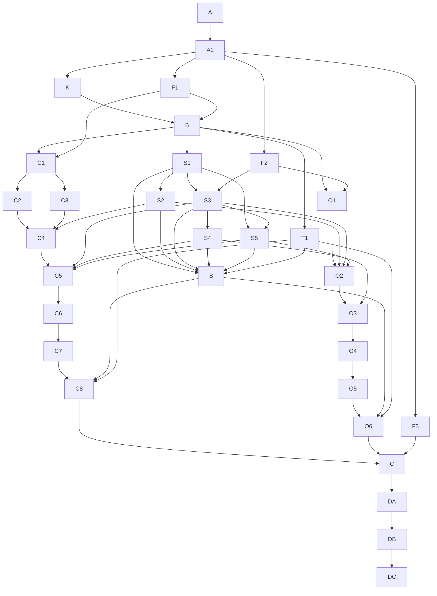

# 第二阶段权威与依赖拓扑

## 输入一致性

| Promised behavior | Input location | Owning model/field | API or workflow entry | Permission/state authority | Conclusion | Action | Blocking decision node |
| --- | --- | --- | --- | --- | --- | --- | --- |
| 个人可信会话、工作区与旧写入器关闭态 | /Users/vsiyo/Desktop/创业项目/自媒体创作Agent/agents-results/2026-08-15/media-c-b-stage-1-identity-and-organization-onboarding/ssot-development-paths.md | 第一阶段 C1 与 I9 | F1/B/C1 | 第一阶段机器节点 | 当前 BLOCKED | 只投影正式状态、候选身份和 I9 关闭回执 | F1 |
| 组织 Binding 与 Provision | /Users/vsiyo/Desktop/创业项目/自媒体创作Agent/agents-results/2026-08-15/media-c-b-stage-1-identity-and-organization-onboarding/ssot-development-paths.md | 第一阶段 C3 | F2/O1/S3 | 第一阶段机器节点 | 当前 BLOCKED | 只投影正式状态并约束第二阶段写入路由 | F2 |
| 第一阶段必需交付完成 | /Users/vsiyo/Desktop/创业项目/自媒体创作Agent/agents-results/2026-08-15/media-c-b-stage-1-identity-and-organization-onboarding/ssot-development-paths.md | 第一阶段 DC2 | F3/C | 第一阶段机器节点 | 当前 BLOCKED | 禁止提前组装候选 | F3 |
| 个人 Web 正文闭环 | /Users/vsiyo/.codex/attachments/63a93708-8bfe-43ce-8dc7-cb079775f3b0/pasted-text.txt | 个人成果与修订 | C1-C8 | 服务端会话和内部成果 | 范围已接受 | 第二阶段实现 | K 已接受 |
| 人工智能文档写入所有权 | /Users/vsiyo/Desktop/创业项目/自媒体创作Agent/agents-results/2026-08-15/media-c-b-stage-1-identity-and-organization-onboarding/.ssot/nodes/K5.json; /Users/vsiyo/Desktop/创业项目/自媒体创作Agent/agents-results/2026-08-15/media-c-b-stage-1-identity-and-organization-onboarding/.ssot/nodes/I9.json | 第一阶段 I7 排除写入且 I9 建立关闭态，第二阶段拥有唯一写入路由 | F1/F2/S3/C5/O2 | 两阶段机器节点与写入合同 | 第一阶段 K5 已接受，I9 仍阻塞 | F1 与 F2 接受后才允许 S3 正式执行 | 第一阶段 K5/I9 |
| 组织飞书正文闭环 | /Users/vsiyo/Library/Mobile Documents/iCloud~md~obsidian/Documents/日记/公共开发集/public/2026-08-15/media-c-b-product-fact-audit/media-c-b-login-document-organization-audit.md | Binding、飞书文档与镜像 | O1-O6 | 服务端 Binding | 主路径仍有全局凭据风险 | 按 Binding 切到唯一写入路由 | K 已接受 |
| 近期活动租户隔离 | /Users/vsiyo/Library/Mobile Documents/iCloud~md~obsidian/Documents/日记/公共开发集/public/2026-08-15/media-c-b-product-fact-audit/media-c-b-login-document-organization-audit.md | 资料所有者与租户范围 | S2/O1 | 服务端授权守卫 | 存在全表读取问题 | 上下文验收前关闭 | K 已接受 |
| 组织经营与商业化 | /Users/vsiyo/.codex/attachments/63a93708-8bfe-43ce-8dc7-cb079775f3b0/pasted-text.txt | 未来第三阶段 | 本阶段无入口 | 未来独立 SSOT | 明确排除 | 不生成节点 | n/a |

## 权威登记

| Claim/domain | Declared authority path | Authority layer | Lookup method | Change required | Owning node | Validation |
| --- | --- | --- | --- | --- | --- | --- |
| 第二阶段决定与编排 | .ssot/manifest.json 及 nodes/edges | decision/orchestration | 机器校验 | 是 | A-DC | check_ssot_program.py |
| 第一阶段 C1/C3/DC2 正式状态 | /Users/vsiyo/Desktop/创业项目/自媒体创作Agent/agents-results/2026-08-15/media-c-b-stage-1-identity-and-organization-onboarding/.ssot/manifest.json | decision/orchestration | 按哈希读取上游节点 | 否；只同步投影 | F1-F3 | 上游 ACCEPTED 回执 |
| 当前产品和源码事实 | /Users/vsiyo/Library/Mobile Documents/iCloud~md~obsidian/Documents/日记/公共开发集/public/2026-08-15/media-c-b-product-fact-audit/media-c-b-login-document-organization-audit.md | runtime-evidence | 来源路径和事实审计 | 否 | A1/S2/O2 | 文件哈希与实现时源码读回 |
| 三阶段拆分与第二阶段边界 | /Users/vsiyo/.codex/attachments/63a93708-8bfe-43ce-8dc7-cb079775f3b0/pasted-text.txt | domain-contract | 用户附件和本次指令 | 已汇编到 K | K | 决定记录第 4 版 |
| 两个发布增量与写入所有权修正 | /Users/vsiyo/.codex/attachments/61fef357-7ee9-4a1a-a348-06db749a7466/pasted-text.txt | domain-contract | 用户提供的结构修正 | 已汇编到 K 与 F2/S3 | K/F2/S3 | 决定记录第 4 版与上游投影 |
| 第一阶段第 4 版结构复核 | /Users/vsiyo/.codex/attachments/7ebe320f-6551-4294-8d1c-2b452a9b6b2b/pasted-text.txt | research/hypothesis | 校验值与逐项合同映射 | 已同步上游哈希、I9 关闭态和五类运行配置 | A1/F1/S3/DA/DC | 机器源与跨阶段负例 |
| 第一阶段旧写入器关闭合同 | /Users/vsiyo/Desktop/创业项目/自媒体创作Agent/agents-results/2026-08-15/media-c-b-stage-1-identity-and-organization-onboarding/.ssot/nodes/I9.json | decision/orchestration | 按哈希读取上游节点 | 否；只通过 F1 投影消费 | F1/S3 | I9 与 C1 同候选 ACCEPTED 回执 |
| 人工智能上下文与写入合同 | 待 B/S1/S3 在真实源码仓冻结的唯一合同 | domain-contract | OpenAPI、类型和保护测试 | 是 | B/S1/S3/T1 | 合同生成与漂移门禁 |
| 入口状态与页面授权合同 | B 节点冻结的独立 entry-state 接口；不得写入会话信封 | domain-contract | OpenAPI、服务端投影、客户端类型和 401/403/409 合同测试 | 是 | B/S1/T1/C6 | 会话严格结构负例与真实会话矩阵 |
| 字体资源与弱网主路径 | index.media.html、src/media.verify.html、mediaDesignTokens.css、media.auth.css | domain-contract | 字体资源清单、构建产物和 Playwright 弱网证据 | 是 | C6/T1/DA | Google Fonts 拦截、字重和布局回归 |
| 生成 Markdown | .ssot/view-sources/*.md -> renderer | execution-record | manifest 哈希绑定 | 自动生成 | A | render --check |

生成的 Markdown 只是读取视图，不是第二套编排权威。第一阶段状态必须先在其机器节点中正式迁移，本文件的 F1-F3 才能同步；本包只读取第一阶段 K5 决定和 I9 关闭合同，不重复拥有或改写它们。

## 修订台账

| Revision | Deviation level | Reason | Changed versions | Affected nodes | Invalidated acceptance/evidence | Nodes to rerun | Approving authority | Timestamp |
| --- | --- | --- | --- | --- | --- | --- | --- | --- |
| 7 | L2 | 接受 studioOrdinaryRoutes + studioTrackRoutes 两组机器路由全量向个人人格开放，并冻结个人会话、租户、所有者作用域与组织能力隔离边界 | PLAN_VERSION 5; DAG_VERSION 5; INTERFACE_FREEZE_VERSION 5; NODE_CONTRACT_VERSION 5; PRODUCT_DECISION_VERSION 4 | A/A1/K/F1/F2/F3/B-S5/C1-C8/O1-O6/S/C/DA/DB/DC | 旧候选分支与测试数量引用；机器源进度视图漂移；会话授权与视觉资源边界待补充 | 重建全部机器分片、执行合同、规划编译记录和生成视图并复验；保留正式节点门禁和普通 IA 产品问题 | main orchestrator under user-requested cross-stage synchronization | 2026-08-30 |

## 不确定性路由

| Uncertainty | Class | Destination | Owner | Blocking scope | Resolution evidence |
| --- | --- | --- | --- | --- | --- |
| 项目根目录没有 Git 元数据 | discoverable-fact | source-notes.md 非 Git 文件哈希基线 | main orchestrator | 只影响本地来源版本表达 | 十二项输入文件校验值 |
| 机器源 .ssot/implementation-progress.md 曾与已发布进度视图脱同步 | discoverable-fact | .ssot/view-sources/40-progress.md 与顶层 implementation-progress.md 同源重建 | orchestrator | 只影响生成视图一致性，不改变正式节点状态 | build_ssot.py 写入三份相同进度内容并由 render --check 校验 |
| 第一阶段 C1、C3、DC2 未接受 | execution-blocker | F1、F2、F3 跨阶段投影 | stage1 acceptance owners | 按三条投影局部阻塞 | 上游节点 ACCEPTED 及候选哈希 |
| 真实个人、飞书组织和验收账号 | execution-blocker | O5/DB 受控身份台账 | runtime acceptance owner | 只阻塞真实外部动作及下游 | 同收据外部系统证据 |
| 现有能力清单与生产源码位置 | discoverable-fact | B/S5 实现前有界查找 | contract owner | 不改变已接受产品决定 | 源码、OpenAPI 和注册表读回 |
| 第二阶段产品选择 | none | K 决定记录与第一阶段已接受决定；studioOrdinaryRoutes + studioTrackRoutes 两组机器路由全量向个人人格开放 | user | 不重复拥有第一阶段决定；路由动作仍需按个人会话、租户、所有者作用域实现 | K ACCEPTED / route allowlist ACCEPTED |

## ASCII 拓扑图

```text
A -> A1
A1 -> K
A1 -> F1
A1 -> F2
A1 -> F3
K -> B
F1 -> B
B -> S1
S1 -> S2
S1 -> S3
F2 -> S3
S1 -> S5
S3 -> S4
S3 -> S5
B -> T1
S1 -> S
S2 -> S
S3 -> S
S4 -> S
S5 -> S
T1 -> S
B -> C1
F1 -> C1
C1 -> C2
C1 -> C3
C2 -> C4
C3 -> C4
S2 -> C4
C4 -> C5
S3 -> C5
S4 -> C5
S5 -> C5
C5 -> C6
C6 -> C7
C7 -> C8
S -> C8
T1 -> C8
B -> O1
F2 -> O1
O1 -> O2
S2 -> O2
S3 -> O2
S5 -> O2
O2 -> O3
S4 -> O3
O3 -> O4
O4 -> O5
O5 -> O6
S -> O6
T1 -> O6
C8 -> C
O6 -> C
F3 -> C
C -> DA
DA -> DB
DB -> DC
```

## Mermaid 依赖图



## 语义节点登记

| Task ID | Semantic key | Work kind | Domain lane | Execution state | Decision state | Decision version | Readiness mode | Hard dependencies | Soft dependencies | Assumptions | Decision refs | Invalidation keys | Write authority | Acceptance authority |
| --- | --- | --- | --- | --- | --- | --- | --- | --- | --- | --- | --- | --- | --- | --- |
| A | media.stage2.charter | charter | governance | ACCEPTED | NOT_APPLICABLE | n/a | FORMAL | n/a | n/a | n/a | n/a | media.stage2.charter.v5 | authoritative-contract | user and planning authority |
| A1 | media.stage2.source-baseline | fact-discovery | source-facts | ACCEPTED | NOT_APPLICABLE | n/a | FORMAL | A | n/a | n/a | n/a | media.stage2.source-baseline.v5 | evidence-only | main orchestrator |
| K | media.stage2.product-decisions | decision-acceptance | product-contract | ACCEPTED | ACCEPTED | 4 | FORMAL | A1 | n/a | n/a | n/a | media.stage2.product-decisions.v5 | authoritative-contract | user |
| F1 | media.stage2.gate.stage1-identity | validation | cross-stage | BLOCKED | NOT_APPLICABLE | n/a | FORMAL | A1 | n/a | n/a | n/a | media.stage2.gate.stage1-identity.v5 | evidence-only | cross-stage projection owner |
| F2 | media.stage2.gate.stage1-provision | validation | cross-stage | BLOCKED | NOT_APPLICABLE | n/a | FORMAL | A1 | n/a | n/a | n/a | media.stage2.gate.stage1-provision.v5 | evidence-only | cross-stage projection owner |
| F3 | media.stage2.gate.stage1-final | validation | cross-stage | BLOCKED | NOT_APPLICABLE | n/a | FORMAL | A1 | n/a | n/a | n/a | media.stage2.gate.stage1-final.v5 | evidence-only | independent acceptance owner |
| B | media.stage2.contract-assembly | contract-assembly | shared-contracts | BLOCKED | NOT_APPLICABLE | n/a | FORMAL | F1, K | n/a | n/a | media.stage2.product-decisions@4 | media.stage2.contract-assembly.v5 | authoritative-contract | main orchestrator |
| S1 | media.stage2.ai-execution-context | contract-compile | shared-ai | BLOCKED | NOT_APPLICABLE | n/a | FORMAL | B | n/a | n/a | media.stage2.product-decisions@4 | media.stage2.ai-execution-context.v5 | implementation | main orchestrator |
| S2 | media.stage2.context-routing | implementation | shared-ai | BLOCKED | NOT_APPLICABLE | n/a | FORMAL | S1 | n/a | n/a | media.stage2.product-decisions@4 | media.stage2.context-routing.v5 | implementation | main orchestrator |
| S3 | media.stage2.writer-routing | contract-compile | shared-writer | BLOCKED | NOT_APPLICABLE | n/a | FORMAL | F2, S1 | n/a | n/a | media.stage2.product-decisions@4 | media.stage2.writer-routing.v5 | implementation | main orchestrator |
| S4 | media.stage2.artifact-record-readback | implementation | shared-artifact | BLOCKED | NOT_APPLICABLE | n/a | FORMAL | S3 | n/a | n/a | media.stage2.product-decisions@4 | media.stage2.artifact-record-readback.v5 | implementation | main orchestrator |
| S5 | media.stage2.capability-side-effects | implementation | shared-capability | BLOCKED | NOT_APPLICABLE | n/a | FORMAL | S1, S3 | n/a | n/a | media.stage2.product-decisions@4 | media.stage2.capability-side-effects.v5 | implementation | main orchestrator |
| T1 | media.stage2.shared-acceptance-harness | acceptance-design | shared-contracts | BLOCKED | NOT_APPLICABLE | n/a | FORMAL | B | n/a | n/a | media.stage2.product-decisions@4 | media.stage2.shared-acceptance-harness.v5 | implementation | main orchestrator |
| C1 | media.stage2.personal-source-scope | implementation | personal-content | BLOCKED | NOT_APPLICABLE | n/a | FORMAL | B, F1 | n/a | n/a | media.stage2.product-decisions@4 | media.stage2.personal-source-scope.v5 | implementation | main orchestrator |
| C2 | media.stage2.personal-research-brief | implementation | personal-content | BLOCKED | NOT_APPLICABLE | n/a | FORMAL | C1 | n/a | n/a | media.stage2.product-decisions@4 | media.stage2.personal-research-brief.v5 | implementation | main orchestrator |
| C3 | media.stage2.personal-decision-brief | implementation | personal-content | BLOCKED | NOT_APPLICABLE | n/a | FORMAL | C1 | n/a | n/a | media.stage2.product-decisions@4 | media.stage2.personal-decision-brief.v5 | implementation | main orchestrator |
| C4 | media.stage2.personal-context-builder | implementation | personal-ai | BLOCKED | NOT_APPLICABLE | n/a | FORMAL | C2, C3, S2 | n/a | n/a | media.stage2.product-decisions@4 | media.stage2.personal-context-builder.v5 | implementation | main orchestrator |
| C5 | media.stage2.personal-internal-writer | implementation | personal-writer | BLOCKED | NOT_APPLICABLE | n/a | FORMAL | C4, S3, S4, S5 | n/a | n/a | media.stage2.product-decisions@4 | media.stage2.personal-internal-writer.v5 | implementation | main orchestrator |
| C6 | media.stage2.personal-web-revision | implementation | personal-editor | BLOCKED | NOT_APPLICABLE | n/a | FORMAL | C5 | n/a | n/a | media.stage2.product-decisions@4 | media.stage2.personal-web-revision.v5 | implementation | main orchestrator |
| C7 | media.stage2.personal-version-export | implementation | personal-publish | BLOCKED | NOT_APPLICABLE | n/a | FORMAL | C6 | n/a | n/a | media.stage2.product-decisions@4 | media.stage2.personal-version-export.v5 | implementation | main orchestrator |
| C8 | media.stage2.personal-e2e | convergence | personal-content | BLOCKED | NOT_APPLICABLE | n/a | FORMAL | C7, S, T1 | n/a | n/a | media.stage2.product-decisions@4 | media.stage2.personal-e2e.v5 | shared-generated | main orchestrator |
| O1 | media.stage2.organization-source-scope | implementation | organization-content | BLOCKED | NOT_APPLICABLE | n/a | FORMAL | B, F2 | n/a | n/a | media.stage2.product-decisions@4 | media.stage2.organization-source-scope.v5 | implementation | main orchestrator |
| O2 | media.stage2.organization-lark-writer | implementation | organization-writer | BLOCKED | NOT_APPLICABLE | n/a | FORMAL | O1, S2, S3, S5 | n/a | n/a | media.stage2.product-decisions@4 | media.stage2.organization-lark-writer.v5 | implementation | main orchestrator |
| O3 | media.stage2.organization-artifact-binding | implementation | organization-artifact | BLOCKED | NOT_APPLICABLE | n/a | FORMAL | O2, S4 | n/a | n/a | media.stage2.product-decisions@4 | media.stage2.organization-artifact-binding.v5 | implementation | main orchestrator |
| O4 | media.stage2.organization-readback | implementation | organization-readback | BLOCKED | NOT_APPLICABLE | n/a | FORMAL | O3 | n/a | n/a | media.stage2.product-decisions@4 | media.stage2.organization-readback.v5 | implementation | main orchestrator |
| O5 | media.stage2.organization-edit-readback | validation | organization-readback | BLOCKED | NOT_APPLICABLE | n/a | FORMAL | O4 | n/a | n/a | media.stage2.product-decisions@4 | media.stage2.organization-edit-readback.v5 | evidence-only | runtime acceptance owner |
| O6 | media.stage2.organization-e2e | convergence | organization-content | BLOCKED | NOT_APPLICABLE | n/a | FORMAL | O5, S, T1 | n/a | n/a | media.stage2.product-decisions@4 | media.stage2.organization-e2e.v5 | shared-generated | main orchestrator |
| S | media.stage2.shared-convergence | convergence | shared-contracts | BLOCKED | NOT_APPLICABLE | n/a | FORMAL | S1, S2, S3, S4, S5, T1 | n/a | n/a | media.stage2.product-decisions@4 | media.stage2.shared-convergence.v5 | shared-generated | main orchestrator |
| C | media.stage2.unique-candidate | convergence | release-candidate | BLOCKED | NOT_APPLICABLE | n/a | FORMAL | C8, F3, O6 | n/a | n/a | media.stage2.product-decisions@4 | media.stage2.unique-candidate.v5 | shared-generated | main orchestrator |
| DA | media.stage2.static-release-acceptance | validation | release | BLOCKED | NOT_APPLICABLE | n/a | FORMAL | C | n/a | n/a | media.stage2.product-decisions@4 | media.stage2.static-release-acceptance.v5 | evidence-only | main orchestrator |
| DB | media.stage2.external-system-acceptance | validation | release | BLOCKED | NOT_APPLICABLE | n/a | FORMAL | DA | n/a | n/a | media.stage2.product-decisions@4 | media.stage2.external-system-acceptance.v5 | evidence-only | runtime acceptance owner |
| DC | media.stage2.independent-release-decision | release-decision | release | BLOCKED | NOT_APPLICABLE | n/a | FORMAL | DB | n/a | n/a | media.stage2.product-decisions@4 | media.stage2.independent-release-decision.v5 | evidence-only | independent acceptance owner |

## 依赖边登记

| From | To | Dependency type | Dependency scope | Required upstream state | Assumption IDs | Invalidation keys | Transferred input | Gate/evidence |
| --- | --- | --- | --- | --- | --- | --- | --- | --- |
| A | A1 | hard | specific-output | ACCEPTED | n/a | edge.a.a1.v5 | 第二阶段唯一开发编排边界 | 只生成第二阶段，不改写第一阶段也不创建第三阶段 |
| A1 | K | hard | specific-output | ACCEPTED | n/a | edge.a1.k.v5 | 可复现的非 Git 来源基线 | 第一阶段 C1、C3、DC2 均未接受 |
| A1 | F1 | hard | specific-output | ACCEPTED | n/a | edge.a1.f1.v5 | 可复现的非 Git 来源基线 | 第一阶段 C1、C3、DC2 均未接受 |
| A1 | F2 | hard | specific-output | ACCEPTED | n/a | edge.a1.f2.v5 | 可复现的非 Git 来源基线 | 第一阶段 C1、C3、DC2 均未接受 |
| A1 | F3 | hard | specific-output | ACCEPTED | n/a | edge.a1.f3.v5 | 可复现的非 Git 来源基线 | 第一阶段 C1、C3、DC2 均未接受 |
| K | B | hard | specific-output | ACCEPTED | n/a | edge.k.b.v5 | 已接受决定记录第 4 版 | 记录实现事实与正式接受状态的证据分层；组织 Binding、飞书写入和组织成员能力不得因个人路由开放而泄漏 |
| F1 | B | hard | specific-output | ACCEPTED | n/a | edge.f1.b.v5 | 身份汇合跨阶段收据 | 只有第一阶段 C1 ACCEPTED 且 I9 属于同一候选时才可接受本投影 |
| B | S1 | hard | specific-output | ACCEPTED | n/a | edge.b.s1.v5 | 共享接口冻结身份 | 不接受前端伪造租户、Binding、正文权威或路由授权 |
| S1 | S2 | hard | specific-output | ACCEPTED | n/a | edge.s1.s2.v5 | AIExecutionContext 第 3 版 | 上下文全部由服务端事实生成 |
| S1 | S3 | hard | specific-output | ACCEPTED | n/a | edge.s1.s3.v5 | AIExecutionContext 第 3 版 | 上下文全部由服务端事实生成 |
| F2 | S3 | hard | specific-output | ACCEPTED | n/a | edge.f2.s3.v5 | 组织开通跨阶段收据 | 只有第一阶段 C3 ACCEPTED 才可接受本投影 |
| S1 | S5 | hard | specific-output | ACCEPTED | n/a | edge.s1.s5.v5 | AIExecutionContext 第 3 版 | 上下文全部由服务端事实生成 |
| S3 | S4 | hard | specific-output | ACCEPTED | n/a | edge.s3.s4.v5 | WriterRouter 第 2 版 | 不允许第一阶段或能力实现绕过统一路由自选文档容器 |
| S3 | S5 | hard | specific-output | ACCEPTED | n/a | edge.s3.s5.v5 | WriterRouter 第 2 版 | 不允许第一阶段或能力实现绕过统一路由自选文档容器 |
| B | T1 | hard | specific-output | ACCEPTED | n/a | edge.b.t1.v5 | 共享接口冻结身份 | 不接受前端伪造租户、Binding、正文权威或路由授权 |
| S1 | S | hard | specific-output | ACCEPTED | n/a | edge.s1.s.v5 | AIExecutionContext 第 3 版 | 上下文全部由服务端事实生成 |
| S2 | S | hard | specific-output | ACCEPTED | n/a | edge.s2.s.v5 | ContextBuilder 路由和来源收据 | 01_ 近期活动与其他资料使用同等租户边界 |
| S3 | S | hard | specific-output | ACCEPTED | n/a | edge.s3.s.v5 | WriterRouter 第 2 版 | 不允许第一阶段或能力实现绕过统一路由自选文档容器 |
| S4 | S | hard | specific-output | ACCEPTED | n/a | edge.s4.s.v5 | ArtifactRecorder 和 ReadbackVerifier | 任一必要步骤失败都不得返回发布成功 |
| S5 | S | hard | specific-output | ACCEPTED | n/a | edge.s5.s.v5 | 能力副作用注册表 | 只读能力不产生文档或远端副作用 |
| T1 | S | hard | specific-output | ACCEPTED | n/a | edge.t1.s.v5 | 保护测试和验收矩阵 | 每个稳定失败类都有红绿门禁 |
| B | C1 | hard | specific-output | ACCEPTED | n/a | edge.b.c1.v5 | 共享接口冻结身份 | 不接受前端伪造租户、Binding、正文权威或路由授权 |
| F1 | C1 | hard | specific-output | ACCEPTED | n/a | edge.f1.c1.v5 | 身份汇合跨阶段收据 | 只有第一阶段 C1 ACCEPTED 且 I9 属于同一候选时才可接受本投影 |
| C1 | C2 | hard | specific-output | ACCEPTED | n/a | edge.c1.c2.v5 | 个人资料投影与范围合同 | 个人工作区不读取任何组织共享资料 |
| C1 | C3 | hard | specific-output | ACCEPTED | n/a | edge.c1.c3.v5 | 个人资料投影与范围合同 | 个人工作区不读取任何组织共享资料 |
| C2 | C4 | hard | specific-output | ACCEPTED | n/a | edge.c2.c4.v5 | 个人研究简报成果 | 研究结论和来源引用可分离复核 |
| C3 | C4 | hard | specific-output | ACCEPTED | n/a | edge.c3.c4.v5 | 个人决策简报成果 | 模型建议不伪装为用户决定 |
| S2 | C4 | hard | specific-output | ACCEPTED | n/a | edge.s2.c4.v5 | ContextBuilder 路由和来源收据 | 01_ 近期活动与其他资料使用同等租户边界 |
| C4 | C5 | hard | specific-output | ACCEPTED | n/a | edge.c4.c5.v5 | PersonalContextBuilder 结果 | 个人任务只使用 personal_web/internal 上下文 |
| S3 | C5 | hard | specific-output | ACCEPTED | n/a | edge.s3.c5.v5 | WriterRouter 第 2 版 | 不允许第一阶段或能力实现绕过统一路由自选文档容器 |
| S4 | C5 | hard | specific-output | ACCEPTED | n/a | edge.s4.c5.v5 | ArtifactRecorder 和 ReadbackVerifier | 任一必要步骤失败都不得返回发布成功 |
| S5 | C5 | hard | specific-output | ACCEPTED | n/a | edge.s5.c5.v5 | 能力副作用注册表 | 只读能力不产生文档或远端副作用 |
| C5 | C6 | hard | specific-output | ACCEPTED | n/a | edge.c5.c6.v5 | InternalArtifactWriter 和个人成果收据 | 个人路径不得创建任何全局飞书文档 |
| C6 | C7 | hard | specific-output | ACCEPTED | n/a | edge.c6.c7.v5 | Web 编辑界面和修订链 | Web 是个人正文的唯一编辑权威 |
| C7 | C8 | hard | specific-output | ACCEPTED | n/a | edge.c7.c8.v5 | 平台版本和发布包成果 | 发布包只引用已回读的个人正文版本 |
| S | C8 | hard | specific-output | ACCEPTED | n/a | edge.s.c8.v5 | 共享路由不可变子候选 | 所有文档能力只有一个路由入口 |
| T1 | C8 | hard | specific-output | ACCEPTED | n/a | edge.t1.c8.v5 | 保护测试和验收矩阵 | 每个稳定失败类都有红绿门禁 |
| B | O1 | hard | specific-output | ACCEPTED | n/a | edge.b.o1.v5 | 共享接口冻结身份 | 不接受前端伪造租户、Binding、正文权威或路由授权 |
| F2 | O1 | hard | specific-output | ACCEPTED | n/a | edge.f2.o1.v5 | 组织开通跨阶段收据 | 只有第一阶段 C3 ACCEPTED 才可接受本投影 |
| O1 | O2 | hard | specific-output | ACCEPTED | n/a | edge.o1.o2.v5 | 组织资料和品牌约束收据 | 组织 A 不得读取组织 B 或个人资料 |
| S2 | O2 | hard | specific-output | ACCEPTED | n/a | edge.s2.o2.v5 | ContextBuilder 路由和来源收据 | 01_ 近期活动与其他资料使用同等租户边界 |
| S3 | O2 | hard | specific-output | ACCEPTED | n/a | edge.s3.o2.v5 | WriterRouter 第 2 版 | 不允许第一阶段或能力实现绕过统一路由自选文档容器 |
| S5 | O2 | hard | specific-output | ACCEPTED | n/a | edge.s5.o2.v5 | 能力副作用注册表 | 只读能力不产生文档或远端副作用 |
| O2 | O3 | hard | specific-output | ACCEPTED | n/a | edge.o2.o3.v5 | LarkArtifactWriter 和远端写入收据 | 组织 A 不得使用组织 B 或部署级凭据 |
| S4 | O3 | hard | specific-output | ACCEPTED | n/a | edge.s4.o3.v5 | ArtifactRecorder 和 ReadbackVerifier | 任一必要步骤失败都不得返回发布成功 |
| O3 | O4 | hard | specific-output | ACCEPTED | n/a | edge.o3.o4.v5 | 组织成果绑定收据 | 组织路径不创建可编辑的内部 Web 正文 |
| O4 | O5 | hard | specific-output | ACCEPTED | n/a | edge.o4.o5.v5 | 组织只读镜像和回读收据 | 未完成回读时不得向用户标记发布成功 |
| O5 | O6 | hard | specific-output | ACCEPTED | n/a | edge.o5.o6.v5 | 飞书编辑和再回读同收据证据 | 飞书是组织正文的唯一编辑权威 |
| S | O6 | hard | specific-output | ACCEPTED | n/a | edge.s.o6.v5 | 共享路由不可变子候选 | 所有文档能力只有一个路由入口 |
| T1 | O6 | hard | specific-output | ACCEPTED | n/a | edge.t1.o6.v5 | 保护测试和验收矩阵 | 每个稳定失败类都有红绿门禁 |
| C8 | C | hard | specific-output | ACCEPTED | n/a | edge.c8.c.v5 | 个人端到端候选 | 个人全链在同一候选上可重现 |
| O6 | C | hard | specific-output | ACCEPTED | n/a | edge.o6.c.v5 | 组织端到端候选 | 组织全链在同一租户、Binding、文档和候选上闭环 |
| F3 | C | hard | specific-output | ACCEPTED | n/a | edge.f3.c.v5 | 第一阶段必需交付跨阶段收据 | 只有第一阶段 DC2 ACCEPTED 才可接受本投影 |
| C | DA | hard | global-completeness | ACCEPTED | n/a | edge.c.da.v5 | 哈希绑定的第二阶段候选 | 只有一个候选，且不包含旧 Writer、双写权威或隐式回退路径 |
| DA | DB | hard | global-completeness | ACCEPTED | n/a | edge.da.db.v5 | 静态验收证据包 | 所有门禁对同一候选通过 |
| DB | DC | hard | global-completeness | ACCEPTED | n/a | edge.db.dc.v5 | 生产与飞书同收据证据 | 目标证据达到 physical-device/external-system |
