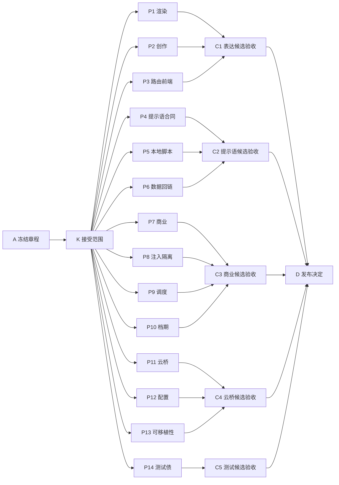

# P1 剩余问题开发路径

## 业务结论与范围

### 术语说明

本路径中的“关闭”是指某一审计问题完成代码修改、针对性测试和本批次候选验收后的正式状态，不是仅有提交或单个测试通过。“发布切片”是能够单独给创作者、运营人员或商务人员带来可检查改善的一组改动；任一切片失败时，其他切片可以保持未晋升而不被误判失败。

P1 尚有 148 条冻结审计基线，不能因近期进入主分支（`main`） 的候选提交自动扣减。近期提交只能作为复验输入；只有本路径的节点验收通过，才允许在后续进度投影中调整条目状态。本路径将 148 条按可独立验收的五个发布切片和十四个源码交付包安排，先处理用户可见表达、上下游提示语和数据回路，再处理商业与运行时闭环、云桥可移植性，最后收敛测试债。

受影响者是创作者、运营人员、商务协作者和维护人员。目标是让他们看到可理解的中文交付信息，让创作、复盘、商务、排期、日常采集和本地素材工作在有证据的前提下衔接，并让后续修改有可重放的测试依据。

## 不包含的工作

本次只建立开发编排与验收边界，不执行产品代码改动、不部署到远端主机、不修改数据库或飞书数据、不重启服务，也不把 P0 或 P2 的状态改写为已关闭。近期合入主分支（`main`）的三个候选变更属于本路径的复验输入；只有按交付包逐项验收后，才可纳入 P1 的正式状态。

## 人工决定与不确定性

没有待用户拍板的产品问题：P1 的范围、冻结数量和优先类别已由用户明确，审计报告提供了每一类问题的位置与建议修法。因此不创建待拍板问题文档（`openproblem.md`）。

| 不确定性 | 分类 | 去向 | 负责人 | 阻塞范围 | 解决证据 |
|---|---|---|---|---|---|
| 近期合入提交是否已覆盖某条 P1 问题 | 可查明事实 | 各交付包的逐项复验 | 对应实现负责人 | 仅该条及其验收 | 变更对照、定向测试与审计编号回链 |
| 远端运行是否与候选代码一致 | 证据缺口 | 发布验收时单独记录 | 发布验收负责人 | 仅涉及远端的发布声明 | 不可变候选标识、服务回读与健康检查 |
| 凭据、远端权限或飞书测试账号不可用 | 执行阻塞 | 对应节点的阻塞台账 | 运行维护负责人 | 仅依赖该能力的节点 | 访问恢复后的最小复测 |

## 冻结基线与拆分

| 交付包 | 冻结条数 | 审计主题 | 本批次必须产出 |
|---|---:|---|---|
| P1 | 18 | 用户可见渲染与机器腔 | 中文标签、枚举映射、内部信息隔离及渲染回归测试 |
| P2 | 14 | 创作链提示语 | 创作、咨询、回洗、拍摄提示语与校验一致性 |
| P3 | 8 | 路由与前端 | 面向用户的错误、进度、状态和素材入口一致性 |
| P4 | 18 | 拆解、入库、增长、商务、复盘提示语 | 各链路角色、输入和校验合同一致 |
| P5 | 15 | 本地脚本提示语 | 本地生成脚本的上下文、截断、中文提示和错误说明 |
| P6 | 12 | 数据流断链 | 复盘、热榜、采集和创作之间的生产者、消费者与回链 |
| P7 | 12 | 商业闭环 | 报价、交付、发布、验收和复盘的可追踪闭环 |
| P8 | 5 | 不可信文本注入面 | 原话隔离、报价保护和长期记忆可信度门禁 |
| P9 | 5 | 运行时与日常调度 | 定时入口、日报产物、租户边界与可观测错误 |
| P10 | 5 | 档期 | 过期档期识别、反问、日历衔接和创作上下文 |
| P11 | 10 | 云桥 | 本地与云端任务、结果、版本、幂等和回传合同 |
| P12 | 6 | 配置 | 失效配置、环境变量、平台机制和合同来源统一 |
| P13 | 6 | 本地硬编码 | 主机、路径、运行时与项目模板的可移植性 |
| P14 | 14 | 测试债 | SSOT 合同、冻结夹具、负向用例和失败基线收敛 |
| 合计 | 148 | P1 冻结审计基线 | 每条问题在所属交付包中完成逐项复验后才可关闭 |

## 宏观阶段与发布切片

### 术语说明

开发基线是本路径开始时的源码身份；晋升基线是每个切片组装候选时必须重新对齐的已接受源码身份；发布候选是晋升基线加上该切片已接受变更形成的不可变身份。当前仅冻结计划，因此候选名称均为计划身份，不能当成已经部署的版本。

| 宏观阶段 | 发布编号 | 用户价值 | 独立验收 | 独立失败 | 开发基线 | 晋升基线 | 发布候选 |
|---|---|---|---|---|---|---|---|
| 表达与创作 | REL-P1-UX | 创作者在文档、聊天和页面上先看到中文可执行结论 | 针对渲染、创作和页面的定向测试均通过 | 失败时不晋升表达切片，不影响后续提示语拆分 | `cffda6e257b483e28b5074eee0e5b7b43b6a9598` | 组装时的 `main` 已接受身份 | `planned:REL-P1-UX` |
| 提示语与资料流 | REL-P1-PIPE | 各内容链路按同一输入事实、角色口吻和校验规则工作 | 链路提示语与数据回链的定向测试通过 | 失败时保留该候选，不阻止商业和云桥切片独立修复 | `cffda6e257b483e28b5074eee0e5b7b43b6a9598` | 组装时的 `main` 已接受身份 | `planned:REL-P1-PIPE` |
| 商业与排期闭环 | REL-P1-BIZ | 商务承诺、排期、日报和不可信外部文本不再静默断链 | 商单与档期的负向、回链和时效测试通过 | 失败时停止商业候选，不宣称已形成闭环 | `cffda6e257b483e28b5074eee0e5b7b43b6a9598` | 组装时的 `main` 已接受身份 | `planned:REL-P1-BIZ` |
| 云桥与可移植运行 | REL-P1-PORT | 云端、本地工具和配置在不同主机上按同一契约交接 | 云桥合同、配置读取和跨路径测试通过 | 失败时拒绝晋升云桥候选，不影响其他切片 | `cffda6e257b483e28b5074eee0e5b7b43b6a9598` | 组装时的 `main` 已接受身份 | `planned:REL-P1-PORT` |
| 测试债收敛 | REL-P1-QA | 维护人员能用仓内合同和夹具重放 P1 验收 | 冻结合同、根因回归和目标测试通过 | 失败时不将测试通过包装为 P1 已完成 | `cffda6e257b483e28b5074eee0e5b7b43b6a9598` | 组装时的 `main` 已接受身份 | `planned:REL-P1-QA` |

## 实施路径摘要

最小章程 A 和范围决定 K 已由本次用户指令接受，因此十四个交付包现在处于正式就绪状态，可按其具体写入范围并行推进。每个发布验收节点只等待本切片的交付包；五个发布验收完成后，最终发布决定 D 才检查候选身份、清理情况和目标证据等级。不存在“某个大阶段完成后才允许其他所有工作开始”的屏障。

## 权威与输入一致性

| 承诺的行为 | 输入位置 | 所属模型或字段 | 工作流入口 | 状态权威 | 结论 | 动作 | 阻塞决定节点 |
|---|---|---|---|---|---|---|---|
| P1 剩余 148 条的计数与状态 | `docs/production-reconciliation/20260828/audit-followup-review.md` | P1 记分板 | 审计后核验 | 最新核验报告 | 冻结为本计划起点，不自动扣减 | 各包逐项复验 | K |
| 每个问题的位置、证据与建议修法 | `docs/production-reconciliation/20260827/pipeline-full-audit.md` | 288 条审计明细 | 各源码链路 | 审计明细 | 可拆到十四个交付包 | 以编号回链定向测试 | K |
| 近期候选提交 | 当前 `main` | Git 提交与测试结果 | 代码复验 | Git 当前身份 | 仅是复验输入 | 不改变审计状态，直至节点验收 | 各 P 节点 |

| 声明或领域 | 权威路径 | 权威层 | 查找方式 | 是否需改动 | 所属节点 | 验证 |
|---|---|---|---|---|---|---|
| 开发编排与依赖 | `.ssot/manifest.json` | 决策与编排 | 机器校验 | 是 | A、K、D | 程序与视图一致性检查 |
| P1 状态基线 | `docs/production-reconciliation/20260828/audit-followup-review.md` | 领域合同 | 计分板与审计编号 | 否 | K | 与冻结总数 148 对账 |
| 问题定位和修法 | `docs/production-reconciliation/20260827/pipeline-full-audit.md` | 领域合同 | 逐条编号回链 | 否 | P1-P14 | 定向测试与复验记录 |
| 当前源码身份 | Git `main` | 执行记录 | `git rev-parse` | 是 | C1-C5 | 候选组装前回读 |

## 工程执行附录

### 节点合同

| Node ID | Goal | Dependencies | Acceptance | Owner |
|---|---|---|---|---|
| A | 冻结本路径边界和机器记录归属 | none | 冻结 148 条基线、五个发布切片和 L2 证据边界 | 规划负责人 |
| K | 接受 P1 范围与状态变更规则 | A | 只有逐项复验通过才可改变 P1 状态 | 用户与规划负责人 |
| P1 | 清理用户可见渲染与机器腔 | K | 覆盖的 18 条完成中文输出与回归验证 | 渲染链实现负责人 |
| P2 | 统一创作链提示语与校验 | K | 覆盖的 14 条完成输入、口吻和校验一致性验证 | 创作链实现负责人 |
| P3 | 修复路由与前端用户状态 | K | 覆盖的 8 条完成接口、页面和负向验证 | 路由与前端负责人 |
| P4 | 修复拆解至复盘的提示语合同 | K | 覆盖的 18 条完成角色、输入和校验验证 | 内容链实现负责人 |
| P5 | 修复本地脚本提示语 | K | 覆盖的 15 条完成上下文、截断和错误说明验证 | 本地工具负责人 |
| P6 | 打通数据回链 | K | 覆盖的 12 条具备生产者、消费者和记录回链 | 数据流负责人 |
| P7 | 打通商业闭环 | K | 覆盖的 12 条具备报价、交付、发布和复盘证据 | 商业链负责人 |
| P8 | 隔离不可信外部文本 | K | 覆盖的 5 条具备输入隔离和覆盖保护测试 | 安全与商务负责人 |
| P9 | 修复运行时与日常调度 | K | 覆盖的 5 条具备正确入口、消费与租户验证 | 运行维护负责人 |
| P10 | 治理过期档期 | K | 覆盖的 5 条具备时效、反问和排期回链验证 | 商业与创作负责人 |
| P11 | 修复云桥交接合同 | K | 覆盖的 10 条具备双端合同和幂等回传验证 | 云桥负责人 |
| P12 | 收敛配置权威 | K | 覆盖的 6 条具备失效检查、配置读取和回归验证 | 配置负责人 |
| P13 | 移除本地硬编码 | K | 覆盖的 6 条在非个人路径环境下可验证 | 可移植性负责人 |
| P14 | 收敛测试债 | K | 覆盖的 14 条以仓内 SSOT、夹具和负向测试重放 | 质量负责人 |
| C1 | 验收表达与创作候选 | P1、P2、P3 | `REL-P1-UX` 定向静态测试通过 | 发布验收负责人 |
| C2 | 验收提示语与资料流候选 | P4、P5、P6 | `REL-P1-PIPE` 定向静态测试通过 | 发布验收负责人 |
| C3 | 验收商业与排期候选 | P7、P8、P9、P10 | `REL-P1-BIZ` 定向静态测试通过 | 发布验收负责人 |
| C4 | 验收云桥与可移植运行候选 | P11、P12、P13 | `REL-P1-PORT` 定向静态测试通过 | 发布验收负责人 |
| C5 | 验收测试债候选 | P14 | `REL-P1-QA` 目标测试通过并与冻结合同一致 | 发布验收负责人 |
| D | 作出 P1 发布决定 | C1、C2、C3、C4、C5 | 所有已接受候选均有不可变身份和对应证明 | 发布决定负责人 |

### ASCII 拓扑图

```text
A --> K
K --> P1, P2, P3 --> C1 --> D
K --> P4, P5, P6 --> C2 --> D
K --> P7, P8, P9, P10 --> C3 --> D
K --> P11, P12, P13 --> C4 --> D
K --> P14 --> C5 --> D
```



### 状态台账

| Task ID | Stage | State | Attempt | Owner | Blocking reason | Evidence | Unlocks |
|---|---|---|---:|---|---|---|---|
| A | A | ACCEPTED | 1 | 规划负责人 | none | 用户范围与机器记录 | K |
| K | A | ACCEPTED | 1 | 用户与规划负责人 | none | 用户明确的 148 条拆分要求 | P1,P2,P3,P4,P5,P6,P7,P8,P9,P10,P11,P12,P13,P14 |
| P1 | B | READY | 0 | 渲染链实现负责人 | none | 审计条目与定向验收合同 | C1 |
| P2 | B | READY | 0 | 创作链实现负责人 | none | 审计条目与定向验收合同 | C1 |
| P3 | B | READY | 0 | 路由与前端负责人 | none | 审计条目与定向验收合同 | C1 |
| P4 | B | READY | 0 | 内容链实现负责人 | none | 审计条目与定向验收合同 | C2 |
| P5 | B | READY | 0 | 本地工具负责人 | none | 审计条目与定向验收合同 | C2 |
| P6 | B | READY | 0 | 数据流负责人 | none | 审计条目与定向验收合同 | C2 |
| P7 | B | READY | 0 | 商业链负责人 | none | 审计条目与定向验收合同 | C3 |
| P8 | B | READY | 0 | 安全与商务负责人 | none | 审计条目与定向验收合同 | C3 |
| P9 | B | READY | 0 | 运行维护负责人 | none | 审计条目与定向验收合同 | C3 |
| P10 | B | READY | 0 | 商业与创作负责人 | none | 审计条目与定向验收合同 | C3 |
| P11 | B | READY | 0 | 云桥负责人 | none | 审计条目与定向验收合同 | C4 |
| P12 | B | READY | 0 | 配置负责人 | none | 审计条目与定向验收合同 | C4 |
| P13 | B | READY | 0 | 可移植性负责人 | none | 审计条目与定向验收合同 | C4 |
| P14 | B | READY | 0 | 质量负责人 | none | 审计条目与定向验收合同 | C5 |
| C1 | C | BLOCKED | 0 | 发布验收负责人 | 等待 P1,P2,P3 | 候选证明待生成 | D |
| C2 | C | BLOCKED | 0 | 发布验收负责人 | 等待 P4,P5,P6 | 候选证明待生成 | D |
| C3 | C | BLOCKED | 0 | 发布验收负责人 | 等待 P7,P8,P9,P10 | 候选证明待生成 | D |
| C4 | C | BLOCKED | 0 | 发布验收负责人 | 等待 P11,P12,P13 | 候选证明待生成 | D |
| C5 | C | BLOCKED | 0 | 发布验收负责人 | 等待 P14 | 候选证明待生成 | D |
| D | D | BLOCKED | 0 | 发布决定负责人 | 等待 C1,C2,C3,C4,C5 | 发布决定待生成 | none |

### 语义节点登记

| Task ID | Semantic key | Work kind | Domain lane | Execution state | Decision state | Decision version | Readiness mode | Hard dependencies | Soft dependencies | Assumptions | Decision refs | Invalidation keys | Write authority | Acceptance authority |
|---|---|---|---|---|---|---|---|---|---|---|---|---|---|---|
| A | charter.p1.remaining | charter | governance | ACCEPTED | NOT_APPLICABLE | n/a | FORMAL | none | none | none | none | charter.p1.remaining | authoritative-contract | 规划负责人 |
| K | decision.p1.remaining-scope | decision-acceptance | governance | ACCEPTED | ACCEPTED | 1 | FORMAL | A | none | none | none | decision.p1.remaining-scope | authoritative-contract | 用户与规划负责人 |
| P1 | delivery.p1.rendering | implementation | presentation | READY | NOT_APPLICABLE | n/a | FORMAL | K | none | none | decision.p1.remaining-scope@1 | rendering.p1 | implementation | 渲染链实现负责人 |
| P2 | delivery.p1.creation-prompts | implementation | creation | READY | NOT_APPLICABLE | n/a | FORMAL | K | none | none | decision.p1.remaining-scope@1 | creation.prompts.p1 | implementation | 创作链实现负责人 |
| P3 | delivery.p1.router-frontend | implementation | interface | READY | NOT_APPLICABLE | n/a | FORMAL | K | none | none | decision.p1.remaining-scope@1 | router.frontend.p1 | implementation | 路由与前端负责人 |
| P4 | delivery.p1.pipeline-prompts | implementation | pipeline | READY | NOT_APPLICABLE | n/a | FORMAL | K | none | none | decision.p1.remaining-scope@1 | pipeline.prompts.p1 | implementation | 内容链实现负责人 |
| P5 | delivery.p1.local-script-prompts | implementation | local-tools | READY | NOT_APPLICABLE | n/a | FORMAL | K | none | none | decision.p1.remaining-scope@1 | local.prompts.p1 | implementation | 本地工具负责人 |
| P6 | delivery.p1.data-flow | implementation | data-flow | READY | NOT_APPLICABLE | n/a | FORMAL | K | none | none | decision.p1.remaining-scope@1 | data.flow.p1 | implementation | 数据流负责人 |
| P7 | delivery.p1.commercial-loop | implementation | commercial | READY | NOT_APPLICABLE | n/a | FORMAL | K | none | none | decision.p1.remaining-scope@1 | commercial.loop.p1 | implementation | 商业链负责人 |
| P8 | delivery.p1.untrusted-input | implementation | input-safety | READY | NOT_APPLICABLE | n/a | FORMAL | K | none | none | decision.p1.remaining-scope@1 | untrusted.input.p1 | implementation | 安全与商务负责人 |
| P9 | delivery.p1.runtime-scheduling | implementation | runtime | READY | NOT_APPLICABLE | n/a | FORMAL | K | none | none | decision.p1.remaining-scope@1 | runtime.scheduling.p1 | implementation | 运行维护负责人 |
| P10 | delivery.p1.schedule | implementation | scheduling | READY | NOT_APPLICABLE | n/a | FORMAL | K | none | none | decision.p1.remaining-scope@1 | scheduling.p1 | implementation | 商业与创作负责人 |
| P11 | delivery.p1.cloud-bridge | implementation | cloud-bridge | READY | NOT_APPLICABLE | n/a | FORMAL | K | none | none | decision.p1.remaining-scope@1 | cloud.bridge.p1 | implementation | 云桥负责人 |
| P12 | delivery.p1.configuration | implementation | configuration | READY | NOT_APPLICABLE | n/a | FORMAL | K | none | none | decision.p1.remaining-scope@1 | configuration.p1 | implementation | 配置负责人 |
| P13 | delivery.p1.portability | implementation | portability | READY | NOT_APPLICABLE | n/a | FORMAL | K | none | none | decision.p1.remaining-scope@1 | portability.p1 | implementation | 可移植性负责人 |
| P14 | delivery.p1.test-debt | implementation | quality | READY | NOT_APPLICABLE | n/a | FORMAL | K | none | none | decision.p1.remaining-scope@1 | test.debt.p1 | implementation | 质量负责人 |
| C1 | acceptance.p1.user-expression | validation | release-ux | BLOCKED | NOT_APPLICABLE | n/a | FORMAL | P1,P2,P3 | none | none | none | acceptance.ux.p1 | evidence-only | 发布验收负责人 |
| C2 | acceptance.p1.pipeline | validation | release-pipeline | BLOCKED | NOT_APPLICABLE | n/a | FORMAL | P4,P5,P6 | none | none | none | acceptance.pipeline.p1 | evidence-only | 发布验收负责人 |
| C3 | acceptance.p1.business | validation | release-business | BLOCKED | NOT_APPLICABLE | n/a | FORMAL | P7,P8,P9,P10 | none | none | none | acceptance.business.p1 | evidence-only | 发布验收负责人 |
| C4 | acceptance.p1.portability | validation | release-portability | BLOCKED | NOT_APPLICABLE | n/a | FORMAL | P11,P12,P13 | none | none | none | acceptance.portability.p1 | evidence-only | 发布验收负责人 |
| C5 | acceptance.p1.quality | validation | release-quality | BLOCKED | NOT_APPLICABLE | n/a | FORMAL | P14 | none | none | none | acceptance.quality.p1 | evidence-only | 发布验收负责人 |
| D | release.p1.decision | release-decision | release | BLOCKED | NOT_APPLICABLE | n/a | FORMAL | C1,C2,C3,C4,C5 | none | none | none | release.p1.decision | shared-generated | 发布决定负责人 |

### 依赖边

| From | To | Dependency type | Dependency scope | Required upstream state | Assumption IDs | Invalidation keys | Transferred input | Gate/evidence |
|---|---|---|---|---|---|---|---|---|
| A | K | hard | specific-output | ACCEPTED | none | charter-to-scope | 冻结章程 | 用户范围确认 |
| K | P1 | hard | specific-output | ACCEPTED | none | scope-to-rendering | 已接受范围决定 | 审计编号与验收合同 |
| K | P2 | hard | specific-output | ACCEPTED | none | scope-to-creation | 已接受范围决定 | 审计编号与验收合同 |
| K | P3 | hard | specific-output | ACCEPTED | none | scope-to-interface | 已接受范围决定 | 审计编号与验收合同 |
| K | P4 | hard | specific-output | ACCEPTED | none | scope-to-pipeline | 已接受范围决定 | 审计编号与验收合同 |
| K | P5 | hard | specific-output | ACCEPTED | none | scope-to-local | 已接受范围决定 | 审计编号与验收合同 |
| K | P6 | hard | specific-output | ACCEPTED | none | scope-to-data | 已接受范围决定 | 审计编号与验收合同 |
| K | P7 | hard | specific-output | ACCEPTED | none | scope-to-commercial | 已接受范围决定 | 审计编号与验收合同 |
| K | P8 | hard | specific-output | ACCEPTED | none | scope-to-input | 已接受范围决定 | 审计编号与验收合同 |
| K | P9 | hard | specific-output | ACCEPTED | none | scope-to-runtime | 已接受范围决定 | 审计编号与验收合同 |
| K | P10 | hard | specific-output | ACCEPTED | none | scope-to-schedule | 已接受范围决定 | 审计编号与验收合同 |
| K | P11 | hard | specific-output | ACCEPTED | none | scope-to-cloud | 已接受范围决定 | 审计编号与验收合同 |
| K | P12 | hard | specific-output | ACCEPTED | none | scope-to-configuration | 已接受范围决定 | 审计编号与验收合同 |
| K | P13 | hard | specific-output | ACCEPTED | none | scope-to-portability | 已接受范围决定 | 审计编号与验收合同 |
| K | P14 | hard | specific-output | ACCEPTED | none | scope-to-quality | 已接受范围决定 | 审计编号与验收合同 |
| P1 | C1 | hard | specific-output | ACCEPTED | none | rendering-to-ux | P1 已验证交付 | 渲染定向测试 |
| P2 | C1 | hard | specific-output | ACCEPTED | none | creation-to-ux | P2 已验证交付 | 创作定向测试 |
| P3 | C1 | hard | specific-output | ACCEPTED | none | interface-to-ux | P3 已验证交付 | 路由与前端定向测试 |
| P4 | C2 | hard | specific-output | ACCEPTED | none | pipeline-to-pipeline-release | P4 已验证交付 | 内容链定向测试 |
| P5 | C2 | hard | specific-output | ACCEPTED | none | local-to-pipeline-release | P5 已验证交付 | 本地工具定向测试 |
| P6 | C2 | hard | specific-output | ACCEPTED | none | data-to-pipeline-release | P6 已验证交付 | 数据回链定向测试 |
| P7 | C3 | hard | specific-output | ACCEPTED | none | commercial-to-business-release | P7 已验证交付 | 商业链定向测试 |
| P8 | C3 | hard | specific-output | ACCEPTED | none | input-to-business-release | P8 已验证交付 | 注入隔离测试 |
| P9 | C3 | hard | specific-output | ACCEPTED | none | runtime-to-business-release | P9 已验证交付 | 调度定向测试 |
| P10 | C3 | hard | specific-output | ACCEPTED | none | schedule-to-business-release | P10 已验证交付 | 档期时效测试 |
| P11 | C4 | hard | specific-output | ACCEPTED | none | cloud-to-portability-release | P11 已验证交付 | 云桥合同测试 |
| P12 | C4 | hard | specific-output | ACCEPTED | none | configuration-to-portability-release | P12 已验证交付 | 配置定向测试 |
| P13 | C4 | hard | specific-output | ACCEPTED | none | portability-to-portability-release | P13 已验证交付 | 可移植性测试 |
| P14 | C5 | hard | specific-output | ACCEPTED | none | quality-to-quality-release | P14 已验证交付 | 冻结合同与回归测试 |
| C1 | D | hard | specific-output | ACCEPTED | none | ux-candidate-to-release | 表达候选身份 | 候选证明 |
| C2 | D | hard | specific-output | ACCEPTED | none | pipeline-candidate-to-release | 提示语候选身份 | 候选证明 |
| C3 | D | hard | specific-output | ACCEPTED | none | business-candidate-to-release | 商业候选身份 | 候选证明 |
| C4 | D | hard | specific-output | ACCEPTED | none | portability-candidate-to-release | 云桥候选身份 | 候选证明 |
| C5 | D | hard | specific-output | ACCEPTED | none | quality-candidate-to-release | 测试候选身份 | 候选证明 |

### 当前就绪波前

| Task ID | Eligibility | Unsatisfied hard dependencies | Active assumptions | Resource decision |
|---|---|---|---|---|
| P1 | FORMAL | none | none | conflict-free |
| P2 | FORMAL | none | none | conflict-free |
| P3 | FORMAL | none | none | conflict-free |
| P4 | FORMAL | none | none | conflict-free |
| P5 | FORMAL | none | none | conflict-free |
| P6 | FORMAL | none | none | conflict-free |
| P7 | FORMAL | none | none | conflict-free |
| P8 | FORMAL | none | none | conflict-free |
| P9 | FORMAL | none | none | conflict-free |
| P10 | FORMAL | none | none | conflict-free |
| P11 | FORMAL | none | none | conflict-free |
| P12 | FORMAL | none | none | conflict-free |
| P13 | FORMAL | none | none | conflict-free |
| P14 | FORMAL | none | none | conflict-free |

| Metric | Value | Basis |
|---|---:|---|
| ready-frontier-width | 14 | 当前 14 个 P 节点均为正式就绪 |
| formal-ready | 14 | 机器节点的 `READY` 与 `FORMAL` 组合 |
| conditional-ready | 0 | 无条件工作节点 |
| global-completeness-barriers | 0 | 所有边均传递具体产物 |
| critical-path-length | 5 | A 到 K 到 P 到 C 到 D |

### 交付物与最大安全并行宽度

| Deliverable ID | Parallel batch | Deliverable | Authority write region | Dependencies | Isolation decision | Conflict class | Owning node | Grouping reason |
|---|---|---|---|---|---|---|---|---|
| DL-P1 | B-ready | 用户可见渲染与机器腔修复 | `selfmedia/creation/writer.py` 等渲染器 | K | independent | none | P1 | n/a |
| DL-P2 | B-ready | 创作链提示语与校验修复 | `selfmedia/creation/llm_generator.py` 等创作模块 | K | independent | none | P2 | n/a |
| DL-P3 | B-ready | 路由与前端用户状态修复 | `openclaw-tag-router/openclaw_app/router/` | K | independent | none | P3 | n/a |
| DL-P4 | B-ready | 拆解至复盘提示语合同修复 | `selfmedia/deconstruct/viral_content/src/prompt.py` 等 | K | independent | none | P4 | n/a |
| DL-P5 | B-ready | 本地脚本提示语修复 | `photo-content-os/prompts/` 与指定脚本 | K | independent | none | P5 | n/a |
| DL-P6 | B-ready | 数据回链修复 | `selfmedia/review/data_review.py` 等数据流模块 | K | independent | none | P6 | n/a |
| DL-P7 | B-ready | 商业闭环修复 | `selfmedia/business/` 的指定商单模块 | K | independent | none | P7 | n/a |
| DL-P8 | B-ready | 不可信文本隔离修复 | `common/llm_client.py` 与指定输入适配器 | K | independent | none | P8 | n/a |
| DL-P9 | B-ready | 运行时与日常调度修复 | `runtime/` 与 `scripts/selfmedia.py` | K | independent | none | P9 | n/a |
| DL-P10 | B-ready | 档期时效与回链修复 | `selfmedia/business/schedule.py` 等指定模块 | K | independent | none | P10 | n/a |
| DL-P11 | B-ready | 云桥交接合同修复 | `photo-content-os/99_System_OpenClaw/` | K | independent | none | P11 | n/a |
| DL-P12 | B-ready | 配置权威收敛 | `config/` 与环境示例 | K | independent | none | P12 | n/a |
| DL-P13 | B-ready | 本地硬编码移除 | `photo-content-os/runtime_paths.py` 等指定文件 | K | independent | none | P13 | n/a |
| DL-P14 | B-ready | 测试债收敛 | `tests/`、`openclaw-tag-router/tests/` 与指定夹具 | K | independent | none | P14 | n/a |
| RC-UX | C-ux | 表达与创作候选验收 | `agents-results/2026-08-29/.../evidence/ux` | P1,P2,P3 | independent | none | C1 | n/a |
| RC-PIPE | C-pipeline | 提示语与资料流候选验收 | `agents-results/2026-08-29/.../evidence/pipeline` | P4,P5,P6 | independent | none | C2 | n/a |
| RC-BIZ | C-business | 商业与排期候选验收 | `agents-results/2026-08-29/.../evidence/business` | P7,P8,P9,P10 | independent | none | C3 | n/a |
| RC-PORT | C-portability | 云桥与可移植候选验收 | `agents-results/2026-08-29/.../evidence/portability` | P11,P12,P13 | independent | none | C4 | n/a |
| RC-QA | C-quality | 测试债候选验收 | `agents-results/2026-08-29/.../evidence/quality` | P14 | independent | none | C5 | n/a |

| Parallel batch | Leaf deliverables | Independent deliverables | Conflict-grouped deliverables | Logical lane target | Available worker slots | Wave count | Graph ready width | Graph antichain width | Resource-verified width |
|---|---:|---:|---:|---:|---:|---:|---:|---:|---:|
| B-ready | 14 | 14 | 0 | 14 | 1 | 14 | 14 | 14 | 14 |
| C-ux | 1 | 1 | 0 | 1 | 1 | 14 | 14 | 14 | 14 |
| C-pipeline | 1 | 1 | 0 | 1 | 1 | 14 | 14 | 14 | 14 |
| C-business | 1 | 1 | 0 | 1 | 1 | 14 | 14 | 14 | 14 |
| C-portability | 1 | 1 | 0 | 1 | 1 | 14 | 14 | 14 | 14 |
| C-quality | 1 | 1 | 0 | 1 | 1 | 14 | 14 | 14 | 14 |

当前文档不派发执行进程，因而“可用执行槽”仅用于展示保守排程，不能形成伪造的并发完成证据。实际执行时，每个独立交付包保持独立逻辑通道；容量不足只增加波次，不得把两个交付包合并或新增虚假依赖。默认可写执行者为 Terra；本路径不登记或调用 Luna。

## 适用性矩阵

| 关注面 | 是否适用 | 本路径处理方式 |
|---|---|---|
| 安全、鉴权与密钥 | required | P8 对外部原话和报价覆盖建立隔离与负向验证 |
| 隐私、合规与留存 | required | P8 记录不可信资料不得直接进入长期记忆的边界 |
| 迁移与恢复 | not-applicable | 本路径不执行数据库迁移；发生迁移时另建恢复合同 |
| 可靠性与回退 | required | P6、P9、P11 规定生产者、消费者、幂等和失败回收验证 |
| 性能与容量 | not-applicable | 当前是源码与静态测试计划，无容量变更 |
| 可观测性 | required | P9、P11 要求失败信息可诊断但不直出内部细节 |
| 无障碍与国际化 | required | P1、P3 消除面向中文用户的英文枚举和机器话术 |
| 成本与外部限制 | required | P4、P5 避免无意义重试、截断与提示语冲突 |
| 部署、回读与监控 | not-applicable | 本次不部署；后续候选晋升另需远端回读 |
| 运维交接 | required | P9、P11、P13 保证入口、路径和本地运行时可交接 |

## 清理与完成定义

| 范围 | 类型 | 旧项 | 动作 | 允许保留 | 证据 |
|---|---|---|---|---|---|
| P1-P14 | 旧逻辑与提示语 | 英文枚举、机器回执、无消费者分支、过期默认值 | 仅在对应节点验收后删除或替换 | 仍被未迁移消费者使用的兼容入口 | 定向搜索、负向测试与回归测试 |
| 当前计划 | 临时执行物 | 无 | 本次不创建工作进程、临时提示文件或远端产物 | 审计输入与当前 `main` 中近期合入的三项变更 | Git 与审计记录 |

本路径禁止把静态测试通过表述为远端已部署、飞书已回读或生产已恢复。当前已证明的最高等级仅为计划与机器结构的静态校验；每个发布切片后续只有在对应候选身份、定向测试和所需运行时证据齐备后，才可以进入已验收状态。
